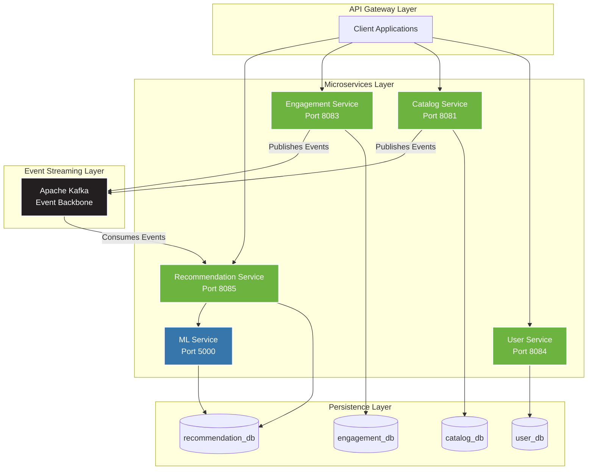

# Media Recommendation System

[](https://github.com/Luca5Eckert/media-recommendation-system)
[](LICENSE)
[](https://openjdk.org/)
[](https://www.python.org/)
[](https://spring.io/projects/spring-boot)
[](https://www.docker.com/)

A production-ready, event-driven media recommendation platform built with microservices architecture. Inspired by industry leaders like Netflix and Spotify, this system delivers personalized content recommendations using machine learning algorithms in real-time.

---

## Table of Contents

- [Overview](#overview)
- [Key Features](#key-features)
- [Architecture](#architecture)
- [Technology Stack](#technology-stack)
- [Getting Started](#getting-started)
- [API Reference](#api-reference)
- [Database Architecture](#database-architecture)
- [ML Service](#ml-service)
- [Project Status](#project-status)
- [Project Structure](#project-structure)
- [Commands Reference](#commands-reference)
- [Contributing](#contributing)
- [License](#license)

---

## Overview

The **Media Recommendation System** is a scalable, distributed application designed to deliver personalized content recommendations to users in real-time. Built with a **microservices architecture** and **event-driven communication**, the system leverages **Apache Kafka** for asynchronous messaging between services, enabling real-time analytics and seamless data flow.

## Key Features

| Feature | Description |
|---------|-------------|
| **Microservices Architecture** | 5 independent services with clear separation of concerns |
| **Event-Driven Communication** | Apache Kafka for asynchronous messaging and real-time data streaming |
| **Hybrid ML Algorithm** | Content-based filtering (70%) combined with popularity scoring (30%) |
| **JWT Authentication** | Secure role-based access control (USER/ADMIN roles) |
| **Database Isolation** | Database-per-service pattern ensuring complete service autonomy |
| **Production Ready** | Docker Compose orchestration with health checks and auto-initialization |

---

## Architecture

The system follows a **microservices architecture** with event-driven communication. Each microservice adheres to the **Database per Service** pattern, ensuring complete isolation and independent scalability.



### Service Descriptions

| Service | Technology | Database | Responsibilities |
|---------|------------|----------|------------------|
| **User Service** | Spring Boot 4.0 | `user_db` | Authentication, user management, preferences |
| **Catalog Service** | Spring Boot 4.0 | `catalog_db` | Media catalog management, CRUD operations |
| **Engagement Service** | Spring Boot 4.0 | `engagement_db` | Interaction tracking, event publishing |
| **Recommendation Service** | Spring Boot 4.0 | `recommendation_db` | Event consumption, ML orchestration |
| **ML Service** | Flask 3.0 | `recommendation_db` | Recommendation algorithm execution |

> **Note:** In local development, all databases run within a single PostgreSQL 15 container for simplicity. In production, each database should be deployed as an independent instance for complete isolation.

---

## Technology Stack

### Core Technologies

| Category | Technology | Version | Purpose |
|----------|------------|---------|---------|
| **Runtime (Java)** | Java | 21 (LTS) | Backend services runtime |
| **Runtime (Python)** | Python | 3.11+ | ML service runtime |
| **Framework (Java)** | Spring Boot | 4.0.0 | Microservices framework |
| **Framework (Python)** | Flask | 3.0.0 | REST API framework |
| **Database** | PostgreSQL | 15 | Primary data storage |
| **Message Broker** | Apache Kafka | 7.3.0 | Event streaming platform |
| **Coordination** | Apache Zookeeper | 7.3.0 | Kafka cluster coordination |

### Infrastructure & DevOps

| Category | Technology | Purpose |
|----------|------------|---------|
| **Containerization** | Docker | Application containerization |
| **Orchestration** | Docker Compose | Multi-container orchestration |
| **WSGI Server** | Gunicorn | Python production server |
| **Build Tool** | Maven | Java project build |

### Security & Data Access

| Category | Technology | Purpose |
|----------|------------|---------|
| **Authentication** | Spring Security + JWT | Token-based authentication |
| **ORM** | Spring Data JPA / Hibernate | Database abstraction |
| **Connection Pooling** | psycopg2 | PostgreSQL connection management |

---

## Getting Started

### Prerequisites

Ensure the following are installed on your system:

- **Docker** (v20.10+): [Installation Guide](https://docs.docker.com/get-docker/)
- **Docker Compose** (v2.0+): [Installation Guide](https://docs.docker.com/compose/install/)

Verify installations:

```bash
docker --version
docker-compose --version
```

### Installation

1. **Clone the repository:**

   ```bash
   git clone https://github.com/Luca5Eckert/media-recommendation-system.git
   cd media-recommendation-system
   ```

2. **Configure environment variables:**

   Create a `.env` file in the project root:

   ```env
   # Database Configuration
   POSTGRES_USER=admin
   POSTGRES_PASSWORD=your-secure-password-here
   
   # JWT Configuration
   JWT_KEY=your-256-bit-jwt-secret-here
   JWT_EXPIRATION=86400000
   ```

   > **Security Note:** Use cryptographically strong values for `POSTGRES_PASSWORD` and `JWT_KEY` in production environments.

3. **Start all services:**

   ```bash
   docker-compose up -d
   ```

4. **Verify deployment:**

   ```bash
   docker-compose ps
   ```

   All services should show status `Up` or `healthy`.

5. **Validate service health:**

   ```bash
   # Check ML Service
   curl -s http://localhost:5000/health | jq
   
   # Check User Service (register test user)
   curl -X POST http://localhost:8084/auth/register \
     -H "Content-Type: application/json" \
     -d '{"name": "Test User", "email": "test@example.com", "password": "SecurePass123!"}'
   ```

### Service Endpoints

| Service | Port | Base URL | Health Check |
|---------|------|----------|--------------|
| User Service | 8084 | `http://localhost:8084` | `/actuator/health` |
| Catalog Service | 8081 | `http://localhost:8081` | `/actuator/health` |
| Engagement Service | 8083 | `http://localhost:8083` | `/actuator/health` |
| Recommendation Service | 8085 | `http://localhost:8085` | `/actuator/health` |
| ML Service | 5000 | `http://localhost:5000` | `/health` |
| PostgreSQL | 5432 | `localhost:5432` | - |
| Apache Kafka | 9092 | `localhost:9092` | - |
| Zookeeper | 2181 | `localhost:2181` | - |

---

## API Reference

### User Service (Port 8084)

#### Authentication

| Method | Endpoint | Description | Auth Required |
|--------|----------|-------------|---------------|
| POST | `/auth/register` | Register new user | No |
| POST | `/auth/login` | Authenticate user | No |

#### User Management

| Method | Endpoint | Description | Auth Required |
|--------|----------|-------------|---------------|
| GET | `/users` | List all users (paginated) | Yes (ADMIN) |
| GET | `/users/{id}` | Get user by ID | Yes |
| PUT | `/users/{id}` | Update user | Yes |
| DELETE | `/users/{id}` | Delete user | Yes (ADMIN) |

**Request Example - Register:**

```json
POST /auth/register
{
  "name": "John Doe",
  "email": "john@example.com",
  "password": "SecurePassword123!"
}
```

**Response Example - Login:**

```json
POST /auth/login
Response:
{
  "token": "eyJhbGciOiJIUzI1NiIs...",
  "type": "Bearer",
  "expiresIn": 86400000
}
```

### Catalog Service (Port 8081)

| Method | Endpoint | Description | Auth Required |
|--------|----------|-------------|---------------|
| GET | `/media` | List all media (paginated) | Yes |
| GET | `/media/{id}` | Get media by ID | Yes |
| POST | `/media` | Create new media | Yes (ADMIN) |
| DELETE | `/media/{id}` | Delete media | Yes (ADMIN) |

**Request Example - Create Media:**

```json
POST /media
Authorization: Bearer <token>
{
  "title": "The Matrix",
  "description": "A computer hacker learns about the true nature of reality",
  "releaseYear": 1999,
  "mediaType": "MOVIE",
  "genres": ["ACTION", "SCI_FI"],
  "coverUrl": "https://example.com/matrix.jpg"
}
```

### Engagement Service (Port 8083)

| Method | Endpoint | Description | Auth Required |
|--------|----------|-------------|---------------|
| POST | `/engagement` | Record user interaction | Yes |

**Interaction Types:** `VIEW`, `LIKE`, `DISLIKE`, `RATING`, `WATCH_TIME`, `CLICK`, `SHARE`, `SAVE`

**Request Example:**

```json
POST /engagement
Authorization: Bearer <token>
{
  "userId": "uuid",
  "mediaId": "uuid",
  "type": "RATING",
  "interactionValue": 4.5
}
```

### Recommendation Service (Port 8085)

| Method | Endpoint | Description | Auth Required |
|--------|----------|-------------|---------------|
| GET | `/api/recommendations` | Get personalized recommendations | Yes |

**Request Parameters:**

| Parameter | Type | Required | Description |
|-----------|------|----------|-------------|
| `userId` | UUID | Yes | User identifier |
| `limit` | Integer | No | Max results (default: 10) |

### ML Service (Port 5000)

| Method | Endpoint | Description |
|--------|----------|-------------|
| GET | `/health` | Service health check |
| POST | `/api/recommendations` | Calculate recommendations |

**Request Example:**

```json
POST /api/recommendations
{
  "user_profile": {
    "user_id": "uuid",
    "genre_scores": {"ACTION": 5.0, "THRILLER": 3.0},
    "interacted_media_ids": []
  },
  "limit": 10
}
```

**Response Example:**

```json
{
  "user_id": "uuid",
  "recommendations": [
    {
      "media_id": "uuid",
      "genres": ["ACTION", "THRILLER"],
      "popularity_score": 0.8,
      "recommendation_score": 0.8745,
      "content_score": 0.8500
    }
  ],
  "count": 10
}
```

---

## Database Architecture

### Database per Service Pattern

The system implements the **Database per Service** pattern, a fundamental microservices principle:

| Principle | Implementation |
|-----------|----------------|
| **Service Isolation** | Each microservice owns its data and schema exclusively |
| **Independent Scalability** | Databases scale independently based on service requirements |
| **Technology Flexibility** | Services can adopt optimal database technologies |
| **Fault Isolation** | Database failures remain contained within service boundaries |

### Database Schema

| Database | Owner | Tables | Description |
|----------|-------|--------|-------------|
| `user_db` | User Service | `users`, `user_preferences` | User accounts, authentication, genre preferences |
| `catalog_db` | Catalog Service | `media` | Media catalog with metadata |
| `engagement_db` | Engagement Service | `interactions` | User interaction events |
| `recommendation_db` | Recommendation + ML Service | `user_profiles`, `media_features`, `recommendations` | Recommendation computation data |

### Auto-Initialization

Databases are automatically initialized on first startup via Docker's `docker-entrypoint-initdb.d` mechanism using the `./scripts/create-databases.sql` script.

---

## ML Service

The ML Service is a production-ready Python microservice responsible for computing personalized recommendations.

### Algorithm

The service implements a **Hybrid Recommendation Algorithm**:

| Component | Weight | Description |
|-----------|--------|-------------|
| **Content-Based Filtering** | 70% | Matches media genres to user preference scores |
| **Popularity Boost** | 30% | Incorporates media popularity metrics |

### Architecture

```
┌─────────────────────────────────────────────────────────────────┐
│                    Recommendation Service (Java)                 │
│  1. Fetches UserProfile from recommendation_db                  │
│  2. Calls ML Service API with UserProfile                       │
└────────────────────────────────┬────────────────────────────────┘
                                 │
                                 ▼
┌─────────────────────────────────────────────────────────────────┐
│                       ML Service (Python)                        │
│  3. Fetches MediaFeatures from recommendation_db                │
│  4. Executes hybrid recommendation algorithm                    │
│  5. Returns scored media list                                   │
└────────────────────────────────┬────────────────────────────────┘
                                 │
                                 ▼
┌─────────────────────────────────────────────────────────────────┐
│                    Recommendation Service (Java)                 │
│  6. Stores and returns personalized recommendations             │
└─────────────────────────────────────────────────────────────────┘
```

### Performance Specifications

| Metric | Value |
|--------|-------|
| Processing Time | < 100ms per request |
| Concurrent Capacity | 8 requests (4 workers × 2 threads) |
| Connection Pool | 2-10 PostgreSQL connections |
| Scalability | Horizontal with shared database |

For detailed documentation, see:
- [ML Service README](ml-service/README.md)
- [Architecture Decisions](ml-service/ARCHITECTURE.md)

---

## Project Status

**Current Phase:** Advanced MVP Development

### Service Completion

| Service | Backend | API | Security | Overall Status |
|---------|:-------:|:---:|:--------:|:--------------:|
| User Service | 95% | 90% | JWT | **90%** |
| Catalog Service | 90% | 80% | JWT | **85%** |
| Engagement Service | 80% | 60% | JWT | **80%** |
| Recommendation Service | 75% | 70% | JWT | **75%** |
| ML Service | 95% | 95% | N/A | **95%** |
| Infrastructure | 100% | N/A | N/A | **100%** |

### Implemented Features

<details>
<summary><strong>Infrastructure</strong></summary>

- Docker Compose configuration for all services
- PostgreSQL 15 with multi-database architecture
- Apache Kafka and Zookeeper integration
- Database auto-initialization scripts
- Multi-stage Dockerfiles for all services

</details>

<details>
<summary><strong>User Service</strong></summary>

- User authentication (register/login)
- JWT token generation and validation
- User CRUD operations
- Role-based access control (USER, ADMIN)
- User preferences management
- OAuth2 Resource Server security

</details>

<details>
<summary><strong>Catalog Service</strong></summary>

- Media entity with metadata
- CRUD operations (Create, Read, Read All, Delete)
- Builder Pattern implementation
- Kafka integration for media events
- Admin-only operations with `@PreAuthorize`

</details>

<details>
<summary><strong>Engagement Service</strong></summary>

- Interaction tracking (VIEW, LIKE, DISLIKE, RATING, WATCH_TIME, CLICK, SHARE, SAVE)
- Interaction recording endpoint
- Kafka event publishing
- Validation and persistence handlers

</details>

<details>
<summary><strong>Recommendation Service</strong></summary>

- UserProfile and MediaFeature entities
- Kafka event consumers
- User profile updates from interactions
- ML Service integration via REST
- Recommendation retrieval endpoint

</details>

<details>
<summary><strong>ML Service</strong></summary>

- Hybrid recommendation algorithm
- Efficient API design
- PostgreSQL connection pooling
- Gunicorn production server
- Health check endpoint
- Comprehensive documentation

</details>

### Roadmap

#### High Priority
- [ ] Complete inter-service communication
- [ ] Media update endpoint
- [ ] Media search/filter functionality
- [ ] User interaction history endpoint
- [ ] Unit and integration tests

#### Medium Priority
- [ ] Standardized exception handlers
- [ ] OpenAPI/Swagger documentation
- [ ] Dead Letter Queue for Kafka
- [ ] Circuit breaker implementation

#### Future Enhancements
- [ ] API Gateway
- [ ] Refresh token support
- [ ] Redis caching
- [ ] CI/CD pipelines
- [ ] Kubernetes orchestration
- [ ] Monitoring stack (Prometheus, Grafana)
- [ ] Distributed tracing
- [ ] Frontend applications

---

## Project Structure

```
media-recommendation-system/
│
├── docker-compose.yml                 # Service orchestration
├── PROJECT_ANALYSIS.md                # Project analysis documentation
├── scripts/
│   └── create-databases.sql           # Database initialization
│
├── catalog-service/                   # Media Catalog Microservice (Hexagonal Architecture)
│   ├── Dockerfile
│   ├── pom.xml
│   ├── mvnw, mvnw.cmd                 # Maven wrapper
│   └── src/main/java/com/mrs/catalog_service/
│       ├── CatalogServiceApplication.java
│       ├── application/               # Application Layer
│       │   ├── controller/            # REST Controllers
│       │   ├── dto/                   # Data Transfer Objects
│       │   ├── exception/             # Application Exceptions
│       │   └── mapper/                # Object Mappers
│       ├── domain/                    # Domain Layer
│       │   ├── model/                 # Domain Entities
│       │   ├── service/               # Business Logic
│       │   ├── handler/               # Command Handlers
│       │   ├── port/                  # Interfaces/Ports
│       │   ├── event/                 # Domain Events
│       │   └── exception/             # Domain Exceptions
│       └── infrastructure/            # Infrastructure Layer
│           ├── persistence/           # Database Adapters
│           ├── producer/              # Kafka Producers
│           ├── security/              # Security Configuration
│           └── exception/             # Infrastructure Exceptions
│
├── user-service/                      # User Management Microservice (Layered Architecture)
│   ├── Dockerfile
│   ├── pom.xml
│   ├── mvnw, mvnw.cmd                 # Maven wrapper
│   └── src/main/java/com/mrs/user_service/
│       ├── UserServiceApplication.java
│       ├── controller/                # REST Controllers
│       ├── dto/                       # Data Transfer Objects
│       ├── model/                     # Entity Models
│       ├── service/                   # Business Logic
│       ├── handler/                   # Command Handlers
│       ├── repository/                # Data Access Layer
│       ├── security/                  # JWT & Security
│       ├── validator/                 # Input Validation
│       ├── mapper/                    # Object Mappers
│       ├── event/                     # Kafka Events
│       └── exception/                 # Exception Handling
│
├── engagement-service/                # User Engagement Microservice (Hexagonal Architecture)
│   ├── Dockerfile
│   ├── pom.xml
│   ├── mvnw, mvnw.cmd                 # Maven wrapper
│   └── src/main/java/com/mrs/engagement_service/
│       ├── EngagementServiceApplication.java
│       ├── application/               # Application Layer
│       │   ├── controller/            # REST Controllers
│       │   ├── dto/                   # Data Transfer Objects
│       │   ├── exception/             # Application Exceptions
│       │   └── mapper/                # Object Mappers
│       ├── domain/                    # Domain Layer
│       │   ├── model/                 # Domain Entities
│       │   ├── service/               # Business Logic
│       │   ├── handler/               # Event Handlers
│       │   ├── port/                  # Interfaces/Ports
│       │   ├── event/                 # Domain Events
│       │   └── exception/             # Domain Exceptions
│       └── infrastructure/            # Infrastructure Layer
│           ├── repository/            # Database Adapters
│           ├── provider/              # External Service Providers
│           ├── security/              # Security Configuration
│           └── exception/             # Infrastructure Exceptions
│
├── recommendation-service/            # Recommendation Orchestration (Hexagonal Architecture)
│   ├── Dockerfile
│   ├── pom.xml
│   ├── mvnw, mvnw.cmd                 # Maven wrapper
│   └── src/main/java/com/mrs/recommendation_service/
│       ├── RecommendationServiceApplication.java
│       ├── application/               # Application Layer
│       │   ├── controller/            # REST Controllers
│       │   ├── consumer/              # Kafka Consumers
│       │   ├── dto/                   # Data Transfer Objects
│       │   ├── event/                 # Application Events
│       │   └── exception/             # Application Exceptions
│       ├── domain/                    # Domain Layer
│       │   ├── model/                 # Domain Entities
│       │   ├── service/               # Business Logic
│       │   ├── handler/               # Command Handlers
│       │   ├── command/               # Command Objects
│       │   ├── port/                  # Interfaces/Ports
│       │   └── exception/             # Domain Exceptions
│       └── infrastructure/            # Infrastructure Layer
│           ├── repository/            # Database Adapters
│           ├── provider/              # External Service Providers (ML Service)
│           ├── security/              # Security Configuration
│           └── exception/             # Infrastructure Exceptions
│
└── ml-service/                        # Machine Learning Service (Python/Flask)
    ├── Dockerfile
    ├── requirements.txt
    ├── app.py                         # Flask Application Entry Point
    ├── models/                        # ML Models (future use)
    │   └── __init__.py
    ├── services/                      # Business Logic
    │   ├── __init__.py
    │   └── recommendation_engine.py   # Hybrid Recommendation Algorithm
    ├── database/                      # Database Access
    │   ├── __init__.py
    │   ├── db_connection.py           # Connection Pool Management
    │   └── media_feature_repository.py # Media Feature Data Access
    ├── test_api.py                    # API Tests
    ├── test_structure.py              # Structure Tests
    ├── README.md                      # Service Documentation
    └── ARCHITECTURE.md                # Architecture Decisions
```

---

## Commands Reference

### Docker Management

```bash
# Start all services
docker-compose up -d

# Stop all services
docker-compose down

# View running containers
docker-compose ps

# View logs
docker-compose logs -f [service-name]

# Restart specific service
docker-compose restart [service-name]

# Remove all data (WARNING: destructive)
docker-compose down -v
```

### Database Operations

```bash
# Access PostgreSQL CLI
docker exec -it media-db psql -U user -d user_db

# List all databases
docker exec -it media-db psql -U user -d user_db -c "\l"

# View PostgreSQL logs
docker logs media-db
```

### Kafka Operations

```bash
# List topics
docker exec -it kafka kafka-topics --list --bootstrap-server localhost:9092

# Create topic
docker exec -it kafka kafka-topics --create \
  --topic engagement-events \
  --bootstrap-server localhost:9092 \
  --partitions 3 \
  --replication-factor 1

# View Kafka logs
docker logs kafka
```

---

## Contributing

Contributions are welcome. Please follow these guidelines:

1. **Fork** the repository
2. **Create** a feature branch (`git checkout -b feature/new-feature`)
3. **Commit** changes with descriptive messages
4. **Push** to your fork
5. **Open** a Pull Request

### Code Standards

- Follow existing code style and patterns
- Include unit tests for new functionality
- Update documentation as needed
- Ensure all tests pass before submitting

---

## Documentation

| Document | Description |
|----------|-------------|
| [ML Service README](ml-service/README.md) | ML Service documentation |
| [Architecture Decisions](ml-service/ARCHITECTURE.md) | Design rationale |
| [Project Analysis](PROJECT_ANALYSIS.md) | Complete project analysis |

---

## License

This project is licensed under the **MIT License**. See the [LICENSE](LICENSE) file for details.

---

## Contact

For questions, issues, or contributions, please open an issue in the [GitHub repository](https://github.com/Luca5Eckert/media-recommendation-system/issues).
