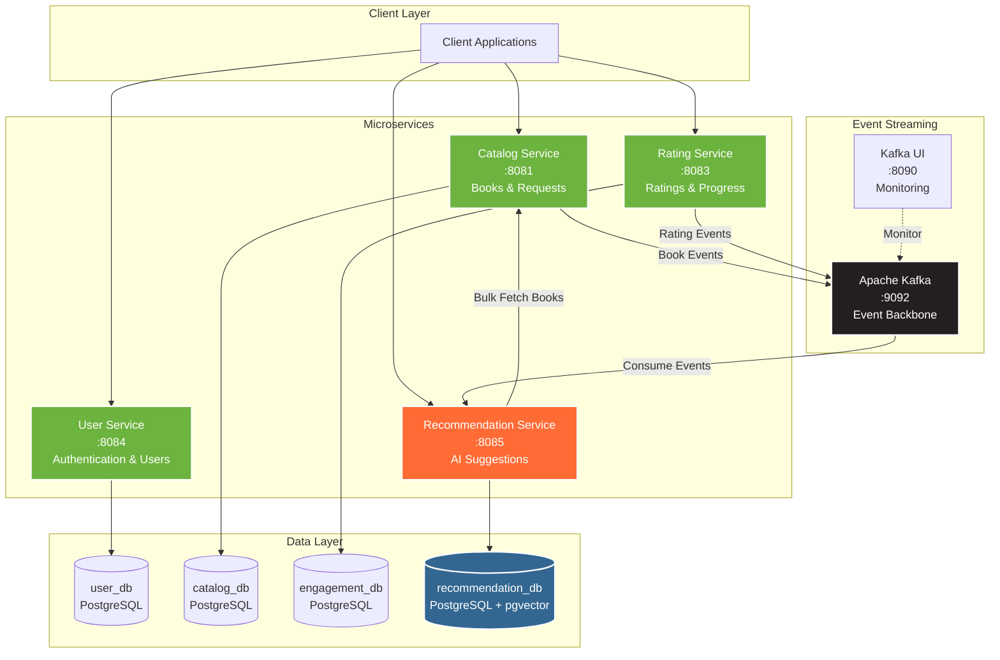
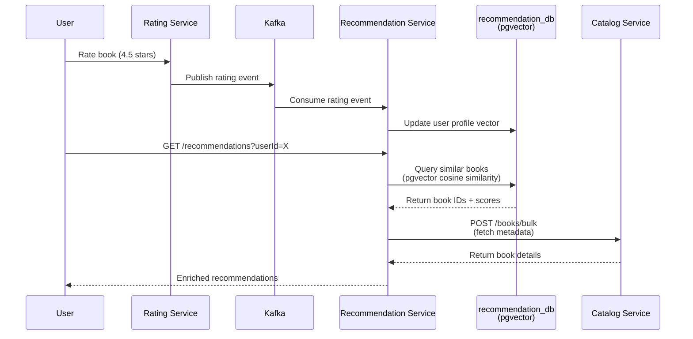
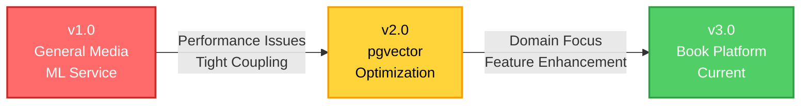
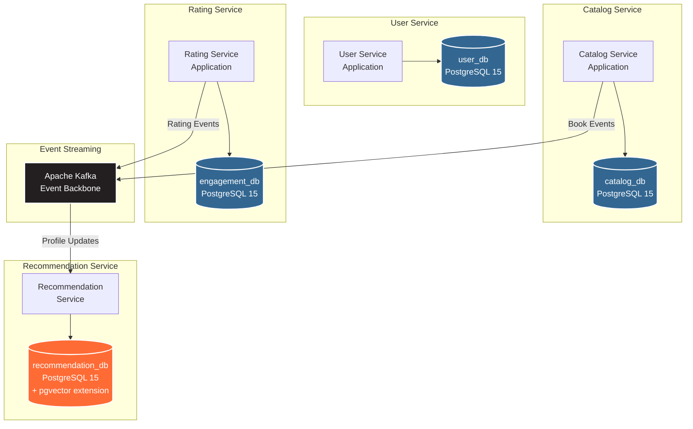
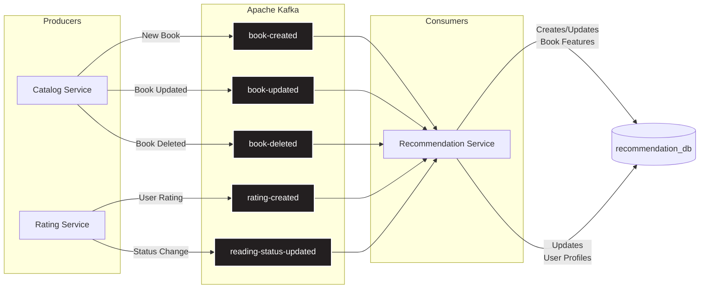

# 📖 VellumHub

[](https://openjdk.org/)
[](https://spring.io/projects/spring-boot)
[](https://www.postgresql.org/)
[](https://github.com/pgvector/pgvector)
[](https://www.docker.com/)
[](LICENSE)

**A microservices-based book recommendation platform powered by vector similarity search**

VellumHub combines the social aspects of book tracking with AI-powered recommendations. Built with Spring Boot microservices, Apache Kafka event streaming, and PostgreSQL with pgvector extension for intelligent book suggestions.

---

## Table of Contents

- [Overview](#overview)
- [Key Features](#key-features)
- [Architecture](#architecture)
  - [System Architecture](#system-architecture)
  - [Architecture Evolution](#architecture-evolution)
  - [Database Architecture](#database-architecture)
  - [Event-Driven Communication](#event-driven-communication)
- [Technology Stack](#technology-stack)
- [Quick Start](#quick-start)
- [API Endpoints](#api-endpoints)
- [Development Status](#development-status)
- [Project Structure](#project-structure)
- [Contributing](#contributing)
- [License](#license)

---

## Overview

**VellumHub** (*Vellum* - ancient parchment for manuscripts + *Hub* - central gathering point) is a distributed book recommendation platform designed around community-driven book discovery. Users can submit books for approval, rate them, track reading progress, and receive personalized recommendations.

### What Makes VellumHub Different

- **Community-Curated Catalog**: Book submissions require admin approval, ensuring quality
- **AI-Powered Recommendations**: Vector similarity search using pgvector for intelligent suggestions
- **Event-Driven Architecture**: Real-time updates via Apache Kafka message streaming
- **Microservices Design**: Independent, scalable services with database-per-service pattern

---

## Key Features

### Current Implementation

| Feature | Status | Description |
|---------|--------|-------------|
| **📚 Book Catalog Management** | ✅ Implemented | CRUD operations for books with metadata (author, ISBN, page count, genres) |
| **✋ Book Submission & Approval** | ✅ Implemented | Users submit books → Admins approve/reject → Catalog updated |
| **⭐ Rating System** | ✅ Implemented | Star ratings that influence personalized recommendations |
| **📖 Reading Progress Tracking** | ✅ Implemented | Track reading status (TO_READ, READING, COMPLETED) with page progress |
| **🎯 Personalized Recommendations** | ✅ Implemented | Vector similarity-based book suggestions using pgvector |
| **🔒 JWT Authentication** | ✅ Implemented | Secure authentication with role-based access (USER/ADMIN) |
| **📊 Event-Driven Updates** | ✅ Implemented | Kafka events for real-time profile and catalog updates |
| **🖥️ Monitoring Dashboard** | ✅ Implemented | Kafka UI for monitoring topics, consumers, and message flow |

### Planned Features

| Feature | Target | Description |
|---------|--------|-------------|
| **💬 Reading Groups** | Future | Collaborative book discussions and group reading lists |
| **🔍 ISBN Lookup** | Future | Automated book metadata fetching via ISBN APIs |
| **👥 Social Features** | Future | Follow users, share reading lists, book reviews |

---

## Architecture

VellumHub follows a **microservices architecture** with **event-driven communication** using Apache Kafka. Each service owns its database following the **Database per Service** pattern.

### System Architecture



### Data Flow: Book Recommendation



### Service Responsibilities

| Service | Port | Database | Responsibilities |
|---------|------|----------|------------------|
| **User Service** | 8084 | `user_db` | User registration, authentication (JWT), user management |
| **Catalog Service** | 8081 | `catalog_db` | Book CRUD, book request submissions, admin approval workflow |
| **Rating Service** | 8083 | `engagement_db` | Star ratings, reading status, page progress tracking |
| **Recommendation Service** | 8085 | `recommendation_db` | Vector similarity search, profile updates, recommendation aggregation |

---

## Architecture Evolution

VellumHub has undergone significant architectural transformation, evolving from a tightly-coupled system with performance bottlenecks to a modern, scalable microservices platform. This evolution demonstrates the project's maturity and commitment to engineering excellence.

### Evolution Timeline



### Version 1.0: General Media Platform with ML Service

**Architecture:**
```
┌──────────┐     REST      ┌─────────────────┐     REST      ┌────────────┐
│  Client  │ ────────────> │ Recommendation  │ ────────────> │ ML Service │
└──────────┘               │    Service      │               │  (Flask)   │
                           └─────────────────┘               └────────────┘
                                    │                               │
                                    │                               │
                                    └───────── Shared DB ───────────┘
```

**Characteristics:**
- **Content Type:** Movies, TV shows, Music
- **Services:** 5 (including Python Flask ML Service)
- **Interactions:** LIKE, DISLIKE, WATCH
- **Recommendation Engine:** External ML Service with REST API

**Critical Problems Identified:**

| Problem | Impact | Root Cause |
|---------|--------|------------|
| **Excessive Latency** | 3+ network hops per request | ML Service processed recommendations synchronously, adding unavoidable network latency |
| **Tight Coupling** | ML Service failure brought down recommendations | Shared database between Java and Python services |
| **Redundant Computation** | Full recalculation on every request | No caching, profile recomputed per request |
| **Poor API Design** | Client had to orchestrate multiple calls | Recommendations returned IDs only, required separate metadata fetch |

### Version 2.0: pgvector Integration & Performance Optimization

**Key Innovation:** Eliminated external ML Service and integrated vector similarity search directly into PostgreSQL using pgvector extension.

**Architecture:**
```
┌──────────┐                 ┌─────────────────┐
│  Client  │ ──────────────> │ Recommendation  │
└──────────┘     REST        │    Service      │
                             └─────────────────┘
                                      │
                          ┌───────────┴───────────┐
                          │   recommendation_db   │
                          │   (pgvector enabled)  │
                          │   Cosine similarity   │
                          └───────────────────────┘
                                      │
                          Bulk fetch  │  enrichment
                                      ↓
                             ┌─────────────────┐
                             │ Catalog Service │
                             └─────────────────┘
```

**Improvements:**

| Problem Solved | v1 Approach | v2 Solution |
|----------------|-------------|-------------|
| **Latency** | 3+ network hops | Single DB query + 1 bulk fetch |
| **Coupling** | Java ↔ Python ↔ Shared DB | Pure Java stack, pgvector native queries |
| **Computation** | Per-request calculation | Real-time Kafka profile updates, instant lookup |
| **API Design** | Client orchestration | Server-side aggregation with enriched response |

**Technical Achievements:**
- ✅ **60-75% latency reduction** (from ~300-500ms to ~80-120ms) through ML Service elimination
- ✅ **Pure Java stack** - removed Python dependency and operational complexity
- ✅ **Event-driven profiles** - Kafka consumers update user vectors in real-time
- ✅ **Native vector queries** - PostgreSQL `<=>` operator with HNSW indexing

### Version 3.0: Book-Focused Platform (Current)

**Strategic Pivot:** Transitioned from general media to specialized book recommendation platform with curated catalog and enhanced user engagement.

**Architecture:**
```
┌──────────┐                 ┌─────────────────┐
│  Client  │ ──────────────> │   Book Catalog  │ ─┐
└──────────┘                 │     Service     │  │
      │                      └─────────────────┘  │
      │                                            │ Kafka
      │                      ┌─────────────────┐  │ Events
      ├────────────────────> │ Rating Service  │ ─┤
      │                      └─────────────────┘  │
      │                               │            │
      │                               ↓            ↓
      │                      ┌──────────────────────┐
      └────────────────────> │  Recommendation      │
                             │  Service (pgvector)  │
                             └──────────────────────┘
```

**Evolution Highlights:**

| Aspect | v1 (Original) | v2 (Optimized) | v3 (Current) |
|--------|---------------|----------------|--------------|
| **Domain** | General Media | General Media | Books Only |
| **Services** | 5 (incl. Flask ML) | 4 (pure Java) | 4 (book-focused) |
| **Content** | Movies, TV, Music | Movies, TV, Music | Books + Authors |
| **Interactions** | LIKE, DISLIKE, WATCH | LIKE, DISLIKE, WATCH | ⭐ Star Ratings (0–5)<br/>📖 Reading Status |
| **Catalog** | Open creation | Open creation | 🛡️ Admin Approval Required |
| **Recommendation** | ML Service (REST) | pgvector (SQL) | pgvector + Reading Patterns |
| **Latency** | ~300-500ms | ~80-120ms | ~80-120ms |
| **Profile Updates** | On-demand | Real-time (Kafka) | Real-time (Kafka) |
| **Enrichment** | Client-side | Server-side | Server-side |

**v3.0 Enhancements:**
- 📚 **Book-Specific Entities:** Author, ISBN, page count, genres, publication year
- ✋ **Approval Workflow:** User submissions require admin review before catalog addition
- ⭐ **Star Rating System:** 0-5 star ratings replace binary like/dislike
- 📖 **Reading Progress:** TO_READ, READING (with page tracking), COMPLETED statuses
- 🎯 **Enhanced Recommendations:** Incorporates reading patterns and rating history

### Development Philosophy

The architectural evolution of VellumHub reflects three core engineering principles:

1. **Performance Through Simplicity** - Each evolution removed complexity while improving performance
2. **Domain-Driven Design** - v3.0 pivot aligned technical architecture with business domain (books)
3. **Operational Excellence** - Event-driven architecture enables real-time updates without synchronous dependencies

---

## Database Architecture

VellumHub implements the **Database per Service** pattern, ensuring complete autonomy and independent scalability for each microservice.



### Database Schemas

| Database | Service | Key Tables | Purpose |
|----------|---------|------------|---------|
| **user_db** | User Service | `users`, `roles`, `user_preferences` | User accounts, authentication credentials, role-based permissions |
| **catalog_db** | Catalog Service | `books`, `book_requests`, `book_progress` | Book metadata, submission approval workflow, reading status |
| **engagement_db** | Rating Service | `ratings` | Star ratings linked to users and books |
| **recommendation_db** | Recommendation Service | `book_features`, `user_profiles`, `recommendations` | Vector embeddings (book features + user preference vectors) |

### pgvector Implementation

The Recommendation Service database leverages **pgvector** extension for high-performance similarity search:

**Vector Storage:**
```sql
-- Book feature vectors (genre-based embeddings)
-- 128 dimensions: optimized balance between embedding richness and query performance
CREATE TABLE book_features (
    id UUID PRIMARY KEY,
    book_id UUID NOT NULL,
    feature_vector vector(128),  -- Book embedding (genres, metadata)
    created_at TIMESTAMP
);

-- User profile vectors (preference embeddings)
-- 128 dimensions: matches book vectors for direct cosine similarity computation
CREATE TABLE user_profiles (
    id UUID PRIMARY KEY,
    user_id UUID NOT NULL,
    profile_vector vector(128),  -- User preference embedding
    updated_at TIMESTAMP
);
```

**Vector Similarity Query:**
```sql
-- Find similar books using cosine distance
SELECT book_id, (feature_vector <=> $1::vector) as similarity
FROM book_features
ORDER BY feature_vector <=> $1::vector
LIMIT 10;
```

**Performance Optimization:**
- **HNSW Index** (Hierarchical Navigable Small World) for approximate nearest neighbor search
- **Fast lookups** on datasets with 100K+ book vectors (typically under 100ms)
- **Real-time updates** via Kafka event consumers

---

## Event-Driven Communication

VellumHub uses **Apache Kafka** as the central nervous system for asynchronous communication between services.

### Kafka Topics & Data Flow



### Event Types

| Event | Producer | Consumer | Trigger | Action |
|-------|----------|----------|---------|--------|
| **book-created** | Catalog Service | Recommendation Service | Book approved by admin | Create `BookFeature` with genre-based vector embedding |
| **book-updated** | Catalog Service | Recommendation Service | Book metadata changed | Update `BookFeature` vector |
| **book-deleted** | Catalog Service | Recommendation Service | Book removed from catalog | Delete `BookFeature` |
| **rating-created** | Rating Service | Recommendation Service | User rates a book | Update `UserProfile` preference vector |
| **reading-status-updated** | Rating Service | Recommendation Service | User updates reading progress | Adjust `UserProfile` weights |

### Benefits of Event-Driven Architecture

✅ **Loose Coupling** - Services communicate without direct dependencies  
✅ **Scalability** - Consumers process events independently at their own pace  
✅ **Resilience** - Kafka retains events; consumers can replay if failures occur  
✅ **Real-Time Updates** - User profiles updated immediately when ratings change  
✅ **Audit Trail** - All state changes captured in event log  

---

## Technology Stack

### Core Technologies

| Category | Technology | Version | Purpose |
|----------|------------|---------|---------|
| **Language** | Java | 21 LTS | Backend runtime |
| **Framework** | Spring Boot | 3.4.2 | Microservices framework |
| **Database** | PostgreSQL | 15-alpine | Relational data storage |
| **Vector Search** | pgvector | latest | AI-powered similarity search |
| **Message Broker** | Apache Kafka | 7.5.0 | Event streaming |
| **Coordination** | Apache Zookeeper | 7.5.0 | Kafka cluster management |

### Infrastructure

| Technology | Purpose |
|------------|---------|
| **Docker** | Service containerization |
| **Docker Compose** | Multi-container orchestration |
| **Maven** | Build automation |
| **Spring Cloud OpenFeign** | Declarative REST client |

### Security & Data

| Technology | Purpose |
|------------|---------|
| **Spring Security + JWT** | Authentication & authorization |
| **Spring Data JPA** | ORM and data access |
| **Hibernate Vector Type** | Native pgvector integration |

---

## Quick Start

### Prerequisites

- **Docker** 20.10+
- **Docker Compose** 2.0+

Verify installations:

```bash
docker --version
docker-compose --version
```

### Installation

1. **Clone the repository**

   ```bash
   git clone https://github.com/Luca5Eckert/VellumHub.git
   cd VellumHub
   ```

2. **Configure environment variables**

   Create a `.env` file:

   ```env
   # Database Credentials
   POSTGRES_USER=admin
   POSTGRES_PASSWORD=your-secure-password
   
   # JWT Configuration
   JWT_KEY=your-256-bit-secret-key-here
   JWT_EXPIRATION=86400000
   ```

   > ⚠️ **Security**: Use strong, randomly generated values in production

3. **Start all services**

   ```bash
   docker-compose up -d
   ```

   This will start:
   - 4 PostgreSQL databases
   - 4 Spring Boot microservices
   - Apache Kafka + Zookeeper
   - Kafka UI dashboard

4. **Verify deployment**

   ```bash
   docker-compose ps
   ```

   All services should show `Up` or `healthy` status.

5. **Access the services**

   | Service | URL | Purpose |
   |---------|-----|---------|
   | User Service | http://localhost:8084 | Registration & authentication |
   | Catalog Service | http://localhost:8081 | Book management |
   | Rating Service | http://localhost:8083 | Ratings & progress |
   | Recommendation Service | http://localhost:8085 | Get recommendations |
   | Kafka UI | http://localhost:8090 | Monitor Kafka topics |

### Quick Test

Register a user and verify the system:

```bash
# Register a new user
curl -X POST http://localhost:8084/auth/register \
  -H "Content-Type: application/json" \
  -d '{
    "name": "Test User",
    "email": "test@example.com",
    "password": "SecurePass123!"
  }'

# Login to get JWT token
curl -X POST http://localhost:8084/auth/login \
  -H "Content-Type: application/json" \
  -d '{
    "email": "test@example.com",
    "password": "SecurePass123!"
  }'
```

---

## API Endpoints

### User Service (Port 8084)

#### Authentication

```http
POST /auth/register
POST /auth/login
```

#### User Management

```http
GET    /users          # List users (paginated, ADMIN only)
GET    /users/{id}     # Get user by ID
PUT    /users/{id}     # Update user
DELETE /users/{id}     # Delete user (ADMIN only)
```

### Catalog Service (Port 8081)

#### Books

```http
GET    /books              # List all approved books (paginated)
GET    /books/{id}         # Get book details
POST   /books              # Create book (ADMIN only - for now)
PUT    /books/{id}         # Update book (ADMIN only)
DELETE /books/{id}         # Delete book (ADMIN only)
POST   /books/bulk         # Get multiple books by IDs
```

#### Book Requests

```http
POST   /book-requests                  # Submit book for approval
POST   /book-requests/{id}/approve     # Approve book (ADMIN only)
```

### Rating Service (Port 8083)

```http
POST   /rating             # Submit a rating
GET    /rating/user/{id}   # Get user's ratings
```

### Recommendation Service (Port 8085)

```http
GET    /api/recommendations?userId={uuid}&limit={n}
```

Returns personalized book recommendations based on:
- User's rating history
- Reading patterns
- Vector similarity with preferred genres/books

---

## Development Status

### Current State

VellumHub is in **active development** with core features implemented and functional:

✅ **Infrastructure**: All 4 microservices deployed with Docker  
✅ **Database**: PostgreSQL with pgvector extension operational  
✅ **Event Streaming**: Kafka topics configured and working  
✅ **Core Features**: Book catalog, ratings, and recommendations working  
✅ **Monitoring**: Kafka UI integrated for observability  

### What's Working

- User registration and JWT authentication
- Book CRUD operations
- Book submission and admin approval workflow
- Star rating system
- Reading progress tracking (status + page count)
- Vector-based book recommendations
- Real-time profile updates via Kafka events

### Known Limitations

- No API Gateway (services exposed directly)
- Limited error handling in some endpoints
- No comprehensive test coverage yet
- Recommendation algorithm is basic (genre-based vectors)
- No frontend application
- No CI/CD pipeline

### Roadmap

#### Short Term
- [ ] Implement comprehensive API Gateway
- [ ] Add unit and integration tests
- [ ] Enhance recommendation algorithm
- [ ] Add OpenAPI/Swagger documentation
- [ ] Improve error handling and validation

#### Long Term
- [ ] Build React/Next.js frontend
- [ ] Add social features (followers, reviews)
- [ ] Implement reading groups
- [ ] ISBN API integration for metadata
- [ ] Deploy to cloud infrastructure (AWS/GCP)
- [ ] Add search and filtering capabilities

---

## Project Structure

```
VellumHub/
│
├── docker-compose.yml              # Multi-service orchestration
├── .env                            # Environment variables (not in git)
│
├── scripts/
│   ├── create-admin-user.sql      # Admin user initialization
│   ├── create-vector-in-recommendation-db.sql  # pgvector setup
│   ├── kafka-health-check.sh      # Kafka monitoring script
│   └── test-service-communication.sh           # Communication tests
│
├── catalog-service/               # Book Catalog Microservice
│   ├── Dockerfile
│   ├── pom.xml
│   └── src/main/java/com/mrs/catalog_service/
│       └── module/
│           ├── book/              # Book management
│           ├── book_request/      # Approval workflow
│           └── book_progress/     # Reading status
│
├── user-service/                  # User Management Microservice
│   ├── Dockerfile
│   ├── pom.xml
│   └── src/main/java/com/mrs/user_service/
│       └── module/
│           ├── auth/              # Authentication & JWT
│           └── user/              # User management
│
├── engagement-service/            # Rating Microservice
│   ├── Dockerfile
│   ├── pom.xml
│   └── src/main/java/com/mrs/engagement_service/
│       └── module/
│           └── rating/            # Star ratings
│
└── recommendation-service/        # Recommendation Engine
    ├── Dockerfile
    ├── pom.xml
    └── src/main/java/com/mrs/recommendation_service/
        └── module/
            ├── book_feature/      # Book vector embeddings
            ├── user_profile/      # User preference vectors
            └── recommendation/    # Recommendation logic
```

---

## Monitoring

### Kafka UI Dashboard

Access the Kafka UI at **http://localhost:8090** to monitor:

- Topic message flow
- Consumer group lag
- Broker health
- Message contents

### Service Health Checks

All services expose Spring Boot Actuator endpoints:

```bash
curl http://localhost:8081/actuator/health  # Catalog Service
curl http://localhost:8083/actuator/health  # Rating Service
curl http://localhost:8084/actuator/health  # User Service
curl http://localhost:8085/actuator/health  # Recommendation Service
```

### Service Logs

```bash
# View logs for specific service
docker logs -f catalog-service

# View Kafka broker logs
docker logs -f kafka
```

---

## Contributing

Contributions are welcome! Please follow these guidelines:

1. Fork the repository
2. Create a feature branch (`git checkout -b feature/amazing-feature`)
3. Commit your changes (`git commit -m 'Add amazing feature'`)
4. Push to your branch (`git push origin feature/amazing-feature`)
5. Open a Pull Request

### Development Guidelines

- Follow existing code structure and patterns
- Write meaningful commit messages
- Update documentation as needed
- Ensure Docker services build successfully

---

## License

This project is licensed under the MIT License - see the [LICENSE](LICENSE) file for details.

---

## Contact

**Project Link**: https://github.com/Luca5Eckert/VellumHub

For questions or issues, please open an issue on GitHub.

---

**VellumHub** - *Where every book finds its reader* 📚
