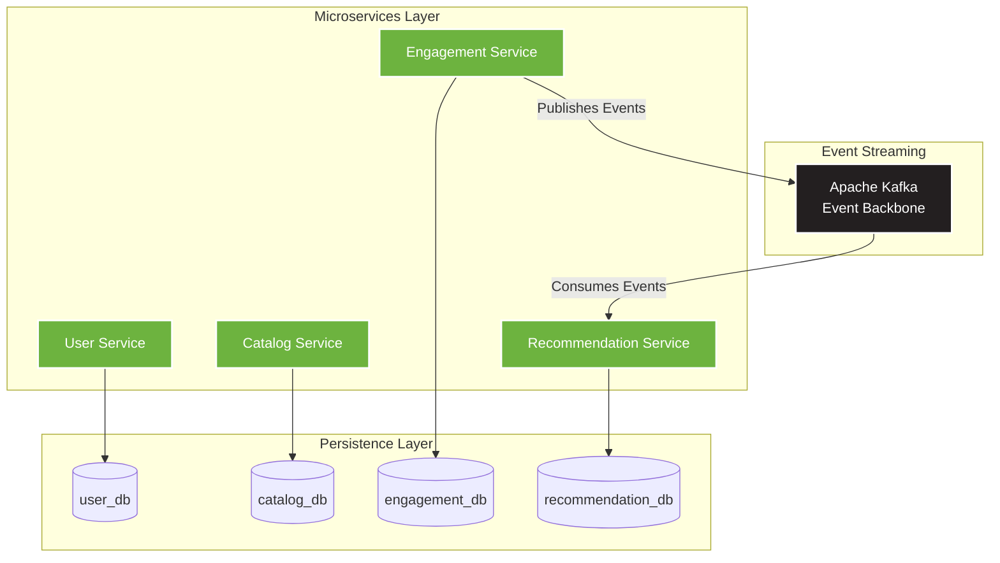

# 🎬 Media Recommendation System

> A next-generation, event-driven media recommendation platform inspired by Netflix and Spotify, built with microservices architecture and powered by machine learning.

[](https://www.docker.com/)
[](https://www.postgresql.org/)
[](https://kafka.apache.org/)
[](https://spring.io/projects/spring-boot)
[](https://www.python.org/)
[](https://openjdk.org/)

## 🚀 Overview

The **Media Recommendation System** is a scalable, distributed application designed to deliver personalized content recommendations to users in real-time. Built with a **microservices architecture** and **event-driven communication**, the system leverages **Apache Kafka** for asynchronous messaging between services, enabling real-time analytics and seamless data flow.

### ✨ Key Highlights

- **5 Microservices** working together in a distributed architecture
- **JWT-based authentication** with role-based access control (USER/ADMIN)
- **Hybrid ML recommendation algorithm** combining content-based filtering (70%) and popularity scoring (30%)
- **Event-driven architecture** with Apache Kafka for real-time data streaming
- **Database-per-service pattern** ensuring complete service isolation
- **Production-ready** Docker Compose setup for local development

### 🏗️ Architecture

The system follows a **microservices architecture** with event-driven communication. Each microservice follows the **Database per Service** pattern, ensuring complete isolation and independent scalability.



**Key Components:**
- 🔐 **User Service (90%)** → `user_db`: Full authentication (register/login), JWT tokens, user CRUD, and user preferences management
- 📚 **Catalog Service (85%)** → `catalog_db`: Media catalog with CRUD operations, genre support, and admin security
- 💡 **Engagement Service (80%)** → `engagement_db`: Tracks user interactions (views, likes, ratings, watch time, etc.) and publishes events to Kafka
- 🎯 **Recommendation Service (75%)** → `recommendation_db`: Consumes engagement events from Kafka, maintains user profiles and media features, orchestrates ML-powered recommendations
- 🤖 **ML Service (95%)**: Stateless Python microservice that calculates personalized recommendations using a hybrid algorithm
- 📨 **Apache Kafka**: Central event bus for asynchronous communication between services

> **📝 Local Development Note**: For simplified local development with Docker Compose, all four databases (`user_db`, `catalog_db`, `engagement_db`, `recommendation_db`) are hosted within a single PostgreSQL 15 container. This approach maintains logical database separation while reducing infrastructure complexity in the development environment. In production, each database would be deployed as an independent instance to ensure complete service isolation.

## 🤖 ML Service - Hybrid Recommendation Engine

The **ML Service** is a **production-ready Python microservice** (95% complete) that calculates personalized media recommendations using a hybrid algorithm.

### Architecture & Design
- **Hybrid Design**: Receives UserProfile via API, fetches MediaFeatures from recommendation_db
- **Content-Based Filtering (70%)**: Matches media genres to user preference scores
- **Popularity Boost (30%)**: Considers media popularity for balanced recommendations
- **Database-per-Service**: Only accesses recommendation_db, maintaining service isolation
- **Efficient Payload**: Small request (~1KB UserProfile only, no media list)
- **Production Ready**: Gunicorn server, connection pooling, health checks

### Integration Flow
```
recommendation-service (Java)
    ↓
    1. Fetches UserProfile from recommendation_db
    2. Calls ML Service API with UserProfile
    ↓
ml-service (Python)
    ↓
    3. Fetches MediaFeatures from recommendation_db
    4. Calculates hybrid recommendations
    5. Returns scored media list
    ↓
recommendation-service
    6. Stores/returns personalized recommendations
```

### Quick Start
```bash
# Check service health
curl http://localhost:5000/health

# Calculate recommendations (called by recommendation-service)
curl -X POST http://localhost:5000/api/recommendations \
  -H "Content-Type: application/json" \
  -d '{
    "user_profile": {
      "user_id": "<your-user-uuid>",
      "genre_scores": {"ACTION": 5.0, "THRILLER": 3.0},
      "interacted_media_ids": []
    },
    "limit": 10
  }'
```

### Performance
- **Processing Time**: <100ms per request (including DB query)
- **Concurrent Capacity**: 4 workers × 2 threads = 8 concurrent requests
- **Connection Pool**: 2-10 PostgreSQL connections
- **Scalability**: Horizontally scalable with shared database

📖 **Full Documentation**: See [ML Service README](ml-service/README.md) and [Architecture Decisions](ml-service/ARCHITECTURE.md)

## 📦 Technology Stack

| Category | Technology | Version | Status |
|----------|------------|---------|--------|
| **Containerization** | Docker & Docker Compose | Latest | ✅ Production Ready |
| **Database** | PostgreSQL | 15 | ✅ Production Ready |
| **Message Broker** | Apache Kafka (Confluent) | 7.3.0 | ✅ Production Ready |
| **Coordination** | Apache Zookeeper | 7.3.0 | ✅ Production Ready |
| **Backend (Java)** | Spring Boot | 4.0.0 | ✅ Production Ready |
| **JDK** | Java | 21 | ✅ LTS |
| **Backend (Python)** | Flask | 3.0.0 | ✅ Production Ready |
| **Python Runtime** | Python | 3.11+ | ✅ |
| **WSGI Server** | Gunicorn | 21.2.0 | ✅ Production Ready |
| **Security** | Spring Security + JWT | - | ✅ Implemented |
| **ORM** | Spring Data JPA / Hibernate | - | ✅ Implemented |
| **Build** | Maven | 3.9 | ✅ |

## 🗄️ Database Architecture

The system follows the **Database per Service** pattern, a core principle of microservices architecture that ensures:
- ✅ **Service Isolation**: Each microservice owns its data and schema
- ✅ **Independent Scalability**: Databases can be scaled independently based on service needs
- ✅ **Technology Flexibility**: Each service can choose the optimal database technology
- ✅ **Fault Isolation**: Database issues in one service don't cascade to others

| Database | Owner Service | Purpose |
|----------|---------------|---------|
| `user_db` | User Service | User accounts, authentication, preferences |
| `catalog_db` | Catalog Service | Media catalog and metadata |
| `engagement_db` | Engagement Service | User interactions (views, likes, ratings, watch time) |
| `recommendation_db` | Recommendation Service + ML Service | User profiles, media features, recommendations |

> 💡 **Auto-Initialization**: All databases are automatically created during the first startup via the `./scripts/create-databases.sql` initialization script.

> 🏗️ **Local Development Setup**: For the local Docker Compose environment, all four databases run within a single PostgreSQL 15 container instance. This simplified approach maintains logical separation while reducing resource overhead for development. In production deployments, each database would be provisioned as a separate instance to achieve full physical isolation.

## ⚙️ Prerequisites

Before running the project, ensure you have the following installed:

- 🐳 **Docker**: [Install Docker](https://docs.docker.com/get-docker/)
- 🐙 **Docker Compose**: [Install Docker Compose](https://docs.docker.com/compose/install/)

Verify your installations:
```bash
docker --version
docker-compose --version
```

## 🚀 Getting Started

### Quick Start

1. **Clone the repository**:
   ```bash
   git clone https://github.com/Luca5Eckert/media-recommendation-system.git
   cd media-recommendation-system
   ```

2. **Create environment file** (copy from example or create `.env`):
   ```bash
   # Required environment variables (use strong values in production!)
   POSTGRES_USER=user
   POSTGRES_PASSWORD=your-secure-password-here
   JWT_KEY=your-256-bit-secret-key-here
   JWT_EXPIRATION=86400000
   ```

3. **Start all services**:
   ```bash
   docker-compose up -d
   ```

4. **Verify services are running**:
   ```bash
   docker-compose ps
   ```

5. **Check health endpoints**:
   ```bash
   # ML Service health
   curl http://localhost:5000/health
   
   # User Service (register a test user)
   curl -X POST http://localhost:8084/auth/register \
     -H "Content-Type: application/json" \
     -d '{"name": "Test User", "email": "test@example.com", "password": "SecurePass123!"}'
   ```

That's it! 🎉 The system is now running with:
- ✅ PostgreSQL with 4 databases automatically initialized
- ✅ Apache Kafka ready for event streaming
- ✅ Zookeeper managing Kafka coordination
- ✅ User Service with authentication (port 8084)
- ✅ Catalog Service with media management (port 8081)
- ✅ Engagement Service for interaction tracking (port 8083)
- ✅ Recommendation Service with Kafka consumers (port 8085)
- ✅ ML Service for personalized recommendations (port 5000)

### 📂 Auto-Initialization

The `./scripts/create-databases.sql` file contains SQL commands to create all required databases. This script is automatically executed when PostgreSQL starts for the first time, thanks to Docker's `docker-entrypoint-initdb.d` mechanism.

## 🔧 Useful Commands

### Docker Management

**View all running containers:**
```bash
docker-compose ps
```

**Stop all services:**
```bash
docker-compose down
```

**Restart services:**
```bash
docker-compose restart
```

**Remove volumes (⚠️ deletes all data):**
```bash
docker-compose down -v
```

### Database Access

**View PostgreSQL logs:**
```bash
docker logs media-db
```

**Access PostgreSQL CLI:**
```bash
docker exec -it media-db psql -U user -d user_db
```

**List all databases:**
```bash
docker exec -it media-db psql -U user -d user_db -c "\l"
```

**Connect to a specific database:**
```bash
docker exec -it media-db psql -U user -d catalog_db
```

### Kafka Management

**View Kafka logs:**
```bash
docker logs kafka
```

**List Kafka topics:**
```bash
docker exec -it kafka kafka-topics --list --bootstrap-server localhost:9092
```

**Create a new topic:**
```bash
docker exec -it kafka kafka-topics --create --topic engagement-events --bootstrap-server localhost:9092 --partitions 3 --replication-factor 1
```

## 🌐 Service Ports & API Endpoints

| Service | Port | Access | Main Endpoints |
|---------|------|--------|----------------|
| PostgreSQL | `5432` | `localhost:5432` | Database connection |
| Apache Kafka | `9092` | `localhost:9092` | Event streaming |
| Zookeeper | `2181` | `localhost:2181` | Kafka coordination |
| **User Service** | `8084` | `http://localhost:8084` | `/auth/register`, `/auth/login`, `/users` |
| **Catalog Service** | `8081` | `http://localhost:8081` | `/media` (CRUD) |
| **Engagement Service** | `8083` | `http://localhost:8083` | `/engagement` (POST) |
| **Recommendation Service** | `8085` | `http://localhost:8085` | `/api/recommendations` |
| **ML Service** | `5000` | `http://localhost:5000` | `/api/recommendations`, `/health` |

### Database Connection Details

```
Host: localhost
Port: 5432
User: user
Password: password
Databases: user_db, catalog_db, engagement_db, recommendation_db
```

## 📈 Project Status

🚀 **This project is in advanced MVP stage** - Core functionality is implemented and services are operational.

### 📊 Service Completion Status

| Service | Backend | API | Security | Overall |
|---------|---------|-----|----------|---------|
| **User Service** | ✅ 95% | ✅ 90% | ✅ JWT | **90%** |
| **Catalog Service** | ✅ 90% | ✅ 80% | ✅ JWT | **85%** |
| **Engagement Service** | ✅ 80% | ⚠️ 60% | ✅ JWT | **80%** |
| **Recommendation Service** | ✅ 75% | ⚠️ 70% | ✅ JWT | **75%** |
| **ML Service** | ✅ 95% | ✅ 95% | N/A | **95%** |
| **Infrastructure** | ✅ 100% | N/A | N/A | **100%** |

### ✅ Completed Features

**Infrastructure:**
- [x] Docker Compose configuration with all 6 services
- [x] PostgreSQL 15 with multi-database architecture (4 isolated DBs)
- [x] Apache Kafka and Zookeeper integration
- [x] Database auto-initialization scripts
- [x] Dockerfiles with multi-stage builds for all services

**User Service:**
- [x] User authentication (`/auth/register`, `/auth/login`)
- [x] JWT token generation and validation
- [x] User CRUD operations (Create, Read, Update, Delete)
- [x] User roles (USER, ADMIN)
- [x] User preferences management with genres
- [x] OAuth2 Resource Server security

**Catalog Service:**
- [x] Media entity with full metadata (title, description, releaseYear, genres, coverUrl)
- [x] CRUD operations (Create, Read by ID, Read All paginated, Delete)
- [x] Builder Pattern for object creation
- [x] Kafka integration for media events
- [x] `@PreAuthorize` security for admin operations

**Engagement Service:**
- [x] Interaction tracking (VIEW, LIKE, DISLIKE, RATING, WATCH_TIME, CLICK, SHARE, SAVE)
- [x] POST endpoint for recording interactions
- [x] Kafka event publishing (`engagement-created` topic)
- [x] Validation and persistence handlers

**Recommendation Service:**
- [x] UserProfile, MediaFeature, and Recommendation entities
- [x] Kafka consumers for engagement, media creation, and deletion events
- [x] User profile updates based on interactions
- [x] Integration with ML Service via REST
- [x] GET endpoint for personalized recommendations

**ML Service:**
- [x] Hybrid recommendation algorithm (Content-based 70% + Popularity 30%)
- [x] Efficient API design (receives UserProfile, fetches media from DB)
- [x] PostgreSQL connection pooling
- [x] Gunicorn production server
- [x] Health check endpoint
- [x] Complete documentation (README.md, ARCHITECTURE.md)

### 🛣️ Remaining for MVP Completion

**High Priority:**
- [ ] Complete inter-service communication (Catalog → Kafka → Recommendation sync)
- [ ] Media update endpoint (PUT /media/{id})
- [ ] Media search/filter by genre and type
- [ ] User interaction history endpoint
- [ ] Automated tests (unit and integration)

**Medium Priority:**
- [ ] Exception handlers standardization
- [ ] OpenAPI/Swagger documentation
- [ ] Dead Letter Queue for failed Kafka events
- [ ] Circuit breaker for ML Service calls

**Future Enhancements (Post-MVP):**
- [ ] API Gateway
- [ ] Refresh token support
- [ ] Redis caching for recommendations
- [ ] CI/CD pipelines
- [ ] Kubernetes orchestration
- [ ] Monitoring (Prometheus, Grafana)
- [ ] Distributed tracing (Jaeger/Zipkin)
- [ ] Frontend application (Web/Mobile)

## 📁 Project Structure

```
media-recommendation-system/
├── docker-compose.yml           # Orchestration for all 6 services
├── scripts/
│   └── create-databases.sql     # Database initialization
│
├── catalog-service/             # Spring Boot (Java 21)
│   └── src/main/java/.../
│       ├── controller/          # MediaController (CRUD)
│       ├── model/               # Media, Genre, MediaType
│       ├── dto/                 # Request/Response DTOs
│       ├── service/             # Business logic
│       ├── handler/             # Command handlers
│       ├── repository/          # JPA repositories
│       └── security/            # JWT configuration
│
├── user-service/                # Spring Boot (Java 21)
│   └── src/main/java/.../
│       ├── controller/          # AuthController, UserController
│       ├── model/               # UserEntity, RoleUser, UserPreference
│       ├── dto/                 # Auth & User DTOs
│       ├── service/             # Auth & User services
│       ├── security/            # JWT Token Service
│       └── validator/           # Custom validators
│
├── engagement-service/          # Spring Boot (Java 21)
│   └── src/main/java/.../
│       ├── controller/          # EngagementController
│       ├── model/               # Interaction, InteractionType
│       ├── event/               # Kafka events
│       └── handler/             # Event handlers
│
├── recommendation-service/      # Spring Boot (Java 21)
│   └── src/main/java/.../
│       ├── controller/          # RecommendationController
│       ├── model/               # UserProfile, MediaFeature
│       ├── consumer/            # Kafka consumers
│       └── service/             # ML integration
│
└── ml-service/                  # Python/Flask
    ├── app.py                   # Flask API endpoints
    ├── services/
    │   └── recommendation_engine.py  # Hybrid algorithm
    ├── database/
    │   ├── db_connection.py     # Connection pooling
    │   └── media_feature_repository.py
    ├── README.md                # Detailed documentation
    └── ARCHITECTURE.md          # Design decisions
```

## 📖 Additional Documentation

- [ML Service README](ml-service/README.md) - Detailed ML Service documentation
- [ML Service Architecture](ml-service/ARCHITECTURE.md) - Design decisions and rationale
- [Project Analysis](PROJECT_ANALYSIS.md) - Complete project analysis and execution plan

## 🤝 Contributing

Contributions are welcome! Please feel free to submit a Pull Request.

## 📄 License

This project is licensed under the MIT License.

## 📧 Contact

For questions or suggestions, please open an issue in the repository.

---

⭐ **If you find this project useful, please consider giving it a star!** ⭐
