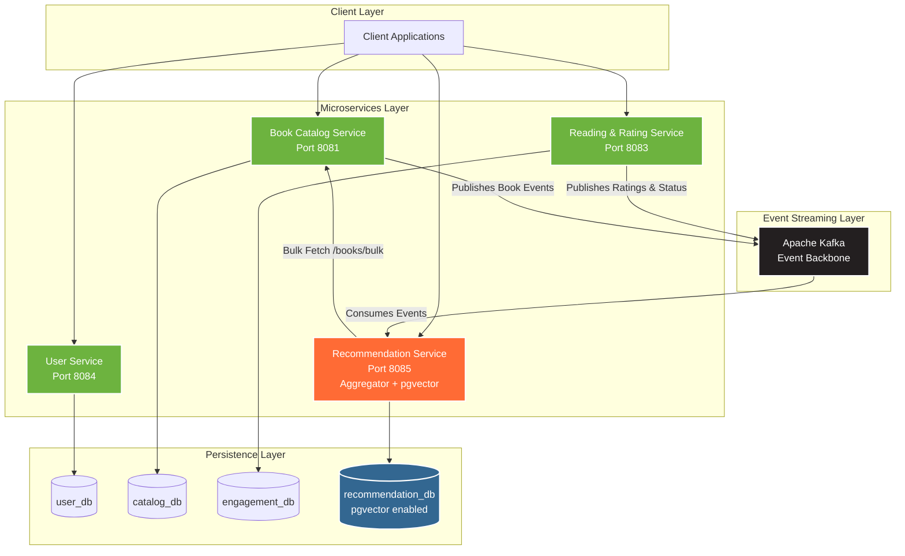

# 📖 VellumHub

[](https://github.com/Luca5Eckert/media-recommendation-system)
[](https://openjdk.org/)
[](https://spring.io/projects/spring-boot)
[](https://www.postgresql.org/)
[](https://www.docker.com/)

A book-focused recommendation platform inspired by Letterboxd, built for readers. Catalog books, rate them with stars, track your reading progress, and get personalized recommendations — all powered by **vector similarity search** with **pgvector** and an event-driven microservices architecture.

---

## Table of Contents

- [Overview](#overview)
- [Key Features](#key-features)
- [Architecture](#architecture)
- [Architecture Evolution](#architecture-evolution)
- [Technology Stack](#technology-stack)
- [Getting Started](#getting-started)
- [API Reference](#api-reference)
- [Database Architecture](#database-architecture)
- [Recommendation Engine](#recommendation-engine)
- [Project Status](#project-status)
- [Project Structure](#project-structure)
- [Commands Reference](#commands-reference)
- [Contributing](#contributing)
- [License](#license)

---

## Overview

**VellumHub** — *Vellum* (the ancient parchment used for manuscripts) + *Hub* (a central gathering point) — is a scalable, distributed application designed to help readers discover, track, and rate books. Think of it as **Letterboxd, but for books**. The platform provides a community-driven book catalog, star ratings, reading status tracking, and personalized recommendations powered by vector similarity search.

Built with a **microservices architecture** and **event-driven communication**, the system leverages **Apache Kafka** for real-time data streaming and **pgvector** for high-performance book recommendations.

## Key Features

### MVP (1.0)

| Feature | Description |
|---------|-------------|
| **📚 Book Catalog with Admin Approval** | Community-submitted book catalog where submissions require admin approval before becoming public |
| **⭐ Star Rating System (0–5)** | Rate books from 0 to 5 stars; ratings feed into personalized recommendations |
| **📖 Reading Status Tracking** | Track books as TO_READ, READING (with page progress), or COMPLETED |
| **🎯 Personalized Recommendations** | AI-powered book suggestions based on reading habits, ratings, and interactions |
| **🔒 JWT Authentication** | Secure role-based access control (USER/ADMIN roles) |
| **📊 Event-Driven Architecture** | Apache Kafka for real-time data streaming across microservices |

### Future (2.0+)

| Feature | Description |
|---------|-------------|
| **💬 Group Reading Chats** | Reading groups for collaborative book discussions |
| **🤖 Algorithmic Book Approval** | Automated book validation using ISBN lookup and metadata scoring |
| **👑 User Levels** | Normal users (rate + join groups) and Premium users (custom covers + create groups) |

---

## Architecture

The system follows a **microservices architecture** with event-driven communication. Each microservice adheres to the **Database per Service** pattern, ensuring complete isolation and independent scalability. The Recommendation Service acts as an **Aggregator**, performing vector similarity queries locally and enriching results through the Catalog Service.



### Service Descriptions

| Service | Technology | Database | Responsibilities |
|---------|------------|----------|------------------|
| **User Service** | Spring Boot 4.0 | `user_db` | Authentication, user management, preferences |
| **Book Catalog Service** | Spring Boot 4.0 | `catalog_db` | Book catalog management, submission & approval workflow, CRUD operations |
| **Reading & Rating Service** | Spring Boot 4.0 | `engagement_db` | Star ratings (0–5), reading status tracking, page progress |
| **Recommendation Service** | Spring Boot 4.0 + pgvector | `recommendation_db` | Vector similarity search, profile vectorization, catalog aggregation |

> **Note:** Each service has its own dedicated PostgreSQL 15 container ensuring complete database isolation and independent scalability. The Recommendation Service database has the `vector` extension enabled for pgvector support.

---

## Architecture Evolution

The system underwent two major evolutions — first to solve critical performance and coupling problems, then to pivot toward a book-focused platform.

### Previous Architecture (v1) — General Media + ML Service

```
Client → Recommendation Service → ML Service (Flask/Python) → recommendation_db
                                        ↓
                                  Computes scores
                                        ↓
         Recommendation Service ← Returns media IDs
                ↓
         Client must call Catalog Service separately for full media data
```

### Architecture v2 — General Media + pgvector

These problems were solved by eliminating the ML Service entirely and moving vector similarity search into PostgreSQL with pgvector:

```
Client → Recommendation Service (pgvector query) → recommendation_db
                ↓
         Bulk fetch enrichment → Catalog Service /media/bulk
                ↓
         Returns fully enriched recommendations in a single response
```

### Architecture v3 (Current) — Book Platform

```
Client → Recommendation Service (pgvector query) → recommendation_db
                ↓
         Bulk fetch enrichment → Book Catalog Service /books/bulk
                ↓
         Returns enriched book recommendations with ratings & reading status
```

#### Why v1 was replaced

The original architecture had four critical problems that made it unsustainable:

| Problem | Impact | Root Cause |
|---------|--------|------------|
| **Excessive latency** | Every recommendation request required 3+ network hops (Recommendation Service → ML Service → Database → back) | The ML Service was a synchronous REST intermediary between the Java backend and the database |
| **Tight coupling** | A failure in the Python ML Service brought down recommendations entirely | The Java Recommendation Service and the Flask ML Service shared the same database, creating hidden dependencies |
| **Redundant computation** | Recommendations were recalculated from scratch on every single request, wasting CPU and increasing response times | No caching or pre-computation strategy — the ML Service ran the full scoring algorithm per request |
| **Weak API abstraction** | The front-end had to orchestrate multiple service calls manually (get recommendations, then fetch media details separately) | The Recommendation Service returned only media IDs, forcing the client to make additional calls to the Catalog Service |

#### How v2 solved each problem

| Problem | v1 | v2 Solution |
|---------|-----|-------------|
| **Excessive latency** | 3+ network hops per request | Single database query using pgvector's `<=>` cosine distance operator + one bulk fetch |
| **Tight coupling** | Java ↔ Python ↔ shared DB | Pure Java stack — ML Service eliminated, vector queries run natively in PostgreSQL |
| **Redundant computation** | Full recalculation per request | User profiles updated in real-time via Kafka events; recommendations are a simple vector lookup |
| **Weak API abstraction** | Client orchestrates multiple calls | Aggregator pattern — Recommendation Service enriches results server-side via `/media/bulk` before returning |


### Evolution Summary

| Aspect | v1 (Original) | v2 (Optimized) | v3 (Book Platform) |
|--------|---------------|----------------|---------------------|
| **Concept** | General media | General media | Books only |
| **Services** | 5 (incl. Flask ML) | 4 (pure Java) | 4 (refactored for books) |
| **Content** | Movies, TV, Music | Movies, TV, Music | Books |
| **Interactions** | Like, Dislike, Watch | Like, Dislike, Watch | Star ratings (0–5), Reading status |
| **Catalog** | Open creation | Open creation | Submission + Admin approval |
| **Recommendation** | ML Service (sync REST) | pgvector (native SQL) | pgvector + reading patterns |
| **Latency** | 3+ network hops | 1 DB query + 1 bulk fetch | 1 DB query + 1 bulk fetch |
| **Profile Updates** | On-demand recalculation | Real-time via Kafka | Real-time via Kafka |
| **Data Enrichment** | Client-side orchestration | Server-side aggregation | Server-side aggregation |

---

## Technology Stack

### Core Technologies

| Category | Technology | Version | Purpose |
|----------|------------|---------|---------|
| **Runtime** | Java | 21 (LTS) | Backend services runtime |
| **Framework** | Spring Boot | 4.0.2 | Microservices framework |
| **Database** | PostgreSQL | 15 | Primary data storage |
| **Vector Search** | pgvector | — | Vector similarity search extension |
| **Message Broker** | Apache Kafka | 7.3.0 | Event streaming platform |
| **Coordination** | Apache Zookeeper | 7.3.0 | Kafka cluster coordination |

### Infrastructure & DevOps

| Category | Technology | Purpose |
|----------|------------|---------|
| **Containerization** | Docker | Application containerization |
| **Orchestration** | Docker Compose | Multi-container orchestration |
| **Build Tool** | Maven | Java project build |
| **Service Communication** | Spring Cloud OpenFeign | Declarative REST client for inter-service calls |

### Security & Data Access

| Category | Technology | Purpose |
|----------|------------|---------|
| **Authentication** | Spring Security + JWT | Token-based authentication |
| **ORM** | Spring Data JPA / Hibernate | Database abstraction with native vector type support |
| **Vector Storage** | Hibernate `@JdbcTypeCode(SqlTypes.VECTOR)` | Native vector column mapping |

---

## Getting Started

### Prerequisites

Ensure the following are installed on your system:

- **Docker** (v20.10+): [Installation Guide](https://docs.docker.com/get-docker/)
- **Docker Compose** (v2.0+): [Installation Guide](https://docs.docker.com/compose/install/)

Verify installations:

```bash
docker --version
docker-compose --version
```

### Installation

1. **Clone the repository:**

   ```bash
   git clone https://github.com/Luca5Eckert/media-recommendation-system.git
   cd media-recommendation-system
   ```

2. **Configure environment variables:**

   Create a `.env` file in the project root:

   ```env
   # Database Configuration
   POSTGRES_USER=admin
   POSTGRES_PASSWORD=your-secure-password-here
   
   # JWT Configuration
   JWT_KEY=your-256-bit-jwt-secret-here
   JWT_EXPIRATION=86400000
   ```

   > **Security Note:** Use cryptographically strong values for `POSTGRES_PASSWORD` and `JWT_KEY` in production environments.

3. **Start all services:**

   ```bash
   docker-compose up -d
   ```

   > The `recommendation_db` is automatically initialized with the pgvector extension and HNSW indexes via the `create-vector-in-recommendation-db.sql` init script.

4. **Verify deployment:**

   ```bash
   docker-compose ps
   ```

   All services should show status `Up` or `healthy`.

5. **Validate service health:**

   ```bash
   # Check User Service (register test user)
   curl -X POST http://localhost:8084/auth/register \
     -H "Content-Type: application/json" \
     -d '{"name": "Test User", "email": "test@example.com", "password": "SecurePass123!"}'
   
   # Check Book Catalog Service
   curl -s http://localhost:8081/actuator/health | jq
   ```

### Service Endpoints

| Service | Port | Base URL | Health Check |
|---------|------|----------|--------------|
| User Service | 8084 | `http://localhost:8084` | `/actuator/health` |
| Book Catalog Service | 8081 | `http://localhost:8081` | `/actuator/health` |
| Reading & Rating Service | 8083 | `http://localhost:8083` | `/actuator/health` |
| Recommendation Service | 8085 | `http://localhost:8085` | `/actuator/health` |
| PostgreSQL (Catalog) | 5432 | `localhost:5432` | — |
| PostgreSQL (Engagement) | 5433 | `localhost:5433` | — |
| PostgreSQL (User) | 5434 | `localhost:5434` | — |
| PostgreSQL (Recommendation) | 5435 | `localhost:5435` | — |
| Apache Kafka | 9092 | `localhost:9092` | — |
| Kafka UI | 8090 | `http://localhost:8090` | Web-based monitoring |
| Zookeeper | 2181 | `localhost:2181` | — |

---

## Monitoring

VellumHub includes comprehensive monitoring tools for Kafka and the microservices.

### Kafka Monitoring

**Kafka UI** - Web-based monitoring dashboard  
🔗 **Access:** http://localhost:8090

Features:
- Real-time broker status and metrics
- Topic management and message browsing
- Consumer group monitoring with lag metrics
- JMX metrics visualization
- Message publishing for testing

### Service Health Checks

All services expose Spring Boot Actuator endpoints:

```bash
# Check service health (includes Kafka connectivity)
curl http://localhost:8081/actuator/health  # Catalog Service
curl http://localhost:8083/actuator/health  # Engagement Service  
curl http://localhost:8084/actuator/health  # User Service
curl http://localhost:8085/actuator/health  # Recommendation Service

# View detailed metrics
curl http://localhost:8081/actuator/metrics
```

### Kafka Health Check Script

Run the included health check script:

```bash
./scripts/kafka-health-check.sh
```

This verifies:
- Kafka container status
- Broker connectivity
- Available topics
- Consumer group status

### Monitoring Best Practices

1. **Monitor Consumer Lag**: Check Kafka UI → Consumer Groups for lag metrics
2. **Check Service Health**: Regularly verify `/actuator/health` endpoints
3. **Review Logs**: Monitor service logs for Kafka events
   ```bash
   docker logs engagement-service | grep "Event sent successfully"
   ```

For detailed monitoring documentation, see [docs/KAFKA_MONITORING.md](docs/KAFKA_MONITORING.md)

---

## API Reference

### User Service (Port 8084)

#### Authentication

| Method | Endpoint | Description | Auth Required |
|--------|----------|-------------|---------------|
| POST | `/auth/register` | Register new user | No |
| POST | `/auth/login` | Authenticate user | No |

#### User Management

| Method | Endpoint | Description | Auth Required |
|--------|----------|-------------|---------------|
| GET | `/users` | List all users (paginated) | Yes (ADMIN) |
| GET | `/users/{id}` | Get user by ID | Yes |
| PUT | `/users/{id}` | Update user | Yes |
| DELETE | `/users/{id}` | Delete user | Yes (ADMIN) |

**Request Example — Register:**

```json
POST /auth/register
{
  "name": "John Doe",
  "email": "john@example.com",
  "password": "SecurePassword123!"
}
```

**Response Example — Login:**

```json
POST /auth/login
Response:
{
  "token": "eyJhbGciOiJIUzI1NiIs...",
  "type": "Bearer",
  "expiresIn": 86400000
}
```

### Book Catalog Service (Port 8081)

**Current Endpoints** (using legacy `/media` paths — will be migrated to `/books` in Sprint 3):

| Method | Endpoint | Description | Auth Required |
|--------|----------|-------------|---------------|
| GET | `/media` | List all media/books (paginated) | Yes |
| GET | `/media/{id}` | Get media/book by ID | Yes |
| POST | `/media` | Create new media/book | Yes (ADMIN) |
| POST | `/media/bulk` | Get multiple media/books by IDs | Yes |
| DELETE | `/media/{id}` | Delete media/book | Yes (ADMIN) |

**Planned Endpoints (Sprint 3)** — new book-specific paths with approval workflow:

| Method | Endpoint | Description | Auth Required |
|--------|----------|-------------|---------------|
| GET | `/books` | List all approved books (paginated) | Yes |
| GET | `/books/{id}` | Get book by ID | Yes |
| POST | `/books` | Submit new book (pending approval) | Yes |
| POST | `/books/bulk` | Get multiple books by IDs | Yes |
| PUT | `/books/{id}/approve` | Approve a pending book | Yes (ADMIN) |
| PUT | `/books/{id}/reject` | Reject a pending book | Yes (ADMIN) |
| GET | `/books/pending` | List pending submissions | Yes (ADMIN) |
| DELETE | `/books/{id}` | Delete book | Yes (ADMIN) |

**Request Example — Submit Book:**

```json
POST /books
Authorization: Bearer <token>
{
  "title": "The Great Gatsby",
  "author": "F. Scott Fitzgerald",
  "description": "A story of decadence and excess",
  "isbn": "978-0743273565",
  "pageCount": 180,
  "genres": ["FICTION", "CLASSIC"],
  "coverUrl": "https://example.com/gatsby.jpg"
}
```

### Reading & Rating Service (Port 8083)

**Current Endpoints:**

| Method | Endpoint | Description | Auth Required |
|--------|----------|-------------|---------------|
| POST | `/engagement` | Record user interaction | Yes |

**Planned Endpoints (Sprint 4):**

| Method | Endpoint | Description | Auth Required |
|--------|----------|-------------|---------------|
| POST | `/books/{bookId}/rating` | Submit or update a star rating (0–5) | Yes |
| GET | `/books/{bookId}/ratings` | Get aggregate rating for a book | Yes |
| POST | `/books/{bookId}/status` | Set or update reading status | Yes |
| PUT | `/books/{bookId}/progress` | Update current page (READING status) | Yes |
| GET | `/users/{userId}/reading-list` | Get user's reading list with statuses | Yes |

**Request Example — Rate a Book:**

```json
POST /books/{bookId}/rating
Authorization: Bearer <token>
{
  "rating": 4.5
}
```

**Request Example — Set Reading Status:**

```json
POST /books/{bookId}/status
Authorization: Bearer <token>
{
  "status": "READING",
  "currentPage": 42
}
```

### Recommendation Service (Port 8085)

| Method | Endpoint | Description | Auth Required |
|--------|----------|-------------|---------------|
| GET | `/api/recommendations` | Get personalized book recommendations | Yes |

**Request Parameters:**

| Parameter | Type | Required | Description |
|-----------|------|----------|-------------|
| `userId` | UUID | Yes | User identifier |
| `limit` | Integer | No | Max results (default: 10) |

The endpoint returns fully enriched book recommendations in a single response. Internally, the service:
1. Queries the local `recommendation_db` using pgvector cosine similarity
2. Factors in user's star ratings and reading patterns
3. Fetches full book details from the Book Catalog Service
4. Returns the aggregated result to the client

---

## Database Architecture

### Database per Service Pattern

The system implements the **Database per Service** pattern:

| Principle | Implementation |
|-----------|----------------|
| **Service Isolation** | Each microservice owns its data and schema exclusively |
| **Independent Scalability** | Databases scale independently based on service requirements |
| **Technology Flexibility** | Services can adopt optimal database technologies |
| **Fault Isolation** | Database failures remain contained within service boundaries |

### Database Schema

| Database | Owner | Key Tables | Description |
|----------|-------|------------|-------------|
| `user_db` | User Service | `users`, `user_preferences` | User accounts, authentication, genre preferences |
| `catalog_db` | Book Catalog Service | `books` (currently `media`) | Book catalog with metadata, approval status |
| `engagement_db` | Reading & Rating Service | `ratings`, `reading_status` (currently `interactions`) | Star ratings, reading progress |
| `recommendation_db` | Recommendation Service | `user_profiles`, `book_features`, `recommendations` | Vector embeddings, user profiles, recommendation data |

### pgvector Setup

The `recommendation_db` is initialized with the `vector` extension on first startup via an SQL init script:

- **`book_features`** (currently `media_features`) stores book embeddings as `vector(3)` columns
- **`user_profiles`** stores user preference vectors as `vector(5)` columns
- **HNSW index** enables fast approximate nearest neighbor search using cosine distance

---

## Recommendation Engine

The Recommendation Service computes personalized book recommendations using **pgvector** for vector similarity search.

### Algorithm

The service implements a **Hybrid Scoring Algorithm** combining vector similarity with popularity and ratings:

| Component | Weight | Description |
|-----------|--------|-------------|
| **Vector Similarity (Content-Based)** | 70% | Cosine distance between user profile vector and book embedding vectors |
| **Popularity + Ratings Score** | 30% | Normalized popularity metric combined with aggregate star ratings |

### How It Works

```
┌──────────────────────────────────────────────────────────────────────┐
│                  Recommendation Service (Spring Boot)                │
│                                                                      │
│  1. Kafka consumers receive book & rating events in real-time        │
│  2. BookFeature embeddings are stored as pgvector columns            │
│  3. UserProfile vectors are updated on each rating/status event      │
│  4. On recommendation request:                                       │
│     → Native SQL query with cosine distance (<=>) ranking           │
│     → HNSW index enables sub-millisecond vector lookups             │
│     → Star ratings and reading status influence scoring             │
│     → Results enriched via Book Catalog Service bulk endpoint       │
│  5. Returns fully enriched book recommendations to the client       │
└──────────────────────────────────────────────────────────────────────┘
```

### Event-Driven Profile Updates

User profiles are updated in real-time through Kafka event consumption.

**Current Kafka Topics** (will be renamed in Sprint 3–4):

| Kafka Topic | Producer | Consumer Action |
|-------------|----------|-----------------|
| `create-media` | Catalog Service | Creates `BookFeature` with genre-based embedding vector |
| `update-media` | Catalog Service | Updates `BookFeature` embedding |
| `delete-media` | Catalog Service | Removes `BookFeature` |
| `engagement-created` | Engagement Service | Updates `UserProfile` preference vector based on interaction |

**Planned Kafka Topics** (Sprint 3–4):

| Kafka Topic | Producer | Consumer Action |
|-------------|----------|-----------------|
| `create-book` | Book Catalog Service | Creates `BookFeature` with genre-based embedding vector |
| `update-book` | Book Catalog Service | Updates `BookFeature` embedding |
| `delete-book` | Book Catalog Service | Removes `BookFeature` |
| `book-rated` | Reading & Rating Service | Updates `UserProfile` preference vector based on rating/status |

---

## Project Status

**Current Phase:** Book Platform Pivot (v3)

### Sprint Progress

| Sprint | Focus | Status |
|--------|-------|--------|
| **Sprint 1** | Autonomy & Vector Infrastructure | ✅ Complete |
| **Sprint 2** | Geometric Intelligence (ML-Service Removal) | ✅ Complete |
| **Sprint 3** | Book Catalog Foundation | 📋 Planned |
| **Sprint 4** | Star Ratings & Reading Status | 📋 Planned |
| **Sprint 5** | Book-Based Recommendations | 📋 Planned |
| **Sprint 6** | Integration, Testing & Polish | 📋 Planned |

### Sprint Details

<details>
<summary><strong>Sprint 1 — Autonomy & Vector Infrastructure ✅</strong></summary>

- [x] pgvector setup: `vector` extension enabled in PostgreSQL, configured in Spring Boot
- [x] Local media embeddings: `MediaFeature` entity with `vector` columns for genre-based embeddings
- [x] Kafka sync (vectorized): Consumer converts incoming media genres into vectors before persisting

</details>

<details>
<summary><strong>Sprint 2 — Geometric Intelligence ✅</strong></summary>

- [x] User vectorization: `UserProfile` maintains a `profile_vector` updated in real-time from interactions
- [x] Vector similarity query: Cosine distance search implemented in the repository layer
- [x] ML-Service shutdown: Flask API removed, all synchronous REST calls eliminated

</details>

<details>
<summary><strong>Sprint 3 — Book Catalog Foundation 📋</strong></summary>

- [ ] Rename `Media` entity to `Book` with book-specific fields (author, ISBN, pageCount, publisher)
- [ ] Add `ApprovalStatus` enum (PENDING, APPROVED, REJECTED) to Book entity
- [ ] Create book submission endpoint (any authenticated user)
- [ ] Create admin approval/rejection endpoints
- [ ] Update bulk fetch endpoint for books
- [ ] Update Kafka topics to book events
- [ ] Update catalog listing to only show APPROVED books by default

</details>

<details>
<summary><strong>Sprint 4 — Star Ratings & Reading Status 📋</strong></summary>

- [ ] Replace interaction types (LIKE/DISLIKE/WATCH) with star rating model (0–5 stars)
- [ ] Create `ReadingStatus` entity (TO_READ, READING, COMPLETED) with page tracking
- [ ] Implement rating submission and update endpoints
- [ ] Implement reading status endpoints with page progress
- [ ] Implement user reading list endpoint
- [ ] Publish rating and status events to Kafka

</details>

<details>
<summary><strong>Sprint 5 — Book-Based Recommendations 📋</strong></summary>

- [ ] Update `MediaFeature` → `BookFeature` with book-specific embeddings
- [ ] Incorporate star ratings into user profile vector updates
- [ ] Incorporate reading status into recommendation signals
- [ ] Paginated recommendation responses with full book data enrichment
- [ ] Cold-start handling with popular and highly-rated books

</details>

<details>
<summary><strong>Sprint 6 — Integration, Testing & Polish 📋</strong></summary>

- [ ] Unit tests for all services (minimum 50% coverage)
- [ ] Integration tests for book submission → approval → catalog flow
- [ ] Integration tests for rating → recommendation pipeline
- [ ] End-to-end test: register → submit book → approve → rate → get recommendations
- [ ] OpenAPI/Swagger documentation for all endpoints
- [ ] Error handling standardization

</details>

### Roadmap

#### MVP (1.0) — In Progress
- [ ] Book catalog with admin approval workflow
- [ ] Star rating system (0–5)
- [ ] Reading status tracking (TO_READ, READING, COMPLETED)
- [ ] Book-based personalized recommendations

#### Future (2.0+)
- [ ] Group reading chats
- [ ] Algorithmic book approval system
- [ ] User levels (Normal / Premium)
- [ ] Frontend applications (React / Next.js)
- [ ] CI/CD pipelines
- [ ] Kubernetes orchestration
- [ ] Monitoring stack

---

## Project Structure

```
media-recommendation-system/
│
├── docker-compose.yml                 # Service orchestration
├── PROJECT_ANALYSIS.md                # Project analysis documentation
├── scripts/
│   └── create-vector-in-recommendation-db.sql  # pgvector initialization
│
├── catalog-service/                   # Book Catalog Microservice (Hexagonal Architecture)
│   ├── Dockerfile
│   ├── pom.xml
│   └── src/main/java/com/mrs/catalog_service/
│       ├── CatalogServiceApplication.java
│       ├── application/               # Application Layer
│       │   ├── controller/            # REST Controllers (incl. bulk endpoint)
│       │   ├── dto/                   # Data Transfer Objects
│       │   ├── exception/             # Application Exceptions
│       │   └── mapper/                # Object Mappers
│       ├── domain/                    # Domain Layer
│       │   ├── model/                 # Domain Entities (Book, ApprovalStatus)
│       │   ├── service/               # Business Logic
│       │   ├── handler/               # Command Handlers
│       │   ├── port/                  # Interfaces/Ports
│       │   ├── event/                 # Domain Events
│       │   └── exception/             # Domain Exceptions
│       └── infrastructure/            # Infrastructure Layer
│           ├── persistence/           # Database Adapters
│           ├── producer/              # Kafka Producers
│           ├── security/              # Security Configuration
│           └── exception/             # Infrastructure Exceptions
│
├── user-service/                      # User Management Microservice (Layered Architecture)
│   ├── Dockerfile
│   ├── pom.xml
│   └── src/main/java/com/mrs/user_service/
│       ├── UserServiceApplication.java
│       └── module/                    # Feature Modules (User, Auth, Preferences)
│
├── engagement-service/                # Reading & Rating Microservice (Hexagonal Architecture)
│   ├── Dockerfile
│   ├── pom.xml
│   └── src/main/java/com/mrs/engagement_service/
│       ├── EngagementServiceApplication.java
│       ├── application/               # Application Layer
│       │   ├── controller/            # REST Controllers
│       │   ├── dto/                   # Data Transfer Objects
│       │   └── mapper/               # Object Mappers
│       ├── domain/                    # Domain Layer
│       │   ├── model/                 # Domain Entities (Rating, ReadingStatus)
│       │   ├── service/               # Business Logic
│       │   └── handler/               # Event Handlers
│       └── infrastructure/            # Infrastructure Layer
│           ├── repository/            # Database Adapters
│           └── security/              # Security Configuration
│
└── recommendation-service/            # Book Recommendation Aggregator (Hexagonal + pgvector)
    ├── Dockerfile
    ├── pom.xml
    └── src/main/java/com/mrs/recommendation_service/
        ├── RecommendationServiceApplication.java
        ├── application/               # Application Layer
        │   ├── controller/            # REST Controllers
        │   ├── consumer/              # Kafka Consumers
        │   └── dto/                   # Data Transfer Objects
        ├── domain/                    # Domain Layer
        │   ├── model/                 # Domain Entities (BookFeature, UserProfile)
        │   ├── handler/               # Command Handlers (vector similarity)
        │   └── command/               # Command Objects
        └── infrastructure/            # Infrastructure Layer
            ├── repository/            # JPA Repositories (pgvector native queries)
            ├── provider/              # Book Catalog Client (OpenFeign)
            └── security/              # Security Configuration
```

---

## Commands Reference

### Docker Management

```bash
# Start all services
docker-compose up -d

# Stop all services
docker-compose down

# View running containers
docker-compose ps

# View logs
docker-compose logs -f [service-name]

# Restart specific service
docker-compose restart [service-name]

# Remove all data (WARNING: destructive)
docker-compose down -v
```

### Database Operations

```bash
# Access PostgreSQL CLI for each service
docker exec -it postgres-user psql -U ${POSTGRES_USER} -d user_db
docker exec -it postgres-catalog psql -U ${POSTGRES_USER} -d catalog_db
docker exec -it postgres-engagement psql -U ${POSTGRES_USER} -d engagement_db
docker exec -it postgres-recommendation psql -U ${POSTGRES_USER} -d recommendation_db

# Verify pgvector extension
docker exec -it postgres-recommendation psql -U ${POSTGRES_USER} -d recommendation_db -c "SELECT extname FROM pg_extension WHERE extname = 'vector';"
```

### Kafka Operations

```bash
# List topics
docker exec -it kafka kafka-topics --list --bootstrap-server localhost:9092

# View Kafka logs
docker logs kafka
```

---

## Contributing

Contributions are welcome. Please follow these guidelines:

1. **Fork** the repository
2. **Create** a feature branch (`git checkout -b feature/new-feature`)
3. **Commit** changes with descriptive messages
4. **Push** to your fork
5. **Open** a Pull Request

### Code Standards

- Follow existing code style and patterns
- Include unit tests for new functionality
- Update documentation as needed
- Ensure all tests pass before submitting

---

## Documentation

| Document | Description |
|----------|-------------|
| [Project Analysis](PROJECT_ANALYSIS.md) | Complete project analysis, sprint planning, and roadmap |

---

## License

This project is licensed under the **MIT License**. See the [LICENSE](LICENSE) file for details.

---

## Contact

For questions, issues, or contributions, please open an issue in the [GitHub repository](https://github.com/Luca5Eckert/media-recommendation-system/issues).
