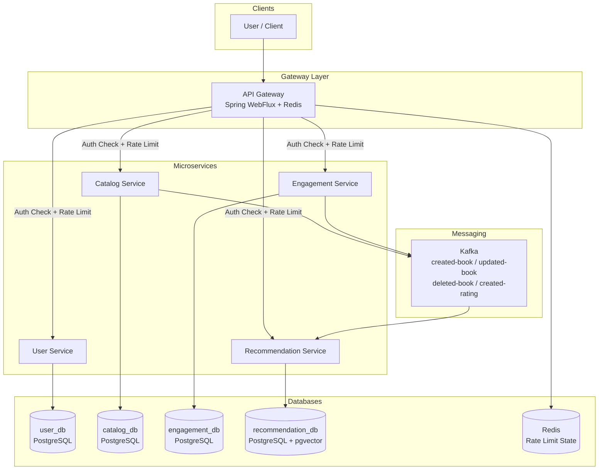
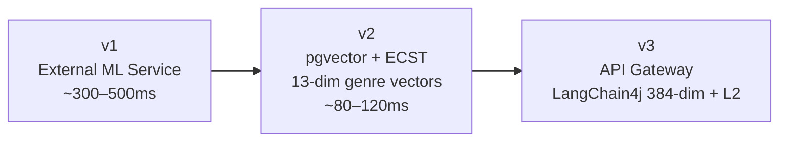
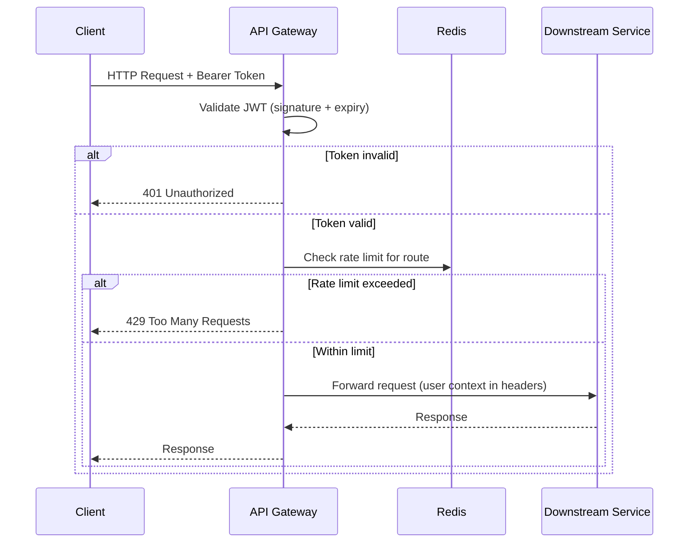
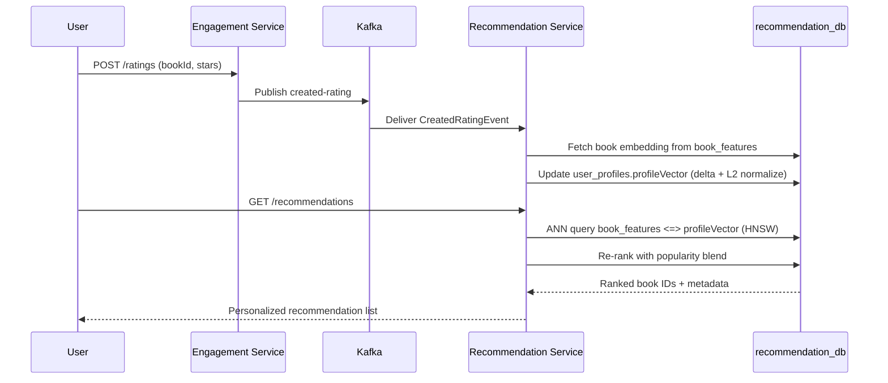

# 📖 VellumHub

[](https://openjdk.org/)
[](https://spring.io/projects/spring-boot)
[](https://docs.spring.io/spring-framework/reference/web/webflux.html)
[](https://www.postgresql.org/)
[](https://github.com/pgvector/pgvector)
[](https://redis.io/)
[](https://kafka.apache.org/)
[](https://www.docker.com/)
[](LICENSE)

**VellumHub** is a production-grade, book-focused microservices platform built on the JVM. It features a reactive API Gateway, event-driven recommendation updates via Kafka (ECST pattern), pgvector similarity search with LangChain4j embeddings, and local read models for low-latency serving.

This README is intentionally architecture-first and evidence-driven — all design decisions are explained with code references and system diagrams.

---

## Table of Contents

- [System Design (v3.0)](#system-design-v30)
- [Architecture Evolution (v1 → v2 → v3)](#architecture-evolution-v1--v2--v3)
- [API Gateway](#api-gateway)
- [AI & Vector Pipeline](#ai--vector-pipeline)
- [Event-Driven Backbone (ECST)](#event-driven-backbone-ecst)
- [Service Modules](#service-modules)
- [Active API Documentation (Swagger/OpenAPI)](#active-api-documentation-swaggeropenapi)
- [Observability](#observability)
- [Database and pgvector Design](#database-and-pgvector-design)
- [Quick Start](#quick-start)
- [Roadmap and Future Enhancements](#roadmap-and-future-enhancements)

---

## System Design (v3.0)

The platform is organized into four layers: Gateway, Microservices, Messaging, and Databases. All external traffic is funneled through the API Gateway, which handles authentication, rate limiting, and reactive proxying before requests reach downstream services.


```mermaid
graph TB
    subgraph Clients
      U[User / Client]
    end

    subgraph Gateway Layer
      GW[API Gateway\nSpring WebFlux + Redis]
    end

    subgraph Microservices
      US[User Service]
      CS[Catalog Service]
      ES[Engagement Service]
      RS[Recommendation Service]
    end

    subgraph Messaging
      K[Kafka\ncreated-book / updated-book\ndeleted-book / created-rating]
    end

    subgraph Databases
      UDB[(user_db\nPostgreSQL)]
      CDB[(catalog_db\nPostgreSQL)]
      EDB[(engagement_db\nPostgreSQL)]
      RDB[(recommendation_db\nPostgreSQL + pgvector)]
      REDIS[(Redis\nRate Limit State)]
    end

    U --> GW

    GW -->|Auth Check + Rate Limit| US
    GW -->|Auth Check + Rate Limit| CS
    GW -->|Auth Check + Rate Limit| ES
    GW -->|Auth Check + Rate Limit| RS

    GW --> REDIS

    US --> UDB
    CS --> CDB
    ES --> EDB
    RS --> RDB

    CS --> K
    ES --> K
    K --> RS
```

The **Recommendation Service** operates as an event-fed local read model, maintaining three internal tables:
- `book_features` — embedding vectors for cosine similarity search
- `user_profiles` — incrementally updated preference vectors per user
- `recommendations` — pre-joined book metadata via ECST for low-latency serving

---

## Architecture Evolution (v1 → v2 → v3)

### v1 — External ML Service

The initial version relied on an external Python ML service sitting in the critical recommendation path. Every recommendation request required a synchronous call to this service, introducing significant latency, operational coupling, and a single point of failure.

**Characteristics:**
- External ML service called synchronously per request
- Multiple network hops on every recommendation
- High operational surface area (Python service + JVM services)
- No event-driven state updates

---

### v2 — In-JVM Vector Search + ECST

Recommendation computation was moved entirely into the JVM ecosystem using PostgreSQL with the pgvector extension. The event backbone was also formalized in this version using the **Event-Carried State Transfer (ECST)** pattern, making Kafka the authoritative source for propagating state changes into the Recommendation Service.

However, the vector space at this stage was **genre-based with only 13 fixed dimensions** — one per genre. While cosine similarity via pgvector's `<=>` operator was already in use with an HNSW index, the embedding space was too coarse to capture nuanced user preferences. There was no semantic embedding model and no normalization applied to vectors.

**Key improvements over v1:**
- Recommendation latency dropped from ~300–500ms (v1) to ~80–120ms by eliminating the external ML hop
- Cosine similarity search via pgvector's `<=>` operator with an HNSW index
- User profiles built incrementally from rating events, stored as 13-dimensional genre vectors
- Kafka consumers keep `book_features`, `user_profiles`, and `recommendations` updated asynchronously — zero cross-service calls at query time (ECST)
- Topic naming standardized: `created-book`, `updated-book`, `deleted-book`, `created-rating`

**Limitations:**
- 13-dimensional genre vectors are too coarse — distinct books within the same genre are indistinguishable in the vector space
- No semantic embedding model; vectors are manually constructed, not learned from content
- No vector normalization — cosine similarity scores poorly calibrated across books with differing vector magnitudes
- No gateway layer — services were directly exposed to clients

---

### v3 — API Gateway + LangChain4j Embeddings + L2 Normalization

The current version addresses the two main gaps from v2: the shallow vector representation and the lack of a centralized entry point for traffic management.

**Key improvements over v2:**

**API Gateway (Spring WebFlux):**
- All client traffic now enters through a single, controlled entry point
- Reactive stack (WebFlux) handles high concurrency without blocking threads
- JWT authentication validated at the gateway before requests are forwarded
- Per-route rate limiting enforced via Redis — prevents individual services from being overwhelmed
- Clean separation: internal services no longer need to handle auth or rate limiting independently

**Embedding Pipeline:**
- Replaced the 13-dimensional genre vectors with LangChain4j's `AllMiniLmL6V2EmbeddingModel`, producing **384-dimensional dense vectors** that capture rich semantic meaning from book content — books with similar themes, writing style, or subject matter now cluster together in the vector space regardless of genre label
- **L2 normalization** applied to all embedding vectors before persistence — projects every vector onto the unit sphere so cosine similarity scores are directly comparable across all books, regardless of raw vector magnitude


```mermaid
graph LR
  V1["v1\nExternal ML Service\n~300–500ms"]
  V2["v2\npgvector + ECST\n13-dim genre vectors\n~80–120ms"]
  V3["v3\nAPI Gateway\nLangChain4j 384-dim + L2"]

  V1 --> V2 --> V3
```

---

## API Gateway

The gateway is the exclusive entry point for all external traffic. It is built with **Spring Boot + Spring WebFlux**, enabling a non-blocking, reactive request pipeline capable of handling high concurrency efficiently.

### Responsibilities

| Concern | Implementation |
|---|---|
| **Request routing** | Proxies requests to the correct downstream service based on path prefix |
| **Authentication** | Validates JWT tokens — invalid or missing tokens are rejected before reaching services |
| **Rate limiting** | Per-route request limits enforced using Redis as the shared state store |
| **Reactive I/O** | WebFlux ensures threads are never blocked waiting on downstream responses |

### Routing Map

All internal services run on port `8080` within the Docker network. The gateway (exposed on `:8080` externally) routes traffic as follows:

| Path Prefix | Upstream Service |
|---|---|
| `/api/users/**` | `user-service:8080` |
| `/api/catalog/**` | `catalog-service:8080` |
| `/api/engagement/**` | `engagement-service:8080` |
| `/api/recommendations/**` | `recommendation-service:8080` |

### Rate Limiting

Rate limit state is stored in Redis (`redis-gateway`), allowing the gateway to track request counts per route (or per user/IP) without holding state in memory. This makes the gateway horizontally scalable if needed.

### Auth Flow


```mermaid
sequenceDiagram
    participant Client
    participant GW as API Gateway
    participant Redis
    participant SVC as Downstream Service

    Client->>GW: HTTP Request + Bearer Token
    GW->>GW: Validate JWT (signature + expiry)
    alt Token invalid
        GW-->>Client: 401 Unauthorized
    else Token valid
        GW->>Redis: Check rate limit for route
        alt Rate limit exceeded
            GW-->>Client: 429 Too Many Requests
        else Within limit
            GW->>SVC: Forward request (user context in headers)
            SVC-->>GW: Response
            GW-->>Client: Response
        end
    end
```

---

## AI & Vector Pipeline

### Embedding Model

The Recommendation Service uses LangChain4j's `AllMiniLmL6V2EmbeddingModel` to generate 384-dimensional dense vectors for each book. This model is a well-established sentence embedding model that produces semantically meaningful representations — books with similar themes, genres, or content cluster together in the vector space.

```java
// recommendation-service/.../config/EmbeddingConfig.java
@Bean
public EmbeddingModel embeddingModel() {
    return new AllMiniLmL6V2EmbeddingModel();
}
```

Both `book_features` and `user_profiles` use the same 384-dimensional space, enabling direct cosine similarity comparison between a user's preference vector and any book's embedding:

```java
// BookFeature.java
@Column(name = "embedding", columnDefinition = "vector(384)")
private float[] embedding;

// UserProfile.java
@Column(columnDefinition = "vector(384)")
private float[] profileVector = new float[384];
```

### L2 Normalization

All embedding vectors are **L2-normalized** before being persisted. This is a critical calibration step: by projecting every vector onto the unit sphere, cosine similarity scores become directly comparable across all books in the catalog. Without normalization, vectors with larger magnitudes would dominate similarity scores even if their direction (semantic content) is less relevant.

This applies to both book embeddings generated on `created-book` / `updated-book` events and to user profile vectors after each rating update.

### User Profile Update Logic

User preference vectors are updated incrementally each time a new rating event arrives. The update pipeline:

1. **Map rating to weight** — ratings are classified as `DETRACTOR` (-5), `NEUTRAL` (+1), or `PROMOTER` (+5) relative to the user's previous rating for that book
2. **Apply delta with learning rate** — the book's embedding is added to the profile vector, scaled by the weight and a learning rate of `0.1f`
3. **L2 normalize** — the updated vector is re-normalized to maintain calibrated cosine similarity

```java
int adjustmentWeight = getWeightAdjustment(newStars, oldStars, isNewRating);
this.profileVector[i] += (bookEmbedding[i] * adjustmentWeight * learningRate);
this.normalizeVector(sumOfSquares); // L2 normalization
```

### Recommendation Retrieval Path

Candidate retrieval is a two-stage pipeline:

**Stage 1 — ANN candidate retrieval (top 200 via cosine distance):**
```sql
SELECT
    b.book_id,
    b.popularity_score,
    (b.embedding <=> u.profile_vector) AS vector_dist
FROM book_features b, user_profiles u
WHERE u.user_id = :userId
ORDER BY b.embedding <=> u.profile_vector ASC
LIMIT 200
```

**Stage 2 — Re-rank with popularity blend (70% semantic / 30% popularity):**
```sql
ORDER BY
    (c.vector_dist * 0.7) + ((1 - COALESCE(c.popularity_score, 0)) * 0.3) ASC
```

The HNSW index on `book_features.embedding` (with `vector_cosine_ops`) ensures Stage 1 runs as an approximate nearest-neighbor search rather than a full table scan, keeping latency low even as the book catalog grows.

---

## Event-Driven Backbone (ECST)

### Pattern

VellumHub uses **Event-Carried State Transfer (ECST)**: Kafka events carry full or partial entity state, allowing consumers to update their local read models without querying the producing service. The Recommendation Service never calls Catalog or Engagement APIs — it receives everything it needs via events.

### Topic Contract

| Topic | Producer | Consumer | Payload |
|---|---|---|---|
| `created-book` | Catalog Service | Recommendation Service | Full book data |
| `updated-book` | Catalog Service | Recommendation Service | Updated book data |
| `deleted-book` | Catalog Service | Recommendation Service | Book ID |
| `created-rating` | Engagement Service | Recommendation Service | `bookId`, `userId`, `stars` |

### Learning Loop


```mermaid
sequenceDiagram
    participant User
    participant ES as Engagement Service
    participant K as Kafka
    participant RS as Recommendation Service
    participant DB as recommendation_db

    User->>ES: POST /ratings (bookId, stars)
    ES->>K: Publish created-rating
    K->>RS: Deliver CreatedRatingEvent
    RS->>DB: Fetch book embedding from book_features
    RS->>DB: Update user_profiles.profileVector (delta + L2 normalize)

    User->>RS: GET /recommendations
    RS->>DB: ANN query book_features <=> profileVector (HNSW)
    RS->>DB: Re-rank with popularity blend
    DB-->>RS: Ranked book IDs + metadata
    RS-->>User: Personalized recommendation list
```

---

## Service Modules

### Catalog Service
Manages the book catalog. Publishes `created-book`, `updated-book`, and `deleted-book` events on all mutations.

| Module | Responsibility |
|---|---|
| `book` | Core book entity — CRUD, search, pagination |
| `book-request` | Community book request management |
| `book-progress` | Per-user reading progress tracking |
| `book-list` | User-curated book lists (e.g., "Want to Read") |

### Engagement Service
Captures user interactions and publishes them to Kafka. Also maintains a local `book_snapshot` via ECST to avoid cross-service calls.

| Module | Responsibility |
|---|---|
| `rating` | User ratings for books; publishes `created-rating` events |
| `interactions` | General interaction tracking _(in progress)_ |
| `book_snapshot` | Local book state replica via ECST for denormalized queries |

### User Service
Handles identity, authentication, and authorization.

| Module | Responsibility |
|---|---|
| `users` | User account management, profile data |
| `auth` | JWT issuance, Google OAuth2 integration |

### Recommendation Service
Event-fed local read model. All data is maintained via Kafka consumers — no synchronous calls to other services at query time.

| Module | Responsibility |
|---|---|
| `book_feature` | Stores LangChain4j 384-dim embeddings per book; updated async on book events |
| `user_profile` | Per-user preference vectors; updated incrementally on rating events |
| `recommendation` | Denormalized book metadata via ECST for low-latency response assembly |

---

## Active API Documentation (Swagger/OpenAPI)

Swagger/OpenAPI is enabled in all microservices. The following paths are publicly accessible (no auth required):
`/swagger-ui/**`, `/swagger-ui.html`, `/v3/api-docs/**`

> **Note:** Access these URLs directly on each service port, bypassing the gateway.

| Service | Swagger UI | OpenAPI JSON |
|---|---|---|
| Gateway Service | `http://localhost:8080/swagger-ui/index.html` | `http://localhost:8080/v3/api-docs` |
| User Service | `http://localhost:8084/swagger-ui/index.html` | `http://localhost:8084/v3/api-docs` |
| Catalog Service | `http://localhost:8081/swagger-ui/index.html` | `http://localhost:8081/v3/api-docs` |
| Engagement Service | `http://localhost:8083/swagger-ui/index.html` | `http://localhost:8083/v3/api-docs` |
| Recommendation Service | `http://localhost:8085/swagger-ui/index.html` | `http://localhost:8085/v3/api-docs` |

---

## Observability

All services include **Spring Boot Actuator** with the following endpoints enabled:

- `/actuator/health` — liveness and readiness (used by Docker healthchecks)
- `/actuator/metrics` — JVM, HTTP, and custom application metrics
- `/actuator/prometheus` — Prometheus-compatible metrics scrape endpoint

Kafka health is monitored via `management.health.kafka.enabled=true`. Health endpoints are explicitly permitted through each service's security configuration so they remain accessible without authentication.

---

## Database and pgvector Design

### Schema Overview

Each microservice owns its own PostgreSQL instance — no shared databases. The Recommendation Service uses the `pgvector/pgvector:pg15` Docker image to enable the `vector` extension.

```sql
-- Bootstrapped via docker-entrypoint-initdb.d
CREATE EXTENSION IF NOT EXISTS vector;

CREATE TABLE IF NOT EXISTS book_features (
    book_id         UUID PRIMARY KEY,
    embedding       vector(384),          -- L2-normalized LangChain4j embedding
    popularity_score DOUBLE PRECISION,
    last_updated    TIMESTAMP WITH TIME ZONE NOT NULL
);

-- HNSW index for approximate nearest-neighbor cosine similarity search
CREATE INDEX IF NOT EXISTS idx_book_embedding_hnsw
ON book_features
USING hnsw (embedding vector_cosine_ops);
```

### Index Strategy

| Property | Value |
|---|---|
| Index type | `hnsw` |
| Operator class | `vector_cosine_ops` |
| Query operator | `<=>` (cosine distance) |
| ANN candidate limit | 200 (re-ranked to final result) |

The HNSW (Hierarchical Navigable Small World) index provides sub-linear query time for approximate nearest-neighbor search, making cosine similarity queries fast even with large book catalogs.

---

## Quick Start

### Prerequisites

- Docker and Docker Compose
- A `.env` file with the following variables:

```env
POSTGRES_USER=your_user
POSTGRES_PASSWORD=your_password
JWT_KEY=your_jwt_secret
JWT_EXPIRATION=86400000
GOOGLE_CLIENT_ID=your_google_client_id
CORS_ALLOWED_ORIGINS=http://localhost:3000
```

### Start All Services

```bash
docker-compose up -d
```

### Service Endpoints

| Service | External Port |
|---|---|
| API Gateway (entry point) | `http://localhost:8080` |
| Kafka UI | `http://localhost:8090` |
| User Service (direct) | `http://localhost:8084` |
| Catalog Service (direct) | `http://localhost:8081` |
| Engagement Service (direct) | `http://localhost:8083` |
| Recommendation Service (direct) | `http://localhost:8085` |

> In production usage, all requests should go through the **API Gateway** on port `8080`. Direct service ports are exposed for local development and Swagger access only.

### Infrastructure Dependencies

```
Redis (rate limit state) → API Gateway
PostgreSQL ×4            → catalog, engagement, user, recommendation services
pgvector (pg15 image)    → recommendation_db only
Zookeeper + Kafka        → catalog, engagement, recommendation services
```

---

## Roadmap and Future Enhancements

| Area | Description |
|---|---|
| **Kafka Resilience** | Custom retry strategies and Dead Letter Topic (DLT) handling for all consumers |
| **Distributed Tracing** | Micrometer Tracing or Zipkin integration for end-to-end request visibility across services |
| **Integration Testing** | Testcontainers-based test suite validating Kafka event flows and pgvector similarity queries |
| **CI/CD** | Upgrade pipeline runners to fully support Java 21 for seamless Maven test execution |
| **Interactions Module** | Complete the `interactions` module in the Engagement Service for richer engagement signals |
| **Gateway Observability** | Per-route metrics and rate limit dashboards via Prometheus + Grafana |

---

**VellumHub** — Reactive gateway, event-driven state, vector-native recommendations. Built entirely on the JVM.
