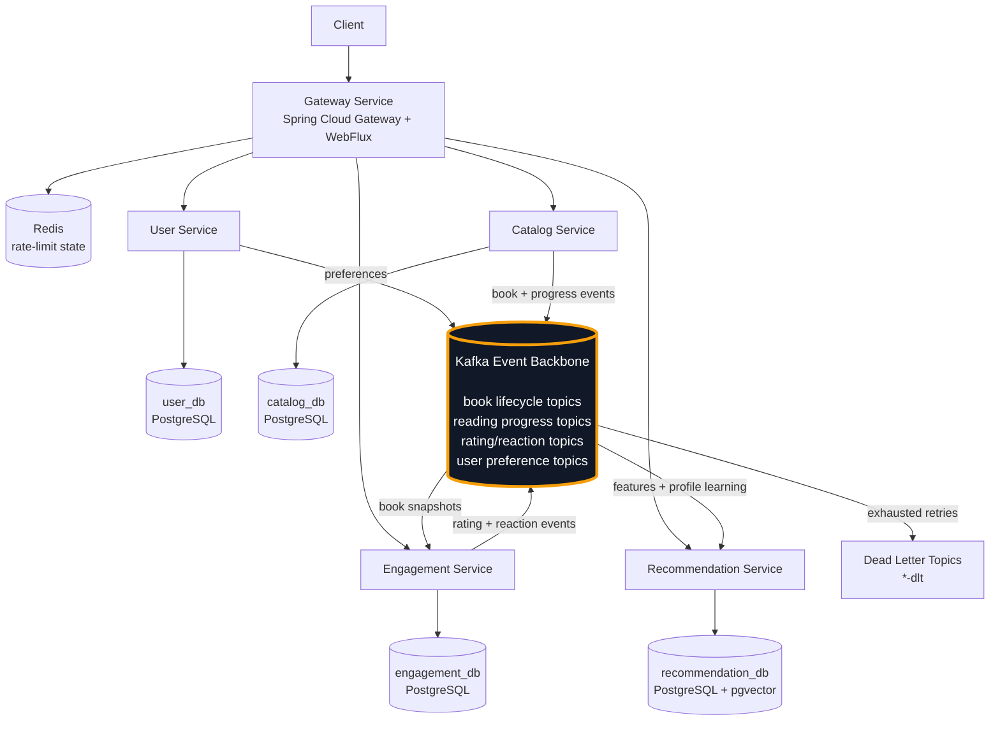
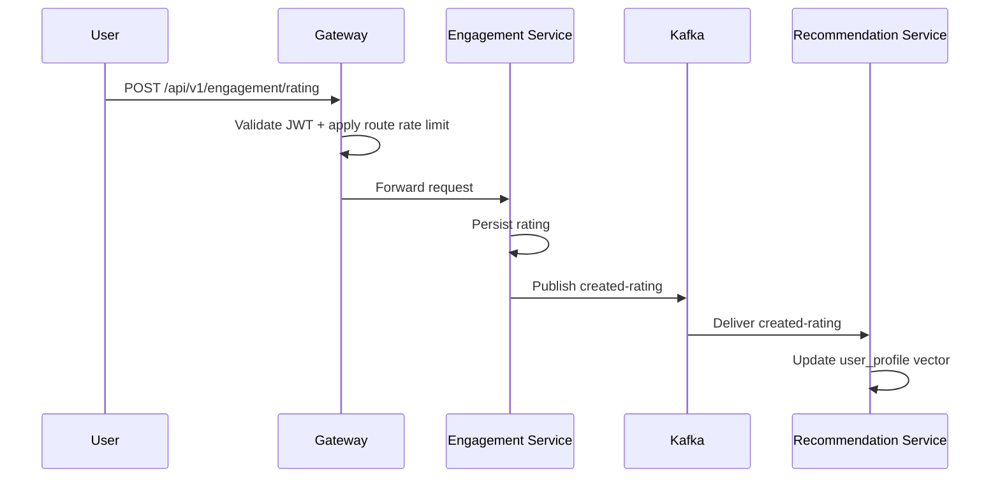

# VellumHub

VellumHub is the backend infrastructure of a social reading platform: users discover books, track reading progress, rate titles, and receive personalized recommendations, served by independent services that communicate through Kafka events.

[](https://openjdk.org/)
[](https://spring.io/projects/spring-boot)
[](https://spring.io/projects/spring-cloud-gateway)
[](https://kafka.apache.org/)
[](https://www.postgresql.org/)
[](https://github.com/pgvector/pgvector)
[](https://redis.io/)
[](https://www.docker.com/)

VellumHub is a JVM microservices platform for book discovery, built to demonstrate distributed-system design through a reactive gateway, service-owned databases, Kafka event-carried state transfer, and pgvector-based recommendation read models.

It is written as a backend engineering reference project: the goal is not just to expose CRUD endpoints, but to show how identity, catalog ownership, reader engagement, asynchronous replication, vector ranking, gateway security, and operational hardening fit together in one system.

## At a Glance

| Dimension | Current evidence |
|---|---|
| Application services | 5: gateway, user, catalog, engagement, recommendation |
| Docker Compose topology | 13 default services, plus 5 optional observability services behind the `observability` profile |
| Codebase size | 393 main Java files and 92 test Java files |
| API surface | 15 controllers across user, catalog, engagement, and recommendation services |
| Application layer | 44 use case classes across domain/application modules |
| Kafka integration | 14 Kafka listener classes across engagement and recommendation services |
| Recommendation model | 384-dimensional embeddings, HNSW cosine index, 200-candidate ANN pool |
| Recommendation latency (local) | Historical local benchmark: ~80-120 ms in-JVM pgvector vs ~300-500 ms with the previous Python sidecar |
| Local test evidence | Gateway and catalog suites have recorded passing local runs |

## Contents

- [Overview](#overview)
- [Architecture](#architecture)
- [Service Map](#service-map)
- [Core Flows](#core-flows)
- [Recommendation Engine](#recommendation-engine)
- [Kafka Event Contracts](#kafka-event-contracts)
- [Gateway and Security](#gateway-and-security)
- [Running Locally](#running-locally)
- [Quality Evidence](#quality-evidence)
- [Roadmap](#roadmap)

## Overview

VellumHub demonstrates:

- **Distributed ownership:** each service owns its domain model and database.
- **Event-carried state transfer:** downstream services build local read models from Kafka events instead of querying source services in their critical paths.
- **Recommendation architecture:** the recommendation service stores local `book_features`, `user_profiles`, and `recommendations` data, with pgvector similarity search over `vector(384)` embeddings.
- **Gateway control plane:** Spring Cloud Gateway WebFlux enforces route-level JWT authentication and Redis-backed rate limiting before traffic reaches internal services.
- **Kafka resilience:** recommendation and engagement consumers use Spring Kafka retry topics and Dead Letter Topic handling for unrecoverable events.
- **Operational visibility:** services expose Actuator health, metrics, and Prometheus endpoints; Kafka UI is included for local topic and consumer inspection; the optional observability profile adds Prometheus, Grafana, Loki, Tempo, and Alloy.

The current architecture is best described as a mature v3 platform moving through v4 reliability hardening: contracts, schema evolution, outbox, idempotency, tracing, and integration testing are now the focus.

## Architecture


```mermaid
graph TB
    Client[Client] --> Gateway[Gateway Service\nSpring Cloud Gateway + WebFlux]
    Gateway --> Redis[(Redis\nrate-limit state)]

    Gateway --> User[User Service]
    Gateway --> Catalog[Catalog Service]
    Gateway --> Engagement[Engagement Service]
    Gateway --> Recommendation[Recommendation Service]

    User --> UserDb[(user_db\nPostgreSQL)]
    Catalog --> CatalogDb[(catalog_db\nPostgreSQL)]
    Engagement --> EngagementDb[(engagement_db\nPostgreSQL)]
    Recommendation --> RecommendationDb[(recommendation_db\nPostgreSQL + pgvector)]

    User -->|preferences| Kafka[(Kafka Event Backbone\n\nbook lifecycle topics\nreading progress topics\nrating/reaction topics\nuser preference topics)]
    Catalog -->|book + progress events| Kafka
    Engagement -->|rating + reaction events| Kafka

    Kafka -->|book snapshots| Engagement
    Kafka -->|features + profile learning| Recommendation
    Kafka -->|exhausted retries| Dlt[Dead Letter Topics\n*-dlt]

    style Kafka fill:#111827,color:#ffffff,stroke:#f59e0b,stroke-width:4px,font-size:18px
```

All public HTTP traffic is intended to enter through the gateway. Downstream services still validate JWTs in their own security configurations, so the gateway is an ingress boundary rather than the only security boundary.

The recommendation query path is local to the recommendation service. It serves from its own read models and does not synchronously call the catalog, engagement, or user services at recommendation serving time. Existing Feign-related configuration in `recommendation-service` is legacy cleanup debt, not an active query-time dependency.

## Service Map

| Service | Role | Local details |
|---|---|---|
| `gateway-service` | Public edge for routing, JWT enforcement, and Redis-backed rate limiting. | [README](gateway-service/README.md) |
| `user-service` | Identity, authentication, Google login, user management, and preference seeds for cold-start recommendations. | [README](user-service/README.md) |
| `catalog-service` | Source of truth for books, book requests, book lists, membership, covers, and current reading progress. | [README](catalog-service/README.md) |
| `engagement-service` | Ratings, reactions, and replicated reading progress history / book snapshots. | [README](engagement-service/README.md) |
| `recommendation-service` | Event-fed recommendation read model, embeddings, user profile vectors, and ranking. | [README](recommendation-service/README.md) |

The root README stays focused on system shape. Endpoint-level inventories live in the service READMEs and OpenAPI pages.

## Core Flows

VellumHub is centered around a few end-to-end flows:

1. **Registration to cold-start profile:** a user registers with preferences, `user-service` publishes `create_user_preference`, and `recommendation-service` seeds a profile vector before the user has ratings.
2. **Catalog mutation to local projections:** `catalog-service` owns book state and emits lifecycle events so recommendation and engagement can update local read models without joining through shared databases.
3. **Reader engagement to learning signal:** ratings, reactions, and reading progress become Kafka signals that adjust user profile vectors inside the recommendation service.
4. **Recommendation serving:** the gateway routes authenticated traffic to `recommendation-service`, which ranks from local `book_features`, `user_profiles`, and `recommendations` tables without source-service calls in the query path.

Rating feedback is a representative asynchronous flow:


```mermaid
sequenceDiagram
    participant U as User
    participant G as Gateway
    participant E as Engagement Service
    participant K as Kafka
    participant R as Recommendation Service

    U->>G: POST /api/v1/engagement/rating
    G->>G: Validate JWT + apply route rate limit
    G->>E: Forward request
    E->>E: Persist rating
    E->>K: Publish created-rating
    K->>R: Deliver created-rating
    R->>R: Update user_profile vector
```

## Recommendation Engine

The recommendation service consumes catalog and interaction events and maintains local projection tables:

| Table | Purpose |
|---|---|
| `book_features` | Book embedding and popularity state, stored as `vector(384)`. |
| `user_profiles` | Per-user preference vector, interacted book IDs, and engagement score. |
| `recommendations` | Denormalized book metadata used to assemble responses without a source-service call. |

The embedding pipeline uses LangChain4j's in-process `AllMiniLmL6V2EmbeddingModel`, which runs in the JVM and produces 384-dimensional vectors. Book and profile vectors are L2-normalized before being used for cosine-distance ranking.

The ranking path is implemented with PostgreSQL + pgvector:

- `book_features.embedding` uses `vector(384)`.
- `idx_book_embedding_hnsw` uses HNSW with `vector_cosine_ops`.
- The native query retrieves an ANN candidate pool of 200 books.
- Already-interacted books are filtered at query time.
- Candidates are re-ranked with a 70% semantic / 30% popularity blend.
- If a user profile is missing, the service falls back to popularity ranking.

Historical local benchmark notes in this repository describe the move from an external Python ML sidecar to in-JVM pgvector ranking as a latency improvement from roughly 300-500 ms to 80-120 ms. Treat those numbers as project-local measurements, not a published production SLA.

## Kafka Event Contracts

VellumHub uses Kafka as the state propagation backbone. Producers publish business events; consumers maintain local projections from those events.

### Current Topics

| Topic | Producer | Consumer(s) |
|---|---|---|
| `created-book` | Catalog | Recommendation, Engagement book snapshot |
| `updated-book` | Catalog | Recommendation |
| `deleted-book` | Catalog | Recommendation, Engagement book snapshot |
| `created-rating` | Engagement | Recommendation user profile learning |
| `user-reaction-changed` | Engagement | Recommendation user profile learning |
| `create_user_preference` | User | Recommendation cold-start profile seed |
| `create-reading-progress` | Catalog | Engagement reading history |
| `updated-reading-progress` | Catalog | Recommendation user profile learning |

### Current Reliability Hardening

The implemented system already uses Kafka for local projections and recommendation learning. The remaining work is to make topic contracts impossible to drift silently:

| Problem | Producer publishes | Consumer/config expects | Tracked by |
|---|---|---|---|
| Reading progress create topic naming | `create-reading-progress` | `created-reading-progress` in recommendation | [#199](https://github.com/Luca5Eckert/VellumHub/issues/199) |
| Reading progress update topic naming | `updated-reading-progress` | `update-reading-progress` in engagement | [#199](https://github.com/Luca5Eckert/VellumHub/issues/199) |
| Retry topic coverage | reading-progress topic names | `updated-progress` in recommendation retry config | [#199](https://github.com/Luca5Eckert/VellumHub/issues/199) |
| Topic name ownership | annotations/properties/tests/docs | single contract source | [#199](https://github.com/Luca5Eckert/VellumHub/issues/199) |

This work is tracked by [issue #199](https://github.com/Luca5Eckert/VellumHub/issues/199): centralize Kafka topic contracts, align producers/consumers/retry config, and add tests that catch contract drift automatically.

## Kafka Resilience

Recommendation and engagement consumers use Spring Kafka retry topic configuration:

- fixed 3-second backoff;
- max 3 attempts;
- retry topic forwarding instead of local try/catch swallowing;
- centralized `.*-dlt` listeners for exhausted messages.

Dead Letter Topic logs include the original topic, DLT topic, exception message, and payload byte length. They do not print raw payloads by default, which keeps the recovery signal useful without exposing Kafka payload content in logs.

## Gateway and Security

The gateway is built with Spring Cloud Gateway on WebFlux and Project Reactor. It routes public prefixes to internal services and applies request limiting through Redis.

| Public prefix | Internal target |
|---|---|
| `/api/v1/auth/**` | `user-service` |
| `/api/v1/users/**` | `user-service` |
| `/api/v1/catalog/**` | `catalog-service` |
| `/api/v1/engagement/**` | `engagement-service` |
| `/api/v1/recommendations/**` | `recommendation-service` |

Current route quotas:

| Route group | Replenish rate | Burst capacity | Key strategy |
|---|---:|---:|---|
| Auth/User flows | 5 | 10 | IP |
| Catalog/Engagement | 30 | 60 | User/principal/IP fallback |
| Recommendations | 20 | 40 | User/principal/IP fallback |

Current operational security hardening still includes removing unsafe production defaults, reducing overly verbose gateway TRACE logging, and tightening Actuator detail exposure in production profiles.

## Running Locally

### Prerequisites

- Docker and Docker Compose
- Java 21
- A `.env` file based on [.env.example](.env.example)

Required environment shape:

```env
POSTGRES_USER=your_user
POSTGRES_PASSWORD=your_password
JWT_KEY=base64_encoded_secret_at_least_32_bytes
JWT_EXPIRATION_MS=604800000
GOOGLE_CLIENT_ID=your_google_client_id
CORS_ALLOWED_ORIGINS=http://localhost:3000
```

For the Docker Compose `prod` profile used by the local stack, `JWT_KEY` is required by all five application services. `JWT_EXPIRATION_MS` is also required by `user-service`, and `GOOGLE_CLIENT_ID` is required for Google login support.

Generate a local Base64 JWT key:

```bash
openssl rand -base64 32
```

Windows PowerShell alternative:

```powershell
$bytes = New-Object byte[] 32; $rng = New-Object System.Security.Cryptography.RNGCryptoServiceProvider; $rng.GetBytes($bytes); [Convert]::ToBase64String($bytes); $rng.Dispose()
```

### Start the Stack

```bash
docker-compose up -d
```

The default compose stack defines 13 services:

- `gateway-service`
- `user-service`
- `catalog-service`
- `engagement-service`
- `recommendation-service`
- `postgres-user`
- `postgres-catalog`
- `postgres-engagement`
- `postgres-recommendation`
- `redis-gateway`
- `zookeeper`
- `kafka`
- `kafka-ui`

The compose configuration currently publishes:

| Component | URL |
|---|---|
| API Gateway | `http://localhost:8080` |
| Kafka UI | `http://localhost:8090` |

Application services run inside the Docker network on port `8080`. Direct host access to downstream services is a development workflow, not the default compose exposure.

To include the local observability stack, enable the `observability` profile:

```bash
docker compose --profile observability up -d --build
```

That profile adds Prometheus, Grafana, Loki, Tempo, and Alloy. Operational details live in [docs/OBSERVABILITY.md](docs/OBSERVABILITY.md).

### Run a Service Directly

Each service has its own Maven wrapper:

```bash
cd catalog-service
./mvnw spring-boot:run
```

On Windows PowerShell:

```powershell
cd catalog-service
.\mvnw.cmd spring-boot:run
```

When running multiple services directly, set distinct `SERVER_PORT` values yourself to avoid local port conflicts.

## Verification Commands

Render and inspect the Docker Compose topology:

```bash
docker compose config --services
```

Run the suites with recorded passing local runs:

```powershell
cd gateway-service
.\mvnw.cmd test

cd ..\catalog-service
.\mvnw.cmd test
```

Run all service test commands during broad local verification:

```powershell
foreach ($service in 'gateway-service','catalog-service','user-service','engagement-service','recommendation-service') {
    Push-Location $service
    .\mvnw.cmd test
    Pop-Location
}
```

Use the full loop when you want a complete local signal before publishing a change.

## API Docs and Ports

Springdoc OpenAPI is configured in the domain services. For direct service runs, open these paths on the service port you assigned:

| Service | Swagger UI | OpenAPI JSON |
|---|---|---|
| User | `/swagger-ui/index.html` | `/v3/api-docs` |
| Catalog | `/swagger-ui/index.html` | `/v3/api-docs` |
| Engagement | `/swagger-ui/index.html` | `/v3/api-docs` |
| Recommendation | `/swagger-ui/index.html` | `/v3/api-docs` |

The gateway currently exposes Actuator endpoints, not a Springdoc UI, and its route prefixes are the public API surface. Service-local Swagger pages are for development and inspection.

## Observability

Services expose Spring Boot Actuator endpoints:

- `/actuator/health`
- `/actuator/info`
- `/actuator/metrics`
- `/actuator/prometheus`

`/actuator/prometheus` is backed by the Micrometer Prometheus registry and exports metrics with a common `service` tag. Health remains publicly reachable for Docker healthchecks. The observability profile scrapes these endpoints through Prometheus and provisions Grafana with Prometheus, Loki, and Tempo datasources. Broader Actuator endpoints such as `info` and `metrics` still require authentication on the application services and gateway.

In the `prod` profile, health details are hidden and the gateway lowers Spring Cloud Gateway logging from local `TRACE` diagnostics to `INFO`.

Kafka UI is available at `http://localhost:8090` when the compose stack is running. The full local observability workflow is documented in [docs/OBSERVABILITY.md](docs/OBSERVABILITY.md), and additional Kafka monitoring notes live in [docs/KAFKA_MONITORING.md](docs/KAFKA_MONITORING.md), though the code-level topic inventory above is newer than parts of that document.

## Quality Evidence

### Static Footprint

These numbers were recalculated from the current local checkout.

| Service | Main Java | Test Java | Controllers | Kafka listeners | Use cases |
|---|---:|---:|---:|---:|---:|
| `gateway-service` | 3 | 1 | 0 | 0 | 0 |
| `user-service` | 58 | 15 | 3 | 0 | 1 |
| `catalog-service` | 158 | 34 | 7 | 0 | 20 |
| `engagement-service` | 96 | 11 | 3 | 5 | 12 |
| `recommendation-service` | 78 | 31 | 2 | 9 | 11 |
| **Total** | **393** | **92** | **15** | **14** | **44** |

### What the Tests Target

The current test suite is strongest around domain behavior and adapter boundaries:

- `catalog-service`: book lifecycle, book requests, book lists, memberships, reading progress, handlers, use cases, and controller behavior.
- `recommendation-service`: user profile vector learning, embedding providers, recommendation use cases, Kafka consumers, mappers, repository adapters, and controller responses.
- `user-service`: auth flows, user handlers/controllers, password validation, security helpers, and user preference event publication.
- `engagement-service`: rating use cases, request context, book snapshot use cases, and reading-session event publishing/consumption paths.
- `gateway-service`: Spring application/gateway configuration smoke coverage.

The next quality step is integration coverage for real Kafka/PostgreSQL behavior with Testcontainers, especially retry/DLT, topic contracts, idempotency, and projection updates.

### Recorded Passing Test Runs

Latest recorded passing local verification in this workspace was performed on 2026-05-25.

| Service | Command | Status |
|---|---|---|
| `gateway-service` | `.\mvnw.cmd test` | Passing: 1 test, 0 failures, 0 errors. |
| `catalog-service` | `.\mvnw.cmd test` | Passing: 142 tests, 0 failures, 0 errors. |

### Current Quality Bar

- Every service has its own Maven wrapper and Dockerfile.
- Unit and slice tests cover domain models, use cases, controllers, Kafka consumers, mappers, and repository adapters in the strongest-covered services.
- Kafka retry/DLT behavior is implemented in engagement and recommendation, but end-to-end retry/DLT verification still needs Testcontainers coverage.
- Docker Compose defines service healthchecks for gateway, databases, Redis, Kafka, and application services.
- Actuator, metrics, Prometheus endpoints, Kafka UI, and the optional Grafana/Prometheus/Loki/Tempo/Alloy profile provide local operational inspection.
- Coverage percentage is not claimed because no local JaCoCo configuration or generated coverage report was found during inspection.
- Docker Compose configuration rendered successfully during local inspection, but a full `docker-compose up` health verification was not part of this README pass.

## Roadmap

VellumHub is a mature v3 platform moving through v4 reliability hardening. The five-service topology, Kafka event backbone, gateway JWT enforcement, service-owned databases, and pgvector recommendation model are in place. The current focus is correctness and operational resilience: contract tests, idempotent consumers, transactional outbox, distributed tracing, safer schema migration, and stronger integration testing.

| Area | Current direction |
|---|---|
| Kafka contracts | Centralize topic names, align producers/consumers/retry configs, and add contract tests ([#199](https://github.com/Luca5Eckert/VellumHub/issues/199)). |
| Consumer idempotency | Add `processed_events` handling for at-least-once Kafka delivery ([#200](https://github.com/Luca5Eckert/VellumHub/issues/200)). |
| Transactional outbox | Persist catalog and engagement changes with outgoing events atomically ([#201](https://github.com/Luca5Eckert/VellumHub/issues/201), [#202](https://github.com/Luca5Eckert/VellumHub/issues/202)). |
| Distributed tracing | Propagate correlation IDs through gateway, HTTP calls, Kafka headers, and logs ([#204](https://github.com/Luca5Eckert/VellumHub/issues/204)). |
| Database migrations | Replace production `ddl-auto=update` behavior with Flyway migrations and validation ([#205](https://github.com/Luca5Eckert/VellumHub/issues/205)). |
| Operational security | Harden Actuator exposure, secret defaults, and production logging ([#206](https://github.com/Luca5Eckert/VellumHub/issues/206)). |
| Integration tests | Add Testcontainers coverage for PostgreSQL, Kafka, retry/DLT, and projection flows ([#207](https://github.com/Luca5Eckert/VellumHub/issues/207)). |

## Why These Choices

- **Service-owned databases:** keeps domain ownership explicit and avoids hidden coupling through shared tables.
- **ECST over synchronous reads:** lets recommendation and engagement serve from local state in critical paths while accepting eventual consistency.
- **pgvector in PostgreSQL:** keeps vector search close to relational metadata, transactions, joins, and local Docker workflows.
- **HNSW cosine search:** gives approximate nearest-neighbor retrieval for dense embeddings with a practical speed/recall tradeoff.
- **In-process embeddings:** avoids a separate ML sidecar in the request path and keeps the platform fully JVM-based.
- **Retry + DLT:** makes event processing failures visible and inspectable instead of silently losing state transitions.

## Design References

- [GitHub README guidance](https://docs.github.com/en/repositories/managing-your-repositorys-settings-and-features/customizing-your-repository/about-readmes)
- [Spring Kafka retry topic configuration](https://docs.spring.io/spring-kafka/reference/retrytopic/retry-config.html)
- [Spring Cloud Gateway reference](https://docs.spring.io/spring-cloud-gateway/docs/current/reference/html/)
- [LangChain4j in-process embeddings](https://docs.langchain4j.dev/integrations/embedding-models/in-process/)
- [pgvector HNSW and cosine search](https://github.com/pgvector/pgvector)
