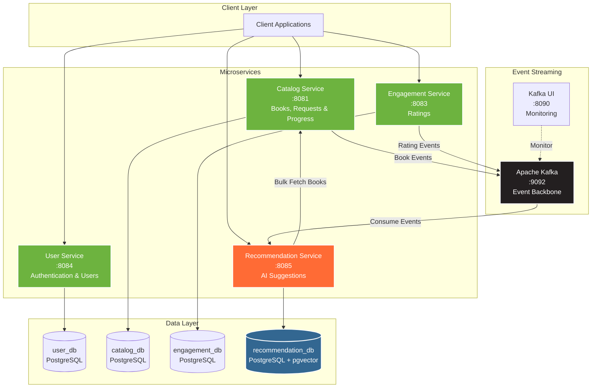
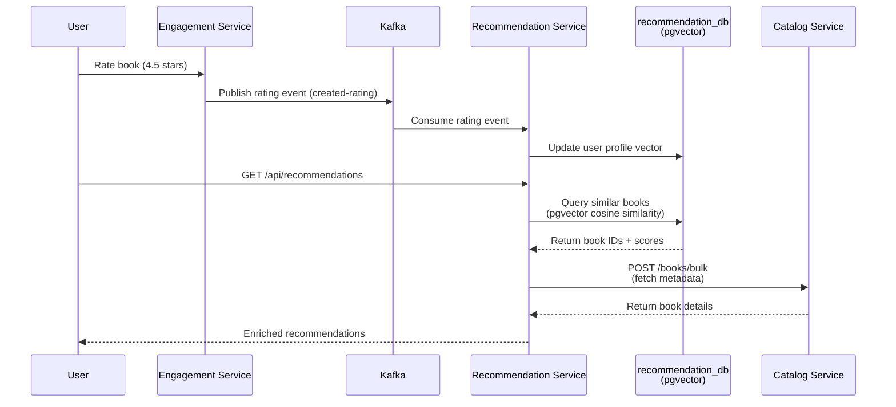
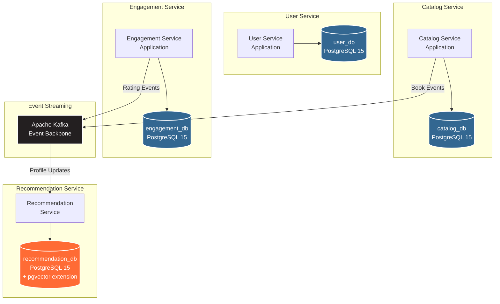
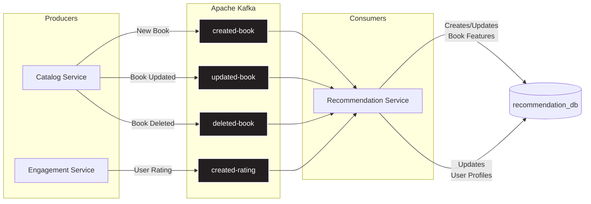

# 📖 VellumHub

[](https://openjdk.org/)
[](https://spring.io/projects/spring-boot)
[](https://www.postgresql.org/)
[](https://github.com/pgvector/pgvector)
[](https://www.docker.com/)
[](LICENSE)

**A microservices-based book recommendation platform powered by vector similarity search**

VellumHub combines the social aspects of book tracking with AI-powered recommendations. Built with Spring Boot microservices, Apache Kafka event streaming, and PostgreSQL with pgvector extension for intelligent book suggestions.

---

## Table of Contents

- [Overview](#overview)
- [Key Features](#key-features)
- [Architecture](#architecture)
  - [System Architecture](#system-architecture)
  - [System Design (v2)](#system-design-v2)
  - [Architecture Evolution](#architecture-evolution)
  - [System Versions](#system-versions)
  - [Database Architecture](#database-architecture)
  - [Event-Driven Communication](#event-driven-communication)
- [Technology Stack](#technology-stack)
- [Quick Start](#quick-start)
- [API Endpoints](#api-endpoints)
- [Development Status](#development-status)
- [Project Structure](#project-structure)
- [Contributing](#contributing)
- [License](#license)

---

## Overview

**VellumHub** (*Vellum* - ancient parchment for manuscripts + *Hub* - central gathering point) is a distributed book recommendation platform designed around community-driven book discovery. Users can submit books for approval, rate them, track reading progress, and receive personalized recommendations.

### What Makes VellumHub Different

- **Community-Curated Catalog**: Book submissions require admin approval, ensuring quality
- **AI-Powered Recommendations**: Vector similarity search using pgvector for intelligent suggestions
- **Event-Driven Architecture**: Real-time updates via Apache Kafka message streaming
- **Microservices Design**: Independent, scalable services with database-per-service pattern

---

## Key Features

### Current Implementation

| Feature | Status | Description |
|---------|--------|-------------|
| **📚 Book Catalog Management** | ✅ Implemented | CRUD operations for books with metadata (author, ISBN, page count, genres) |
| **✋ Book Submission & Approval** | ✅ Implemented | Users submit books → Admins approve/reject → Catalog updated |
| **📋 Book Lists & Collections** | ✅ Implemented | Create, share and collaborate on curated book collections with like/membership features |
| **⭐ Rating System** | ✅ Implemented | Star ratings (0-5 stars) with text reviews that influence personalized recommendations |
| **📖 Reading Progress Tracking** | ✅ Implemented | Track reading status (TO_READ, READING, COMPLETED) with page progress |
| **🎯 Personalized Recommendations** | ✅ Implemented | Vector similarity-based book suggestions using pgvector |
| **🔒 JWT Authentication** | ✅ Implemented | Secure authentication with role-based access (USER/ADMIN), including Google OAuth |
| **📊 Event-Driven Updates** | ✅ Implemented | Kafka events for real-time profile and catalog updates |
| **🖥️ Monitoring Dashboard** | ✅ Implemented | Kafka UI for monitoring topics, consumers, and message flow |
| **🖼️ Book Cover Management** | ✅ Implemented | Upload and retrieve book cover images with bulk operations support |

### Planned Features

| Feature | Target | Description |
|---------|--------|-------------|
| **💬 Reading Groups** | Future | Collaborative book discussions and group reading lists |
| **🔍 ISBN Lookup** | Future | Automated book metadata fetching via ISBN APIs |
| **👥 Social Features** | Future | Follow users, share reading lists, book reviews |

---

## Architecture

VellumHub follows a **microservices architecture** with **event-driven communication** using Apache Kafka. Each service owns its database following the **Database per Service** pattern.

### System Architecture


```mermaid
graph TB
    subgraph "Client Layer"
        CLIENT[Client Applications]
    end
    
    subgraph "Microservices"
        US[User Service<br/>:8084<br/>Authentication & Users]
        CS[Catalog Service<br/>:8081<br/>Books, Requests & Progress]
        RS[Engagement Service<br/>:8083<br/>Ratings]
        RCS[Recommendation Service<br/>:8085<br/>AI Suggestions]
    end
    
    subgraph "Event Streaming"
        KAFKA[Apache Kafka<br/>:9092<br/>Event Backbone]
        KUI[Kafka UI<br/>:8090<br/>Monitoring]
    end
    
    subgraph "Data Layer"
        DB1[(user_db<br/>PostgreSQL)]
        DB2[(catalog_db<br/>PostgreSQL)]
        DB3[(engagement_db<br/>PostgreSQL)]
        DB4[(recommendation_db<br/>PostgreSQL + pgvector)]
    end
    
    CLIENT --> US
    CLIENT --> CS
    CLIENT --> RS
    CLIENT --> RCS
    
    US --> DB1
    CS --> DB2
    RS --> DB3
    RCS --> DB4
    
    CS -->|Book Events| KAFKA
    RS -->|Rating Events| KAFKA
    KAFKA -->|Consume Events| RCS
    
    RCS -->|Bulk Fetch Books| CS
    
    KUI -.Monitor.-> KAFKA
    
    style KAFKA fill:#231F20,stroke:#fff,stroke-width:2px,color:#fff
    style US fill:#6DB33F,stroke:#fff,stroke-width:2px,color:#fff
    style CS fill:#6DB33F,stroke:#fff,stroke-width:2px,color:#fff
    style RS fill:#6DB33F,stroke:#fff,stroke-width:2px,color:#fff
    style RCS fill:#FF6B35,stroke:#fff,stroke-width:2px,color:#fff
    style DB4 fill:#336791,stroke:#fff,stroke-width:2px,color:#fff
```

### System Design (v2)

This is the central design model for the current platform release. It describes how VellumHub v2 is structured to deliver recommendation quality, operational resilience, and service autonomy.

#### Design Principles

- **Domain ownership by service**: each microservice owns its write model and persistence
- **Asynchronous state propagation**: recommendation state is materialized from Kafka events
- **AI-enhanced retrieval**: semantic embeddings are used for candidate scoring and ranking
- **Separation of concerns**: architecture internals and release versioning are documented in separate sections

#### Core v2 Design Components

| Component | Responsibility | Why it matters in v2 |
|-----------|----------------|----------------------|
| **Catalog Service** | Source of truth for book metadata and lifecycle events | Feeds high-quality book context into recommendation embeddings |
| **Engagement Service** | Source of truth for user ratings | Drives continuous preference learning in user profiles |
| **Recommendation Service** | Maintains `book_features` + `user_profiles`, computes ranking | Keeps recommendation reads fast and local via pgvector |
| **Kafka Topics** (`created-book`, `updated-book`, `deleted-book`, `created-rating`) | Event backbone for state synchronization | Enables ECST and deterministic replay/recovery |
| **PostgreSQL + pgvector** | Stores vectors and executes cosine distance queries | Provides low-latency vector retrieval within the transactional stack |

#### AI Embedding and Retrieval Flow

1. **Book ingestion**
   - Catalog publishes book events with metadata (`title`, `author`, `description`, `genres`)
   - Recommendation Service generates semantic embedding vectors via LangChain4j `EmbeddingModel`
   - `book_features.embedding` is persisted as `vector(384)`
2. **Profile learning**
   - Engagement publishes `created-rating`
   - Recommendation Service updates `user_profiles.profile_vector` (384D) and engagement state incrementally
   - Profile vectors are normalized for cosine similarity operations
3. **Recommendation read path**
   - Query nearest candidates in pgvector using cosine distance
   - Apply ranking blend (vector distance + popularity)
   - Enrich result payload with Catalog metadata for final API response

### Data Flow: Book Recommendation


```mermaid
sequenceDiagram
    participant User
    participant RS as Engagement Service
    participant Kafka
    participant RCS as Recommendation Service
    participant DB as recommendation_db<br/>(pgvector)
    participant CS as Catalog Service
    
    User->>RS: Rate book (4.5 stars)
    RS->>Kafka: Publish rating event (created-rating)
    Kafka->>RCS: Consume rating event
    RCS->>DB: Update user profile vector
    
    User->>RCS: GET /api/recommendations
    RCS->>DB: Query similar books<br/>(pgvector cosine similarity)
    DB-->>RCS: Return book IDs + scores
    RCS->>CS: POST /books/bulk<br/>(fetch metadata)
    CS-->>RCS: Return book details
    RCS-->>User: Enriched recommendations
```

### Service Responsibilities

| Service | Port | Database | Responsibilities |
|---------|------|----------|------------------|
| **User Service** | 8084 | `user_db` | User registration, authentication (JWT), user management |
| **Catalog Service** | 8081 | `catalog_db` | Book CRUD, book request submissions, admin approval workflow, reading progress & status tracking |
| **Engagement Service** | 8083 | `engagement_db` | Star ratings (create, update, query with filters) |
| **Recommendation Service** | 8085 | `recommendation_db` | Vector similarity search, profile updates, recommendation aggregation |

---

## Architecture Evolution

This section describes the **technical architecture changes** only. Product versioning is documented separately in [System Versions](#system-versions).

### Legacy Technical Baseline (External ML Service)

The original implementation relied on an external Python Flask ML service for recommendation inference, creating avoidable latency and operational coupling.

**Architecture:**
```
┌──────────┐     REST      ┌─────────────────┐     REST      ┌────────────┐
│  Client  │ ────────────> │ Recommendation  │ ────────────> │ ML Service │
└──────────┘               │    Service      │               │  (Flask)   │
                           └─────────────────┘               └────────────┘
                                    │                               │
                                    └───────── Shared DB ───────────┘
```

**Key Problems:**

| Problem | Impact |
|---------|--------|
| **Excessive Latency** | 3+ network hops per request (~300-500ms) |
| **Tight Coupling** | ML Service failure brought down recommendations |
| **Redundant Computation** | Full recalculation on every request |
| **Poor API Design** | Client had to orchestrate multiple service calls |

### Current Technical Baseline (pgvector + Java Services)

The current technical baseline removes the external ML service and executes vector retrieval directly in PostgreSQL (pgvector), with recommendation orchestration inside Java services.

**Architecture:**
```
┌──────────┐                 ┌─────────────────┐
│  Client  │ ──────────────> │   Book Catalog  │ ─┐
└──────────┘                 │     Service     │  │
      │                      └─────────────────┘  │
      │                                            │ Kafka
      │                      ┌─────────────────┐  │ Events
      ├────────────────────> │ Engagement      │ ─┤
      │                      │    Service      │  │
      │                      └─────────────────┘  │
      │                               │            │
      │                               ↓            ↓
      │                      ┌──────────────────────┐
      └────────────────────> │  Recommendation      │
                             │  Service (pgvector)  │
                             └──────────────────────┘
                                       │
                           ┌───────────┴───────────┐
                           │   recommendation_db   │
                           │   (pgvector enabled)  │
                           └───────────────────────┘
```

**Key Improvements:**

| Aspect | Legacy Baseline | Current Baseline |
|--------|-----------------|------------------|
| **Architecture** | 5 services (incl. Flask ML) | 4 services (pure Java) |
| **Domain** | General media | Books only |
| **Latency** | ~300-500ms | ~80-120ms |
| **Recommendation Engine** | External ML Service (REST) | Native pgvector (SQL) |
| **Profile Updates** | On-demand recalculation | Real-time via Kafka events |
| **API Design** | Client orchestration | Server-side aggregation |
| **Interactions** | LIKE, DISLIKE, WATCH | Star Ratings (0–5) + Reading Status |
| **Catalog** | Open creation | Admin approval required |

**Technical Achievements:**
- 60-75% latency reduction (300-500ms → 80-120ms)
- Pure Java stack with reduced operational complexity
- Event-driven profile updates via Kafka
- PostgreSQL pgvector with vector similarity search and HNSW indexing
- Book-focused domain model (ISBN, author metadata, page tracking)

### Recommendation State Model (Event-Carried State Transfer)

Recommendation state is maintained using **Event-Carried State Transfer (ECST)**. Kafka events carry the data required to keep `book_features` and `user_profiles` updated incrementally, turning the recommendation database into a local, replayable read model.

**What improved:**
- Faster recommendation reads with local state
- Lower coupling between producer and consumer services
- Deterministic replay for recovery scenarios
- Horizontal consumer scalability

## System Versions

This section tracks **product versioning** and delivery scope. It is intentionally separate from architecture internals.

| Version | Status | Focus |
|---------|--------|-------|
| **v1.x** | Historical baseline | First generation recommendation flow with external ML dependency |
| **v2.0** | Delivered | Book-first platform on pgvector + Java microservices |
| **v2.1** | Delivered | Event-Carried State Transfer for recommendation state synchronization |
| **v2.2** | In progress (current) | AI embeddings maturity, Book Lists consolidation, and ranking quality improvements |

### Added in v2

- AI embedding pipeline in Recommendation Service using LangChain4j `EmbeddingModel` for `book_features` (`vector(384)`)
- Incremental user profile learning with 384-dimensional `user_profiles` vectors updated from rating events
- ECST event flow (`created-book`, `updated-book`, `deleted-book`, `created-rating`) to maintain recommendation state
- Book Lists domain in Catalog Service, including list ownership, membership roles, and likes

### Planned for v2.x

- Continue tuning embedding/ranking strategy (vector distance + popularity weighting) for recommendation quality
- Expand automated validation with stronger integration/end-to-end coverage
- Introduce API gateway for centralized routing and cross-cutting concerns
- Complete frontend integration for the full v2 experience

---

## Database Architecture

VellumHub implements the **Database per Service** pattern, ensuring complete autonomy and independent scalability for each microservice.


```mermaid
graph TB
    subgraph "User Service"
        US_APP[User Service<br/>Application]
        US_DB[(user_db<br/>PostgreSQL 15)]
        US_APP --> US_DB
    end
    
    subgraph "Catalog Service"
        CS_APP[Catalog Service<br/>Application]
        CS_DB[(catalog_db<br/>PostgreSQL 15)]
        CS_APP --> CS_DB
    end
    
    subgraph "Engagement Service"
        RS_APP[Engagement Service<br/>Application]
        RS_DB[(engagement_db<br/>PostgreSQL 15)]
        RS_APP --> RS_DB
    end
    
    subgraph "Recommendation Service"
        REC_APP[Recommendation<br/>Service]
        REC_DB[(recommendation_db<br/>PostgreSQL 15<br/>+ pgvector extension)]
        REC_APP --> REC_DB
    end
    
    subgraph "Event Streaming"
        KAFKA[Apache Kafka<br/>Event Backbone]
    end
    
    CS_APP -->|Book Events| KAFKA
    RS_APP -->|Rating Events| KAFKA
    KAFKA -->|Profile Updates| REC_APP
    
    style US_DB fill:#336791,stroke:#fff,stroke-width:2px,color:#fff
    style CS_DB fill:#336791,stroke:#fff,stroke-width:2px,color:#fff
    style RS_DB fill:#336791,stroke:#fff,stroke-width:2px,color:#fff
    style REC_DB fill:#FF6B35,stroke:#fff,stroke-width:2px,color:#fff
    style KAFKA fill:#231F20,stroke:#fff,stroke-width:2px,color:#fff
```

### Database Schemas

| Database | Service | Key Tables | Purpose |
|----------|---------|------------|---------|
| **user_db** | User Service | `tb_users`, `user_preferences`, `tb_user_genre` | User accounts, authentication credentials, role-based access control, genre preferences |
| **catalog_db** | Catalog Service | `books`, `book_requests`, `book_progress` | Book metadata, submission approval workflow, reading status |
| **engagement_db** | Engagement Service | `ratings` | Star ratings linked to users and books |
| **recommendation_db** | Recommendation Service | `book_features`, `user_profiles` | Vector embeddings (book features + user preference vectors) |

### pgvector Implementation

The Recommendation Service database leverages **pgvector** extension for high-performance similarity search:

**Vector Storage:**
```sql
-- Book semantic embeddings generated from title, author, description and genres
CREATE TABLE book_features (
    book_id UUID PRIMARY KEY,
    embedding vector(384),
    popularity_score DOUBLE PRECISION,
    last_updated TIMESTAMP WITH TIME ZONE NOT NULL
);

-- User preference vectors learned from rating behavior
CREATE TABLE user_profiles (
    user_id UUID PRIMARY KEY,
    profile_vector vector(384),
    total_engagement_score DOUBLE PRECISION,
    last_updated TIMESTAMP WITH TIME ZONE NOT NULL
);
```

**Vector Similarity Query:**
```sql
-- Find similar books using cosine distance
SELECT book_id, (embedding <=> $1::vector) as similarity
FROM book_features
ORDER BY embedding <=> $1::vector
LIMIT 10;
```

**How It Works:**
- **Semantic Embedding Generation**: vectors are generated from book metadata with an embedding model
- **Book Vectors**: `book_features.embedding` stores 384-dimensional semantic representations
- **User Vectors**: `user_profiles.profile_vector` is updated incrementally from rating events
- **Similarity Search**: PostgreSQL pgvector computes cosine distance between user and book vectors

**Performance Optimization:**
- **HNSW Index** (Hierarchical Navigable Small World) for approximate nearest neighbor search
- **Fast lookups** on datasets with 100K+ book vectors (typically under 100ms)
- **Real-time updates** via Kafka event consumers

---

## Event-Driven Communication

VellumHub uses **Apache Kafka** as the central nervous system for asynchronous communication between services.

### Kafka Topics & Data Flow


```mermaid
graph LR
    subgraph "Producers"
        CS[Catalog Service]
        ES[Engagement Service]
    end
    
    subgraph "Apache Kafka"
        T1[created-book]
        T2[updated-book]
        T3[deleted-book]
        T4[created-rating]
    end
    
    subgraph "Consumers"
        REC[Recommendation Service]
    end
    
    CS -->|New Book| T1
    CS -->|Book Updated| T2
    CS -->|Book Deleted| T3
    ES -->|User Rating| T4
    
    T1 --> REC
    T2 --> REC
    T3 --> REC
    T4 --> REC
    
    REC -->|Creates/Updates<br/>Book Features| DB[(recommendation_db)]
    REC -->|Updates<br/>User Profiles| DB
    
    style T1 fill:#231F20,stroke:#fff,stroke-width:2px,color:#fff
    style T2 fill:#231F20,stroke:#fff,stroke-width:2px,color:#fff
    style T3 fill:#231F20,stroke:#fff,stroke-width:2px,color:#fff
    style T4 fill:#231F20,stroke:#fff,stroke-width:2px,color:#fff
```

### Event Types

| Event | Producer | Consumer | Trigger | Action |
|-------|----------|----------|---------|--------|
| **created-book** | Catalog Service | Recommendation Service | Book approved by admin | Create `BookFeature` with semantic vector embedding |
| **updated-book** | Catalog Service | Recommendation Service | Book metadata changed | Update `BookFeature` vector |
| **deleted-book** | Catalog Service | Recommendation Service | Book removed from catalog | Delete `BookFeature` |
| **created-rating** | Engagement Service | Recommendation Service | User rates a book | Update `UserProfile` preference vector |

### Benefits of Event-Driven Architecture

✅ **Loose Coupling** - Services communicate without direct dependencies  
✅ **Scalability** - Consumers process events independently at their own pace  
✅ **Resilience** - Kafka retains events; consumers can replay if failures occur  
✅ **Real-Time Updates** - User profiles updated immediately when ratings change  
✅ **Audit Trail** - All state changes captured in event log  

---

## Technology Stack

### Core Technologies

| Category | Technology | Version | Purpose |
|----------|------------|---------|---------|
| **Language** | Java | 21 LTS | Backend runtime |
| **Framework** | Spring Boot | 3.4.2 | Microservices framework |
| **Database** | PostgreSQL | 15-alpine | Relational data storage |
| **Vector Search** | pgvector | latest | AI-powered similarity search |
| **Message Broker** | Apache Kafka | 7.5.0 | Event streaming |
| **Coordination** | Apache Zookeeper | 7.5.0 | Kafka cluster management |

### Infrastructure

| Technology | Purpose |
|------------|---------|
| **Docker** | Service containerization |
| **Docker Compose** | Multi-container orchestration |
| **Maven** | Build automation |
| **Spring Cloud OpenFeign** | Declarative REST client |

### Security & Data

| Technology | Purpose |
|------------|---------|
| **Spring Security + JWT** | Authentication & authorization |
| **Spring Data JPA** | ORM and data access |
| **Hibernate Vector Type** | Native pgvector integration |

---

## Quick Start

### Prerequisites

- **Docker** 20.10+
- **Docker Compose** 2.0+

Verify installations:

```bash
docker --version
docker-compose --version
```

### Installation

1. **Clone the repository**

   ```bash
   git clone https://github.com/Luca5Eckert/VellumHub.git
   cd VellumHub
   ```

2. **Configure environment variables**

   Create a `.env` file:

   ```env
   # Database Credentials
   POSTGRES_USER=admin
   POSTGRES_PASSWORD=your-secure-password
   
   # JWT Configuration
   JWT_KEY=your-256-bit-secret-key-here
   JWT_EXPIRATION=86400000
   ```

   > ⚠️ **Security**: Use strong, randomly generated values in production

3. **Start all services**

   ```bash
   docker-compose up -d
   ```

   This will start:
   - 4 PostgreSQL databases
   - 4 Spring Boot microservices
   - Apache Kafka + Zookeeper
   - Kafka UI dashboard

4. **Verify deployment**

   ```bash
   docker-compose ps
   ```

   All services should show `Up` or `healthy` status.

5. **Access the services**

   | Service | URL | Purpose |
   |---------|-----|---------|
   | User Service | http://localhost:8084 | Registration & authentication |
   | Catalog Service | http://localhost:8081 | Book management & reading progress |
   | Engagement Service | http://localhost:8083 | Ratings |
   | Recommendation Service | http://localhost:8085 | Get recommendations |
   | Kafka UI | http://localhost:8090 | Monitor Kafka topics |

### Quick Test

Register a user and verify the system:

```bash
# Register a new user
curl -X POST http://localhost:8084/auth/register \
  -H "Content-Type: application/json" \
  -d '{
    "name": "Test User",
    "email": "test@example.com",
    "password": "SecurePass123!"
  }'

# Login to get JWT token
curl -X POST http://localhost:8084/auth/login \
  -H "Content-Type: application/json" \
  -d '{
    "email": "test@example.com",
    "password": "SecurePass123!"
  }'
```

---

## API Endpoints

### User Service (Port 8084)

#### Authentication

```http
POST /auth/register
POST /auth/login
POST /auth/google    # Login via Google OAuth (requires Google ID token)
```

#### User Management

```http
POST   /users          # Create user (ADMIN only)
GET    /users          # List all users (paginated)
GET    /users/{id}     # Get user by ID
GET    /users/me       # Get authenticated user's own profile
PUT    /users/{id}     # Update user (ADMIN only)
DELETE /users/{id}     # Delete user (ADMIN only)
```

### Catalog Service (Port 8081)

#### Books

```http
GET    /books              # List all approved books (paginated)
GET    /books/{id}         # Get book details
POST   /books              # Create book (ADMIN only)
PUT    /books/{id}         # Update book (ADMIN only)
DELETE /books/{id}         # Delete book (ADMIN only)
POST   /books/bulk         # Get multiple books by IDs (internal use)
POST   /books/{id}/cover   # Upload book cover (ADMIN only)
GET    /books/{id}/cover   # Get book cover image
POST   /books/covers/bulk  # Get multiple book covers in bulk (Base64 encoded)
```

#### Book Lists

```http
POST   /book/list                 # Create new book list
GET    /book/list                 # Get all lists (filters: title, description, genres, owner, type; paginated)
GET    /book/list/{bookListId}    # Get specific list by ID
PUT    /book/list/{bookListId}    # Update list (owner/admin only)
DELETE /book/list/{bookListId}    # Delete list (owner only)
```

#### Book Requests

```http
POST   /book-requests                    # Submit book for approval
GET    /book-requests                    # List all requests (ADMIN only, paginated)
POST   /book-requests/{id}/approve       # Approve book request (ADMIN only)
```

#### Book Progress

```http
POST   /book-progress/{bookId}/status    # Set reading status (TO_READ, READING, COMPLETED)
PUT    /book-progress/{bookId}/progress  # Update current page number
DELETE /book-progress/{bookId}           # Remove book from reading list
GET    /book-progress/reading-list       # Get authenticated user's reading list
```

### Engagement Service (Port 8083)

```http
POST   /rating               # Submit a rating (0–5 stars with optional text review)
GET    /rating/{userId}      # Get ratings by user ID (filters: minStars, maxStars, from, to; paginated)
GET    /rating/me            # Get authenticated user's own ratings (same filters)
GET    /rating/{bookId}      # Get all ratings for a specific book (paginated)
PUT    /rating/{ratingId}    # Update an existing rating
DELETE /rating/{ratingId}    # Delete a rating
```

### Recommendation Service (Port 8085)

```http
GET    /api/recommendations?limit={n}&offset={n}
```

> Authentication is required (JWT). The user ID is extracted from the token — no `userId` query parameter is needed.

Returns personalized book recommendations based on:
- User's rating history
- Reading patterns
- Vector similarity with preferred genres/books

---

## Development Status

### Current State

VellumHub is in **active development** with core features implemented and functional:

✅ **Infrastructure**: All 4 microservices deployed with Docker  
✅ **Database**: PostgreSQL with pgvector extension operational  
✅ **Event Streaming**: Kafka topics configured and working  
✅ **Core Features**: Book catalog, ratings, and recommendations working  
✅ **Monitoring**: Kafka UI integrated for observability  

### What's Working

- User registration and JWT authentication
- Book CRUD operations
- Book submission and admin approval workflow
- Star rating system
- Reading progress tracking (status + page count)
- Book lists and collaborative collections (membership + likes)
- Vector-based book recommendations
- Real-time profile updates via Kafka events

### Known Limitations

- No API Gateway (services exposed directly)
- Limited error handling in some endpoints
- Unit tests exist across all services; integration and end-to-end tests are still pending
- Recommendation vectorization is in active v2 evolution (weights and semantic signals continue to be tuned)
- Frontend application is under active development — see [VellumHubFront](https://github.com/Luca5Eckert/VellumHubFront)
- No CI/CD pipeline

### Roadmap

#### Short Term
- [ ] Implement comprehensive API Gateway
- [ ] Add integration and end-to-end tests
- [ ] Enhance recommendation algorithm
- [ ] Improve error handling and validation

#### Long Term
- [ ] Complete React/Next.js frontend (in progress at [VellumHubFront](https://github.com/Luca5Eckert/VellumHubFront))
- [ ] Add social features (followers, reviews)
- [ ] Implement reading groups
- [ ] ISBN API integration for metadata
- [ ] Deploy to cloud infrastructure (AWS/GCP)
- [ ] Add search and filtering capabilities

---

## Project Structure

```
VellumHub/
│
├── docker-compose.yml              # Multi-service orchestration
├── .env                            # Environment variables (not in git)
│
├── scripts/
│   ├── create-admin-user.sql      # Admin user initialization
│   ├── create-vector-in-recommendation-db.sql  # pgvector setup
│   ├── kafka-health-check.sh      # Kafka monitoring script
│   └── test-service-communication.sh           # Communication tests
│
├── catalog-service/               # Book Catalog Microservice
│   ├── Dockerfile
│   ├── pom.xml
│   └── src/main/java/com/mrs/catalog_service/
│       └── module/
│           ├── book/              # Book management & cover operations
│           ├── book_list/         # User-created book collections
│           ├── book_request/      # Approval workflow
│           └── book_progress/     # Reading status
│
├── user-service/                  # User Management Microservice
│   ├── Dockerfile
│   ├── pom.xml
│   └── src/main/java/com/mrs/user_service/
│       └── module/
│           ├── auth/              # Authentication & JWT (email/password + Google OAuth)
│           ├── user/              # User management
│           └── user_preference/   # User genre preferences
│
├── engagement-service/            # Rating Microservice
│   ├── Dockerfile
│   ├── pom.xml
│   └── src/main/java/com/mrs/engagement_service/
│       └── module/
│           └── rating/            # Star ratings
│
└── recommendation-service/        # Recommendation Engine
    ├── Dockerfile
    ├── pom.xml
    └── src/main/java/com/mrs/recommendation_service/
        └── module/
            ├── book_feature/      # Book vector embeddings
            ├── user_profile/      # User preference vectors
            └── recommendation/    # Recommendation logic
```

---

## Monitoring

### Kafka UI Dashboard

Access the Kafka UI at **http://localhost:8090** to monitor:

- Topic message flow
- Consumer group lag
- Broker health
- Message contents

### Service Health Checks

All services expose Spring Boot Actuator endpoints:

```bash
curl http://localhost:8081/actuator/health  # Catalog Service
curl http://localhost:8083/actuator/health  # Engagement Service
curl http://localhost:8084/actuator/health  # User Service
curl http://localhost:8085/actuator/health  # Recommendation Service
```

### Service Logs

```bash
# View logs for specific service
docker logs -f catalog-service

# View Kafka broker logs
docker logs -f kafka
```

---

## Contributing

Contributions are welcome! Please follow these guidelines:

1. Fork the repository
2. Create a feature branch (`git checkout -b feature/amazing-feature`)
3. Commit your changes (`git commit -m 'Add amazing feature'`)
4. Push to your branch (`git push origin feature/amazing-feature`)
5. Open a Pull Request

### Development Guidelines

- Follow existing code structure and patterns
- Write meaningful commit messages
- Update documentation as needed
- Ensure Docker services build successfully

---

## License

This project is licensed under the MIT License - see the [LICENSE](LICENSE) file for details.

---

## Contact

**Project Link**: https://github.com/Luca5Eckert/VellumHub

For questions or issues, please open an issue on GitHub.

---

**VellumHub** - *Where every book finds its reader* 📚
