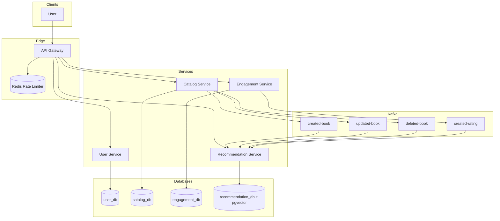
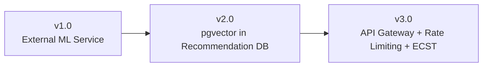
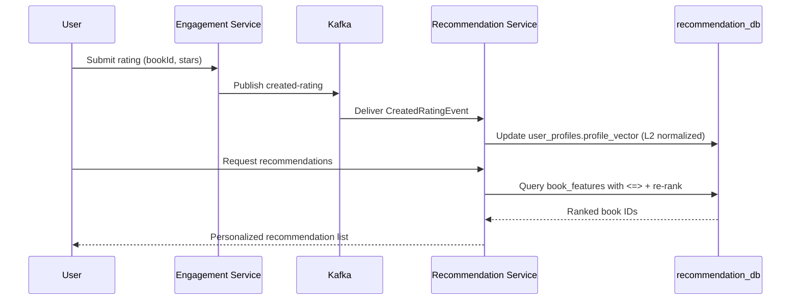

# 📖 VellumHub

[](https://openjdk.org/)
[](https://spring.io/projects/spring-boot)
[](https://www.postgresql.org/)
[](https://github.com/pgvector/pgvector)
[](https://www.docker.com/)
[](LICENSE)

VellumHub is a production-oriented, book-focused microservices platform with event-driven recommendation updates, pgvector similarity search, and local read models for low-latency serving.

This README is intentionally architecture-first, evidence-driven, and aligned with the current runtime implementation.

---

## Table of Contents

- [System Design (v3.0)](#system-design-v30)
- [Architecture Evolution (v1.0 → v2.0 → v2.1 → v3.0)](#architecture-evolution-v10--v20--v21--v30)
- [Active API Documentation (Swagger/OpenAPI)](#active-api-documentation-swaggeropenapi)
- [AI & Vector Pipeline](#ai--vector-pipeline)
- [Event-Driven Backbone (ECST)](#event-driven-backbone-ecst)
- [Observability](#observability)
- [Database and pgvector Design](#database-and-pgvector-design)
- [Roadmap and Future Enhancements](#roadmap-and-future-enhancements)
- [Quick Start](#quick-start)

---

## System Design (v3.0)


```mermaid
graph TB
    subgraph Clients
      U[User]
    end

    subgraph Edge
      GW[API Gateway]
      REDIS[(Redis Rate Limiter)]
    end

    subgraph Services
      US[User Service]
      CS[Catalog Service]
      ES[Engagement Service]
      RS[Recommendation Service]
    end

    subgraph Kafka
      B1[created-book]
      B2[updated-book]
      B3[deleted-book]
      R1[created-rating]
    end

    subgraph Databases
      UDB[(user_db)]
      CDB[(catalog_db)]
      EDB[(engagement_db)]
      RDB[(recommendation_db + pgvector)]
    end

    U --> GW
    GW --> US
    GW --> CS
    GW --> ES
    GW --> RS
    GW --> REDIS

    US --> UDB
    CS --> CDB
    ES --> EDB
    RS --> RDB

    CS --> B1
    CS --> B2
    CS --> B3
    ES --> R1

    B1 --> RS
    B2 --> RS
    B3 --> RS
    R1 --> RS
```

The Recommendation Service acts as an event-fed local read model:
- `book_features` for vector search state
- `user_profiles` for preference vectors
- `recommendations` for response metadata

Edge layer hardening in v3.0:
- Central ingress through Spring Cloud Gateway (`gateway-service`)
- Redis-backed request rate limiting per route (`RequestRateLimiter`)
- Auth route protected by IP-based limiter; authenticated routes protected by user-aware limiter

### v3.0 edge policy (current implementation)

| Route | Key strategy | Replenish rate | Burst capacity |
|---|---|---:|---:|
| `/api/v1/auth/**` | IP-based (`ipKeyResolver`) | 5 req/s | 10 |
| `/api/v1/users/**` | User-based (`userKeyResolver`) | 10 req/s | 20 |
| `/api/v1/catalog/**` | User-based (`userKeyResolver`) | 30 req/s | 60 |
| `/api/v1/engagement/**` | User-based (`userKeyResolver`) | 30 req/s | 60 |
| `/api/v1/recommendation/**` | User-based (`userKeyResolver`) | 20 req/s | 40 |

---

## Architecture Evolution (v1.0 → v2.0 → v2.1 → v3.0)

### v1.0
- External ML service in critical recommendation path
- More network hops and operational coupling

### v2.0
- Recommendation compute moved into JVM services + PostgreSQL pgvector
- Historical project docs in this repository report latency movement from ~300–500ms to ~80–120ms in this transition narrative

### v3.0
- API Gateway introduced as the single external entry point
- Route-level rate limiting introduced with Redis token buckets
- Event-Carried State Transfer (ECST) used to keep recommendation state synchronized incrementally
- User interactions feed Kafka topics, and consumers update vectors continuously


```mermaid
graph LR
  V1[v1.0\nExternal ML Service] --> V2[v2.0\npgvector in Recommendation DB]
  V2 --> V3[v3.0\nAPI Gateway + Rate Limiting + ECST]
```

---

## Active API Documentation (Swagger/OpenAPI)

Swagger/OpenAPI is configured in all services and exposed publicly via security rules:
`/swagger-ui/**`, `/swagger-ui.html`, `/v3/api-docs/**`.

In v3.0, the recommended production ingress is the API Gateway (`http://localhost:8080`), while Swagger remains service-scoped for technical API inspection.

| Service | Swagger UI | OpenAPI JSON |
|---|---|---|
| User Service | `http://localhost:8084/swagger-ui/index.html` | `http://localhost:8084/v3/api-docs` |
| Catalog Service | `http://localhost:8081/swagger-ui/index.html` | `http://localhost:8081/v3/api-docs` |
| Engagement Service | `http://localhost:8083/swagger-ui/index.html` | `http://localhost:8083/v3/api-docs` |
| Recommendation Service | `http://localhost:8085/swagger-ui/index.html` | `http://localhost:8085/v3/api-docs` |

---

## AI & Vector Pipeline

### Embedding model and dimensionality

Recommendation uses LangChain4j embeddings with `AllMiniLmL6V2EmbeddingModel`, stored as `vector(384)`:

```java
// recommendation-service/.../share/config/EmbeddingConfig.java
@Bean
public EmbeddingModel embeddingModel() {
    return new AllMiniLmL6V2EmbeddingModel();
}
```

```java
// recommendation-service/.../book_feature/domain/model/BookFeature.java
@Column(name = "embedding", columnDefinition = "vector(384)")
private float[] embedding;
```

```java
// recommendation-service/.../user_profile/domain/model/UserProfile.java
@Column(columnDefinition = "vector(384)")
private float[] profileVector = new float[384];
```

The book embedding provider normalizes vectors to unit length before persistence.

### User profile update logic on new ratings

Profile updates are incremental and normalized:
- Category weight mapping (`DETRACTOR=-5`, `NEUTRAL=1`, `PROMOTER=5`)
- Delta update with learning rate `0.1f`
- L2 normalization after update

```java
int adjustmentWeight = getWeightAdjustment(newStars, oldStars, isNewRating);
this.profileVector[i] += (bookEmbedding[i] * adjustmentWeight * learningRate);
this.normalizeVector(sumOfSquares);
```

### Retrieval path

Candidate retrieval uses cosine-distance operator `<=>`, then re-ranks with popularity blend:

```sql
SELECT
    b.book_id,
    b.popularity_score,
    (b.embedding <=> u.profile_vector) AS vector_dist
...
ORDER BY b.embedding <=> u.profile_vector ASC
LIMIT 200
```

```sql
ORDER BY
    (c.vector_dist * 0.7) + ((1 - COALESCE(c.popularity_score, 0)) * 0.3) ASC
```

---

## Event-Driven Backbone (ECST)

### Learning loop (interaction → event → vector update)


```mermaid
sequenceDiagram
    participant User
    participant ES as Engagement Service
    participant K as Kafka
    participant RS as Recommendation Service
    participant DB as recommendation_db

    User->>ES: Submit rating (bookId, stars)
    ES->>K: Publish created-rating
    K->>RS: Deliver CreatedRatingEvent
    RS->>DB: Update user_profiles.profile_vector (L2 normalized)

    User->>RS: Request recommendations
    RS->>DB: Query book_features with <=> + re-rank
    DB-->>RS: Ranked book IDs
    RS-->>User: Personalized recommendation list
```

### Topic naming (standardized)

Use these topic names consistently:
- `created-book`
- `updated-book`
- `deleted-book`
- `created-rating`

### Internal Contract Variance

Payload naming is now aligned for the rating event contract:

- Engagement producer event field: `bookId`
- Recommendation consumer event field: `bookId`

---

### Observability

- Spring Boot Actuator included in all services
- Health/metrics/prometheus endpoints enabled in service properties
- Health endpoints exposed through security configuration
- Kafka health indicator is enabled (`management.health.kafka.enabled=true`)
- Gateway edge metrics can be inferred from Redis-backed limiter behavior and route-level traffic controls


---

## Database and pgvector Design

The repository includes explicit Recommendation DB bootstrap SQL:

```sql
CREATE EXTENSION IF NOT EXISTS vector;

CREATE TABLE IF NOT EXISTS book_features (
    book_id UUID PRIMARY KEY,
    embedding vector(384),
    popularity_score DOUBLE PRECISION,
    last_updated TIMESTAMP WITH TIME ZONE NOT NULL
);

CREATE INDEX IF NOT EXISTS idx_book_embedding_hnsw
ON book_features
USING hnsw (embedding vector_cosine_ops);
```

Confirmed from code and SQL:
- Index type: `hnsw`
- Operator class: `vector_cosine_ops`
- Similarity operator used in query path: `<=>`

---

## Roadmap and Future Enhancements

### Planned Technical Improvements

- **Gateway Hardening:** Expand edge controls with route-specific quotas by client class and environment profiles.
- **Kafka Resilience:** Implement custom retry and Dead Letter Topic (DLT) strategies for consumers.
- **Observability:** Integrate distributed tracing instrumentation (e.g., Micrometer Tracing or Zipkin) across services, including gateway hops.
- **Integration Testing:** Introduce a Testcontainers-based test suite to validate Kafka and pgvector workflows.
- **CI/CD Alignment:** Upgrade pipeline runners to fully support Java 21 for seamless Maven test execution.

---

## Quick Start

```bash
docker-compose up -d
```

Service URLs:
- API Gateway (entry point): `http://localhost:8080`
- User Service: `http://localhost:8084`
- Catalog Service: `http://localhost:8081`
- Engagement Service: `http://localhost:8083`
- Recommendation Service: `http://localhost:8085`
- Kafka UI: `http://localhost:8090`

---

**VellumHub** — Event-driven, vector-native book recommendations on the JVM.
