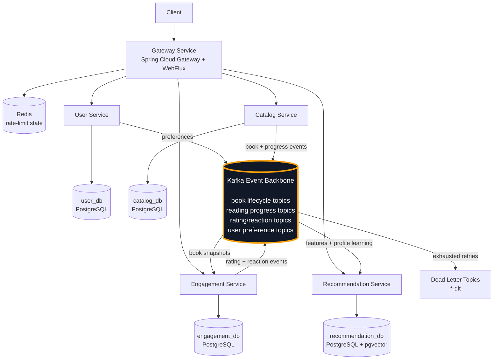
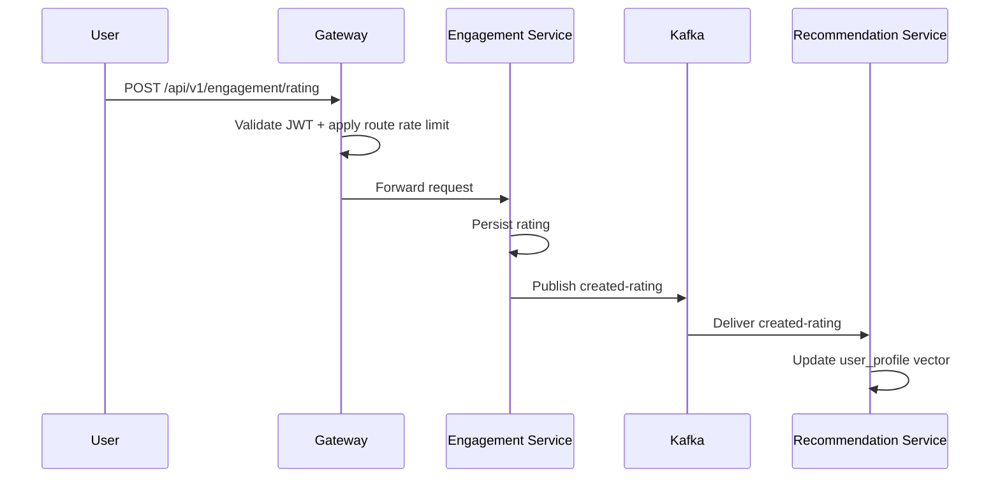

# VellumHub

> A production-grade JVM microservices backend for book discovery — demonstrating distributed system design through service-owned databases, event-carried state transfer, vector-based recommendations, gateway-enforced security, and operational hardening.

[](https://openjdk.org/)
[](https://spring.io/projects/spring-boot)
[](https://kafka.apache.org/)
[](https://github.com/pgvector/pgvector)
[](https://spring.io/projects/spring-cloud-gateway)
[](https://www.postgresql.org/)
[](https://redis.io/)
[](https://www.docker.com/)

VellumHub is the backend infrastructure of a social reading platform. Users discover books, track reading progress, rate titles, react to content, and receive personalized recommendations — served by five independent services communicating through Kafka events.

The project is written as a backend engineering reference system. The goal is not merely to expose CRUD endpoints, but to show how identity, catalog ownership, reader engagement, asynchronous replication, vector ranking, gateway security, observability, and reliability hardening fit together in one coherent platform.

The current architecture is a mature v3 platform moving through v4 reliability hardening. The five-service topology, Kafka backbone, gateway JWT enforcement, service-owned databases, and pgvector recommendation model are in place. The active focus is correctness and operational resilience: topic contracts, idempotent consumers, transactional outbox, database migrations, production security, tracing, and integration testing.

---

## Contents

- [System at a Glance](#system-at-a-glance)
- [Architecture](#architecture)
- [Repository Layout](#repository-layout)
- [Service Map](#service-map)
- [Core Flows](#core-flows)
- [Recommendation Engine](#recommendation-engine)
- [Kafka Event Contracts](#kafka-event-contracts)
- [Kafka Resilience](#kafka-resilience)
- [Gateway and Security](#gateway-and-security)
- [Running Locally](#running-locally)
- [Observability](#observability)
- [Quality and Test Coverage](#quality-and-test-coverage)
- [Roadmap](#roadmap)
- [Design Decisions](#design-decisions)
- [References](#references)

---

## System at a Glance

### Scale

| Dimension | Value |
|---|---:|
| Application services | 5 |
| Docker Compose services, default profile | 13 |
| Optional observability services | 5 |
| Main Java files | 393 |
| Test Java files | 92 |
| Controllers | 15 |
| Use case classes | 44 |
| Kafka listener classes | 14 |

### Recommendation model

| Dimension | Value |
|---|---|
| Embedding dimensions | 384 |
| Index type | HNSW cosine |
| ANN candidate pool | 200 books |
| Ranking blend | 70% semantic / 30% popularity |
| Local benchmark latency | ~80-120 ms in-JVM pgvector |
| Previous architecture latency | ~300-500 ms with external Python ML sidecar |

The latency numbers are project-local benchmark notes, not production SLAs.

### Local quality evidence

| Area | Current evidence |
|---|---|
| Gateway tests | Recorded passing local run |
| Catalog tests | Recorded passing local run |
| Gateway suite | 1 test, 0 failures, 0 errors |
| Catalog suite | 142 tests, 0 failures, 0 errors |
| Latest recorded passing run | 2026-05-25 |

Coverage percentage is not claimed because no local JaCoCo configuration or generated coverage report was found during inspection.

---

## Architecture

All public HTTP traffic enters through the gateway. Downstream services also validate JWTs independently, so the gateway is an ingress boundary rather than the only security boundary.


```mermaid
graph TB
    Client[Client] --> Gateway[Gateway Service\nSpring Cloud Gateway + WebFlux]
    Gateway --> Redis[(Redis\nrate-limit state)]

    Gateway --> User[User Service]
    Gateway --> Catalog[Catalog Service]
    Gateway --> Engagement[Engagement Service]
    Gateway --> Recommendation[Recommendation Service]

    User --> UserDb[(user_db\nPostgreSQL)]
    Catalog --> CatalogDb[(catalog_db\nPostgreSQL)]
    Engagement --> EngagementDb[(engagement_db\nPostgreSQL)]
    Recommendation --> RecommendationDb[(recommendation_db\nPostgreSQL + pgvector)]

    User -->|preferences| Kafka[(Kafka Event Backbone\n\nbook lifecycle topics\nreading progress topics\nrating/reaction topics\nuser preference topics)]
    Catalog -->|book + progress events| Kafka
    Engagement -->|rating + reaction events| Kafka

    Kafka -->|book snapshots| Engagement
    Kafka -->|features + profile learning| Recommendation
    Kafka -->|exhausted retries| Dlt[Dead Letter Topics\n*-dlt]

    style Kafka fill:#111827,color:#ffffff,stroke:#f59e0b,stroke-width:4px,font-size:18px
```

Key architectural choices:

- **Service-owned databases:** each service owns its domain model and schema. There are no shared application tables.
- **Event-carried state transfer:** downstream services build local read models from Kafka events instead of querying source services in critical paths.
- **Local recommendation serving:** the recommendation service reads from its own `book_features`, `user_profiles`, and `recommendations` tables at query time, with no synchronous calls to catalog, engagement, or user services.
- **Gateway-controlled ingress:** Spring Cloud Gateway WebFlux enforces JWT authentication and Redis-backed rate limits before requests reach downstream services.
- **Defense in depth:** downstream services validate JWTs independently instead of relying exclusively on the gateway.
- **Operational visibility:** the local platform includes Actuator, Prometheus metrics, structured logs, OpenTelemetry Java Agent traces, Kafka UI, and an optional Grafana/Prometheus/Loki/Tempo/Alloy stack.

Existing Feign-related configuration in `recommendation-service` is legacy cleanup debt, not an active recommendation query-time dependency.

---

## Repository Layout

```text
.
├── services/           # Application service modules
│   ├── gateway-service
│   ├── user-service
│   ├── catalog-service
│   ├── engagement-service
│   └── recommendation-service
├── infra/              # Docker, observability config, scripts
├── docs/               # Architecture and operational documentation
├── docker-compose.yml
└── .env.example
```

Application code lives under `services/`. Local environment definitions, Docker support files, observability configuration, and operational scripts live under `infra/`. Project documentation lives under `docs/`, while root-level files are kept for common entrypoints such as `docker-compose.yml`, `.env.example`, and this README.

---

## Service Map

| Service | Responsibility | Details |
|---|---|---|
| `gateway-service` | Public edge for routing, JWT enforcement, and Redis-backed rate limiting | [README](services/gateway-service/README.md) |
| `user-service` | Identity, authentication, Google login, user management, and preference seeds for cold-start recommendations | [README](services/user-service/README.md) |
| `catalog-service` | Source of truth for books, book requests, book lists, membership, covers, and current reading progress | [README](services/catalog-service/README.md) |
| `engagement-service` | Ratings, reactions, replicated reading progress history, and book snapshots | [README](services/engagement-service/README.md) |
| `recommendation-service` | Event-fed read model, embeddings, user profile vectors, and ranking | [README](services/recommendation-service/README.md) |

The root README stays focused on system shape, reliability posture, and local operation. Endpoint-level inventories and OpenAPI details live in each service README and service-local Swagger UI.

---

## Core Flows

### 1. Registration to cold-start profile

A user registers with genre preferences. `user-service` publishes `created-user-preference`, and `recommendation-service` seeds a profile vector before the user has ratings or reactions.

### 2. Catalog mutation to local projections

`catalog-service` owns book state and emits lifecycle events. Recommendation and engagement consume those events to update local read models without joining through shared databases or performing synchronous source-service reads.

### 3. Reader engagement to learning signal

Ratings, reactions, and reading progress become Kafka signals that adjust user profile vectors inside the recommendation service.

### 4. Recommendation serving

The gateway routes authenticated recommendation traffic to `recommendation-service`, which ranks from local PostgreSQL + pgvector tables without synchronous calls to catalog, engagement, or user services.

### Representative asynchronous flow — rating feedback


```mermaid
sequenceDiagram
    participant U as User
    participant G as Gateway
    participant E as Engagement Service
    participant K as Kafka
    participant R as Recommendation Service

    U->>G: POST /api/v1/engagement/rating
    G->>G: Validate JWT + apply route rate limit
    G->>E: Forward request
    E->>E: Persist rating
    E->>K: Publish created-rating
    K->>R: Deliver created-rating
    R->>R: Update user_profile vector
```

---

## Recommendation Engine

The recommendation service consumes catalog and interaction events and maintains local projection tables:

| Table | Purpose |
|---|---|
| `book_features` | Book embedding and popularity state, stored as `vector(384)` |
| `user_profiles` | Per-user preference vector, interacted book IDs, and engagement score |
| `recommendations` | Denormalized book metadata for response assembly without source-service calls |

The embedding pipeline uses LangChain4j's in-process `AllMiniLmL6V2EmbeddingModel`, which runs in the JVM and produces 384-dimensional vectors. Book and profile vectors are L2-normalized before cosine-distance ranking.

Ranking path:

1. `book_features.embedding` is stored as `vector(384)`.
2. `idx_book_embedding_hnsw` uses HNSW with `vector_cosine_ops`.
3. ANN search retrieves a candidate pool of 200 books.
4. Already-interacted books are filtered at query time.
5. Candidates are re-ranked with a 70% semantic / 30% popularity blend.
6. If a user profile is missing, the service falls back to popularity ranking.

Historical local benchmark notes describe the move from an external Python ML sidecar to in-JVM pgvector ranking as a latency improvement from roughly 300-500 ms to 80-120 ms. Treat these numbers as local project measurements, not a published production SLA.

---

## Kafka Event Contracts

Kafka is the state propagation backbone. Producers publish business events; consumers maintain local projections from those events.

### Topic inventory

Kafka topic names, type aliases, and cross-service event payloads are centralized in `lib/kafka-contracts`.

| Topic | Producer | Consumer(s) |
|---|---|---|
| `created-book` | Catalog | Recommendation, Engagement book snapshot |
| `updated-book` | Catalog | Recommendation |
| `deleted-book` | Catalog | Recommendation, Engagement book snapshot |
| `created-rating` | Engagement | Recommendation user profile learning |
| `user-reaction-changed` | Engagement | Recommendation user profile learning |
| `created-user-preference` | User | Recommendation cold-start profile seed |
| `created-reading-progress` | Catalog | Engagement reading history |
| `updated-reading-progress` | Catalog | Recommendation user profile learning |

The contract library keeps producers, consumers, retry configuration, and JSON type mappings aligned to one source of truth.

---

## Kafka Resilience

Recommendation and engagement consumers use Spring Kafka retry topic configuration:

- Fixed 3-second backoff.
- Maximum of 3 attempts.
- Retry topic forwarding instead of local `try/catch` swallowing.
- Centralized `*-dlt` listeners for exhausted messages.

Dead Letter Topic logs include the original topic, DLT topic, exception message, and payload byte length. They do not print raw payloads by default, keeping the recovery signal useful without exposing Kafka message content in logs.

The implemented system already uses Kafka for local projections and recommendation learning. The remaining work is to make topic contracts impossible to drift silently, then harden consumer idempotency and transactional event publication.

---

## Gateway and Security

The gateway is built with Spring Cloud Gateway on WebFlux and Project Reactor. It routes public prefixes to internal services and applies request limiting through Redis.

### Route table

| Public prefix | Internal target |
|---|---|
| `/api/v1/auth/**` | `user-service` |
| `/api/v1/users/**` | `user-service` |
| `/api/v1/catalog/**` | `catalog-service` |
| `/api/v1/engagement/**` | `engagement-service` |
| `/api/v1/recommendations/**` | `recommendation-service` |

### Rate limits

| Route group | Replenish rate | Burst capacity | Key strategy |
|---|---:|---:|---|
| Auth / User | 5 req/s | 10 | IP |
| Catalog / Engagement | 30 req/s | 60 | Principal → IP fallback |
| Recommendations | 20 req/s | 40 | Principal → IP fallback |

### Current hardening posture

- The gateway is the public ingress boundary, but downstream services still validate JWTs independently.
- Health endpoints remain reachable for Docker healthchecks.
- Broader Actuator endpoints such as `info` and `metrics` require authentication on application services and gateway.
- In the `prod` profile, health details are hidden and gateway logging is reduced from local `TRACE` diagnostics to `INFO`.
- Remaining operational security work includes removing unsafe production defaults, tightening Actuator exposure, hardening secret handling, and reducing production log verbosity.

---

## Running Locally

### Prerequisites

- Docker and Docker Compose
- Java 21
- A `.env` file based on [`.env.example`](.env.example)

Required environment shape:

```env
POSTGRES_USER=your_user
POSTGRES_PASSWORD=your_password
JWT_KEY=base64_encoded_secret_at_least_32_bytes
JWT_EXPIRATION_MS=604800000
GOOGLE_CLIENT_ID=your_google_client_id
CORS_ALLOWED_ORIGINS=http://localhost:3000
```

For the Docker Compose `prod` profile used by the local stack, `JWT_KEY` is required by all five application services. `JWT_EXPIRATION_MS` is also required by `user-service`, and `GOOGLE_CLIENT_ID` is required for Google login support.

Generate a local Base64 JWT key:

```bash
openssl rand -base64 32
```

Windows PowerShell alternative:

```powershell
$bytes = New-Object byte[] 32
$rng = New-Object System.Security.Cryptography.RNGCryptoServiceProvider
$rng.GetBytes($bytes)
[Convert]::ToBase64String($bytes)
$rng.Dispose()
```

### Start the default stack

```bash
docker-compose up -d
```

The default Compose stack defines 13 services:

- `gateway-service`
- `user-service`
- `catalog-service`
- `engagement-service`
- `recommendation-service`
- `postgres-user`
- `postgres-catalog`
- `postgres-engagement`
- `postgres-recommendation`
- `redis-gateway`
- `zookeeper`
- `kafka`
- `kafka-ui`

Published local endpoints:

| Component | URL |
|---|---|
| API Gateway | `http://localhost:8080` |
| Kafka UI | `http://localhost:8090` |

Application services run inside the Docker network on port `8080`. Direct host access to downstream services is a development workflow, not the default Compose exposure.

### Start with observability

```bash
docker compose --profile observability up -d --build
```

This adds Prometheus, Grafana, Loki, Tempo, and Alloy. Operational details live in [docs/OBSERVABILITY.md](docs/OBSERVABILITY.md).

### Run a service directly

Each service has its own Maven wrapper:

```bash
cd services/catalog-service
./mvnw spring-boot:run
```

Windows PowerShell:

```powershell
cd services\catalog-service
.\mvnw.cmd spring-boot:run
```

When running multiple services directly, set distinct `SERVER_PORT` values to avoid local port conflicts.

### Verify the topology

```bash
docker compose config --services
```

### Run tests

Recorded passing local suites:

```powershell
cd services\gateway-service
.\mvnw.cmd test

cd ..\catalog-service
.\mvnw.cmd test
```

Run all service test commands during broad local verification:

```powershell
foreach ($service in 'gateway-service','catalog-service','user-service','engagement-service','recommendation-service') {
    Push-Location "services\$service"
    .\mvnw.cmd test
    Pop-Location
}
```

Use the full loop when you want a complete local signal before publishing a broad change.

### API docs and ports

Springdoc OpenAPI is configured in the domain services. For direct service runs, open these paths on the service port you assigned:

| Service | Swagger UI | OpenAPI JSON |
|---|---|---|
| User | `/swagger-ui/index.html` | `/v3/api-docs` |
| Catalog | `/swagger-ui/index.html` | `/v3/api-docs` |
| Engagement | `/swagger-ui/index.html` | `/v3/api-docs` |
| Recommendation | `/swagger-ui/index.html` | `/v3/api-docs` |

The gateway exposes Actuator endpoints, not a Springdoc UI. Its route prefixes are the public API surface. Service-local Swagger pages are for development and inspection.

---

## Observability

The optional observability profile provides a complete local signal without external infrastructure. It combines service metrics, structured logs, traces, dashboards, alerts, and runbooks.

Enable it with:

```bash
docker compose --profile observability up -d --build
```

### Local observability endpoints

| Component | URL | Purpose |
|---|---|---|
| Prometheus | `http://localhost:9090` | Scrapes service metrics from `/actuator/prometheus` |
| Grafana | `http://localhost:3002` | Dashboards, Explore, and provisioned datasources |
| Loki | `http://localhost:3100` | Stores structured Docker logs collected by Alloy |
| Tempo | `http://localhost:3200` | Stores traces sent through Alloy |
| Alloy | `http://localhost:12345` | Collects Docker logs and forwards OTLP traces |
| Kafka UI | `http://localhost:8090` | Topic and consumer-group inspection |

Grafana is provisioned with Prometheus, Loki, and Tempo datasources plus these dashboards:

- `VellumHub Overview`
- `Gateway and HTTP`
- `Services JVM and DB`
- `Kafka Flow`
- `Recommendation Health`

### Actuator endpoints

Services expose Spring Boot Actuator endpoints:

- `/actuator/health`
- `/actuator/info`
- `/actuator/metrics`
- `/actuator/prometheus`

`/actuator/prometheus` is backed by the Micrometer Prometheus registry and exports metrics with a common `service` tag. Prometheus scrapes the gateway, user, catalog, engagement, and recommendation services on the Docker network.

### Custom metrics

Custom application metrics use the `vellumhub_*` prefix with intentionally low-cardinality labels: `service`, `topic`, `event_type`, `consumer_group`, `operation`, and `result`.

Kafka and DLT metrics:

- `vellumhub_kafka_events_published_total`
- `vellumhub_kafka_events_publish_failed_total`
- `vellumhub_kafka_events_consumed_total`
- `vellumhub_kafka_events_consume_failed_total`
- `vellumhub_kafka_event_processing_duration_seconds_count`
- `vellumhub_kafka_event_processing_duration_seconds_sum`
- `vellumhub_kafka_dlt_events_total`

Business metrics:

- `vellumhub_users_total`
- `vellumhub_books_total`
- `vellumhub_books_updated_total`
- `vellumhub_books_deleted_total`
- `vellumhub_reading_progress_updated_total`
- `vellumhub_ratings_total`
- `vellumhub_reactions_changed_total`
- `vellumhub_recommendations_requested_total`
- `vellumhub_recommendations_generated_total`
- `vellumhub_recommendation_empty_results_total`
- `vellumhub_recommendation_generation_duration_seconds_count`
- `vellumhub_recommendation_generation_duration_seconds_sum`

The Kafka metrics cover producer success/failure, consumer success/failure, processing duration, and DLT quarantine. Business metrics cover user registration/admin creation, catalog book lifecycle, reading progress updates, ratings, reactions, and recommendation generation. Recommendation metrics distinguish empty results from generated non-empty results.

Structured logs flow from application containers to Loki through Alloy. DLT logs include original topic, DLT topic, exception message, and payload byte length without printing raw Kafka payloads by default.

Traces are emitted by the OpenTelemetry Java Agent and forwarded through Alloy to Tempo. Metrics and logs intentionally stay on the Micrometer/Prometheus and Docker-log/Loki paths.

Operational documentation:

- [docs/OBSERVABILITY.md](docs/OBSERVABILITY.md)
- [docs/OBSERVABILITY_RUNBOOKS.md](docs/OBSERVABILITY_RUNBOOKS.md)
- [docs/KAFKA_MONITORING.md](docs/KAFKA_MONITORING.md)

The code-level topic inventory in this README is newer than parts of the Kafka monitoring document.

---

## Quality and Test Coverage

### Static footprint

| Service | Main Java | Test Java | Controllers | Kafka listeners | Use cases |
|---|---:|---:|---:|---:|---:|
| `gateway-service` | 3 | 1 | 0 | 0 | 0 |
| `user-service` | 58 | 15 | 3 | 0 | 1 |
| `catalog-service` | 158 | 34 | 7 | 0 | 20 |
| `engagement-service` | 96 | 11 | 3 | 5 | 12 |
| `recommendation-service` | 78 | 31 | 2 | 9 | 11 |
| **Total** | **393** | **92** | **15** | **14** | **44** |

### What the tests target

The current test suite is strongest around domain behavior and adapter boundaries:

- `catalog-service`: book lifecycle, book requests, book lists, memberships, reading progress, handlers, use cases, and controller behavior.
- `recommendation-service`: user profile vector learning, embedding providers, recommendation use cases, Kafka consumers, mappers, repository adapters, and controller responses.
- `user-service`: auth flows, user handlers/controllers, password validation, security helpers, and user preference event publication.
- `engagement-service`: rating use cases, request context, book snapshot use cases, and reading-session event publishing/consumption paths.
- `gateway-service`: Spring application and gateway configuration smoke coverage.

The next quality step is integration coverage for real Kafka/PostgreSQL behavior with Testcontainers, especially retry/DLT, topic contracts, idempotency, and projection updates.

### Recorded passing test runs

Latest recorded passing local verification in this workspace was performed on 2026-05-25.

| Service | Command | Status |
|---|---|---|
| `gateway-service` | `.\mvnw.cmd test` | Passing: 1 test, 0 failures, 0 errors |
| `catalog-service` | `.\mvnw.cmd test` | Passing: 142 tests, 0 failures, 0 errors |

### Current quality bar

- Every service has its own Maven wrapper and Dockerfile.
- Unit and slice tests cover domain models, use cases, controllers, Kafka consumers, mappers, and repository adapters in the strongest-covered services.
- Kafka retry/DLT behavior is implemented in engagement and recommendation, but end-to-end retry/DLT verification still needs Testcontainers coverage.
- Docker Compose defines service healthchecks for gateway, databases, Redis, Kafka, and application services.
- Actuator, metrics, Prometheus endpoints, structured logs, OpenTelemetry Java Agent traces, Kafka UI, and the optional Grafana/Prometheus/Loki/Tempo/Alloy profile provide local operational inspection.
- Coverage percentage is not claimed because no local JaCoCo configuration or generated coverage report was found during inspection.
- Docker Compose configuration rendered successfully during local inspection, but a full `docker-compose up` health verification was not part of this README pass.

---

## Roadmap

VellumHub is currently focused on correctness and operational resilience. The next phase is not about adding more endpoints; it is about making the existing platform safer under real distributed-system failure modes.

| Area | Goal | Issue |
|---|---|---|
| Kafka contracts | Centralize topic names, align producers/consumers/retry configs, and add drift-detection tests | [#199](https://github.com/Luca5Eckert/VellumHub/issues/199) |
| Consumer idempotency | Add `processed_events` handling for at-least-once Kafka delivery | [#200](https://github.com/Luca5Eckert/VellumHub/issues/200) |
| Transactional outbox | Persist catalog and engagement changes atomically with outgoing events | [#201](https://github.com/Luca5Eckert/VellumHub/issues/201), [#202](https://github.com/Luca5Eckert/VellumHub/issues/202) |
| Distributed tracing | Add manual domain spans or Kafka propagation where automatic OTEL instrumentation is insufficient | [#204](https://github.com/Luca5Eckert/VellumHub/issues/204) |
| Database migrations | Replace production `ddl-auto=update` behavior with Flyway migrations and validation | [#205](https://github.com/Luca5Eckert/VellumHub/issues/205) |
| Operational security | Harden Actuator exposure, secret defaults, and production logging | [#206](https://github.com/Luca5Eckert/VellumHub/issues/206) |
| Integration tests | Add Testcontainers coverage for PostgreSQL, Kafka, retry/DLT, and projection flows | [#207](https://github.com/Luca5Eckert/VellumHub/issues/207) |

---

## Design Decisions

| Decision | Rationale |
|---|---|
| Service-owned databases | Keeps domain ownership explicit, avoids hidden coupling through shared tables, and makes each service independently deployable. |
| Event-carried state transfer over synchronous reads | Lets recommendation and engagement serve from local state in critical paths while accepting eventual consistency. |
| PostgreSQL + pgvector | Keeps vector search close to relational metadata, transactions, joins, and local Docker workflows. |
| HNSW cosine search | Provides approximate nearest-neighbor retrieval for dense embeddings with a practical speed/recall tradeoff suitable for the candidate pool size. |
| In-process LangChain4j embeddings | Removes a separate ML sidecar from the request path, keeps the platform JVM-based, and improves local recommendation latency. |
| Retry topics + DLT | Makes event processing failures visible and inspectable instead of silently losing state transitions through local exception swallowing. |
| Gateway plus downstream JWT validation | Uses the gateway as the ingress boundary without making it the only security boundary. |
| Optional observability profile | Keeps the default local stack lighter while still allowing full metrics, logs, traces, and dashboards when operational inspection is needed. |

---

## References

- [GitHub README guidance](https://docs.github.com/en/repositories/managing-your-repositorys-settings-and-features/customizing-your-repository/about-readmes)
- [Spring Kafka retry topic configuration](https://docs.spring.io/spring-kafka/reference/retrytopic/retry-config.html)
- [Spring Cloud Gateway reference](https://docs.spring.io/spring-cloud-gateway/docs/current/reference/html/)
- [LangChain4j in-process embeddings](https://docs.langchain4j.dev/integrations/embedding-models/in-process/)
- [pgvector HNSW and cosine search](https://github.com/pgvector/pgvector)
