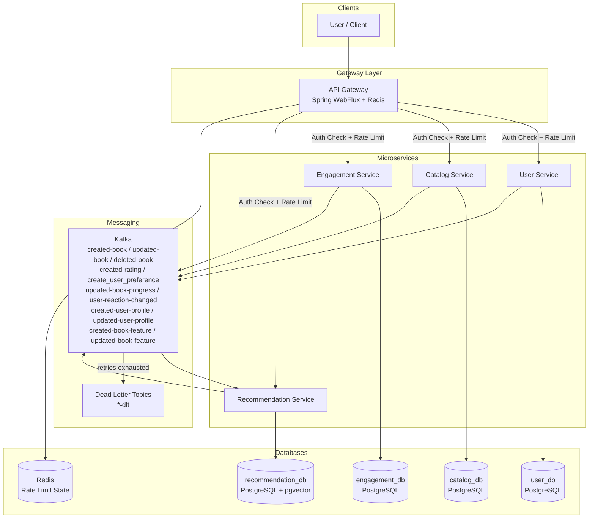
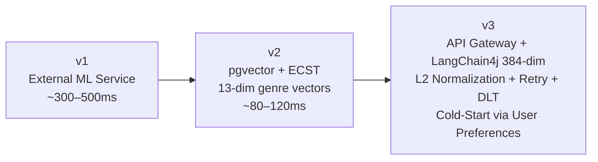
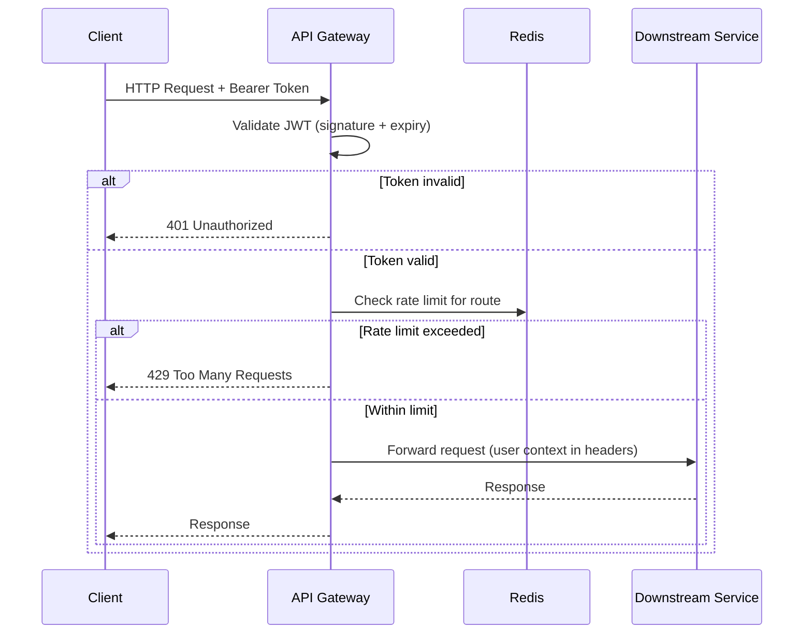
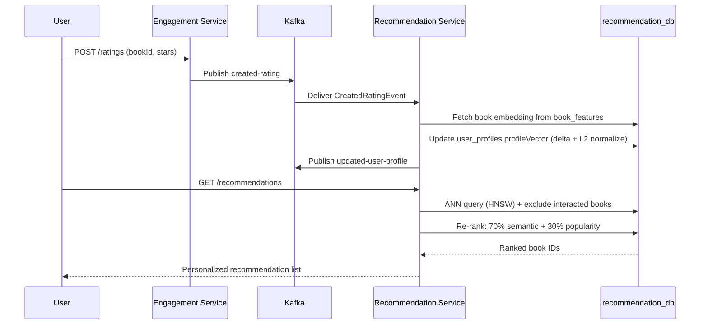
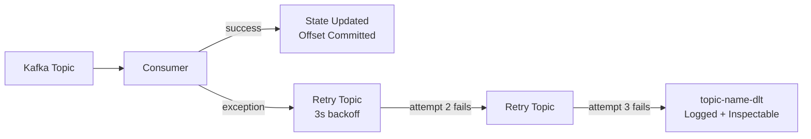

# 📖 VellumHub

[](https://openjdk.org/)
[](https://spring.io/projects/spring-boot)
[](https://docs.spring.io/spring-framework/reference/web/webflux.html)
[](https://www.postgresql.org/)
[](https://github.com/pgvector/pgvector)
[](https://redis.io/)
[](https://kafka.apache.org/)
[](https://www.docker.com/)
[](LICENSE)

**VellumHub** is a backend engineering reference platform built entirely on the JVM, designed around production patterns: a reactive API Gateway, event-driven recommendation state via Kafka (ECST), pgvector similarity search with LangChain4j embeddings, resilient consumers with retry and Dead Letter Topic handling, and a cold-start strategy seeded from user preferences declared at registration.

This README is architecture-first and evidence-driven — every major design decision is grounded in code references, SQL, and system diagrams.

---

## Table of Contents

- [System Design (v3.0)](#system-design-v30)
- [Architecture Evolution (v1 → v2 → v3)](#architecture-evolution-v1--v2--v3)
- [API Gateway](#api-gateway)
- [AI & Vector Pipeline](#ai--vector-pipeline)
- [Cold-Start Strategy](#cold-start-strategy)
- [Event-Driven Backbone (ECST)](#event-driven-backbone-ecst)
- [Kafka Resilience (Retry + DLT)](#kafka-resilience-retry--dlt)
- [Testing Strategy](#testing-strategy)
- [Service Modules](#service-modules)
- [Active API Documentation (Swagger/OpenAPI)](#active-api-documentation-swaggeropenapi)
- [Observability](#observability)
- [Database and pgvector Design](#database-and-pgvector-design)
- [Quick Start](#quick-start)
- [Roadmap and Future Enhancements](#roadmap-and-future-enhancements)

---

## System Design (v3.0)

The platform is organized into four layers: Gateway, Microservices, Messaging, and Databases. All external traffic enters through the API Gateway, which handles authentication, rate limiting, and reactive proxying before forwarding requests to downstream services.


```mermaid
graph TB
    subgraph Clients
      U[User / Client]
    end

    subgraph Gateway Layer
      GW[API Gateway\nSpring WebFlux + Redis]
    end

    subgraph Microservices
      US[User Service]
      CS[Catalog Service]
      ES[Engagement Service]
      RS[Recommendation Service]
    end

    subgraph Messaging
      K[Kafka\ncreated-book / updated-book / deleted-book\ncreated-rating / create_user_preference\nupdated-book-progress / user-reaction-changed\ncreated-user-profile / updated-user-profile\ncreated-book-feature / updated-book-feature]
      DLT[Dead Letter Topics\n*-dlt]
    end

    subgraph Databases
      UDB[(user_db\nPostgreSQL)]
      CDB[(catalog_db\nPostgreSQL)]
      EDB[(engagement_db\nPostgreSQL)]
      RDB[(recommendation_db\nPostgreSQL + pgvector)]
      REDIS[(Redis\nRate Limit State)]
    end

    U --> GW

    GW -->|Auth Check + Rate Limit| US
    GW -->|Auth Check + Rate Limit| CS
    GW -->|Auth Check + Rate Limit| ES
    GW -->|Auth Check + Rate Limit| RS

    GW --> REDIS

    US --> UDB
    CS --> CDB
    ES --> EDB
    RS --> RDB

    CS --> K
    ES --> K
    US --> K
    RS --> K
    K --> RS
    K -->|retries exhausted| DLT
```

The **Recommendation Service** operates as an event-fed local read model with three internal tables:

- `book_features` — 384-dim L2-normalized embeddings per book, used for ANN search
- `user_profiles` — incrementally updated preference vectors per user
- `recommendations` — pre-joined book metadata via ECST for low-latency response assembly

---

## Architecture Evolution (v1 → v2 → v3)

### v1 — External ML Service

The initial version relied on an external Python ML service in the critical recommendation path. Every request required a synchronous call to this service, introducing latency, operational coupling, and a single point of failure.

**Characteristics:**
- ML called synchronously per recommendation request
- Multiple network hops on every query
- High operational surface area (Python + JVM)
- No event-driven state updates

---

### v2 — In-JVM Vector Search + ECST

Recommendation computation moved entirely into the JVM. PostgreSQL + pgvector replaced the external ML service, and Kafka was formalized as the state propagation backbone using the **Event-Carried State Transfer (ECST)** pattern.

However, the vector space was **genre-based with 13 fixed dimensions** — one per genre. The embedding space was too coarse to distinguish books within the same genre, there was no semantic model, and vectors were not normalized.

**Key improvements over v1:**
- Latency dropped from ~300–500ms to ~80–120ms by eliminating the external ML hop
- Cosine similarity via pgvector's `<=>` operator with an HNSW index
- User profiles built incrementally from rating events
- Kafka consumers keep `book_features`, `user_profiles`, and `recommendations` updated asynchronously — zero cross-service calls at query time (ECST)

**Limitations:**
- 13-dimensional genre vectors too coarse for nuanced similarity
- No semantic embedding model — vectors manually constructed
- No vector normalization — cosine scores poorly calibrated
- No gateway layer — services directly exposed
- No Kafka retry or DLT — consumer failures were silent or stalled offsets
- No cold-start strategy — new users received no meaningful recommendations

---

### v3 — API Gateway + LangChain4j Embeddings + L2 Normalization + Kafka Resilience + Cold-Start

The current version addresses every limitation from v2.

**API Gateway (Spring WebFlux):** Single controlled entry point with JWT validation and per-route rate limiting via Redis. Internal services no longer handle auth independently.

**Embedding Pipeline:** Replaced 13-dim genre vectors with LangChain4j's `AllMiniLmL6V2EmbeddingModel`, producing **384-dimensional dense vectors**. L2 normalization applied before persistence projects every vector onto the unit sphere, making cosine scores directly comparable regardless of magnitude.

**Cold-Start Strategy:** On registration, the User Service captures genre preferences and a free-text `about` field, publishing a `create_user_preference` event. The Recommendation Service seeds the user's profile vector from this data using the same embedding pipeline — users get meaningful results from their very first request. If no profile exists at query time, the service falls back to a pure popularity ranking.

**Kafka Resilience:** All consumers are covered by a single `RetryTopicConfiguration` with 3 attempts and 3-second fixed backoff. Spring Kafka's non-blocking retry mechanism commits the original offset immediately, so partitions are never stalled. Events exhausting retries are forwarded to `*-dlt` topics and captured by a centralized DLT listener.

**Expanded Event Contract:** The Recommendation Service now publishes `created-user-profile`, `updated-user-profile`, `created-book-feature`, and `updated-book-feature`, making the full recommendation lifecycle expressible as an event chain with no synchronous inter-service coupling.


```mermaid
graph LR
  V1["v1\nExternal ML Service\n~300–500ms"]
  V2["v2\npgvector + ECST\n13-dim genre vectors\n~80–120ms"]
  V3["v3\nAPI Gateway + LangChain4j 384-dim\nL2 Normalization + Retry + DLT\nCold-Start via User Preferences"]

  V1 --> V2 --> V3
```

---

## API Gateway

The gateway is the exclusive entry point for all external traffic, built on **Spring Boot + Spring WebFlux** for a non-blocking, reactive request pipeline.

### Responsibilities

| Concern | Implementation |
|---|---|
| **Request routing** | Path-prefix proxying to downstream services |
| **Authentication** | JWT validation (signature + expiry) before forwarding |
| **Rate limiting** | Per-route limits enforced via Redis shared state |
| **Reactive I/O** | WebFlux — threads never blocked on downstream I/O |

### Routing Map

| Path Prefix | Upstream Service |
|---|---|
| `/api/users/**` | `user-service:8080` |
| `/api/catalog/**` | `catalog-service:8080` |
| `/api/engagement/**` | `engagement-service:8080` |
| `/api/recommendations/**` | `recommendation-service:8080` |

> Swagger UI paths (`/swagger-ui/**`, `/v3/api-docs/**`) bypass the gateway intentionally — they are served directly on each service's port for local development without requiring authentication.

### Rate Limiting

Rate limit state lives in Redis (`redis-gateway`), keeping the gateway stateless and horizontally scalable.

### Auth Flow


```mermaid
sequenceDiagram
    participant Client
    participant GW as API Gateway
    participant Redis
    participant SVC as Downstream Service

    Client->>GW: HTTP Request + Bearer Token
    GW->>GW: Validate JWT (signature + expiry)
    alt Token invalid
        GW-->>Client: 401 Unauthorized
    else Token valid
        GW->>Redis: Check rate limit for route
        alt Rate limit exceeded
            GW-->>Client: 429 Too Many Requests
        else Within limit
            GW->>SVC: Forward request (user context in headers)
            SVC-->>GW: Response
            GW-->>Client: Response
        end
    end
```

---

## AI & Vector Pipeline

### Embedding Model

The Recommendation Service uses LangChain4j's `AllMiniLmL6V2EmbeddingModel` to generate 384-dimensional dense vectors per book. Books with similar themes, writing style, or subject matter cluster together in the vector space regardless of genre label.

```java
// recommendation-service/.../config/EmbeddingConfig.java
@Bean
public EmbeddingModel embeddingModel() {
    return new AllMiniLmL6V2EmbeddingModel();
}
```

Both `book_features` and `user_profiles` share the same 384-dimensional space, enabling direct cosine similarity between a user's preference vector and any book embedding:

```java
// BookFeature.java
@Column(name = "embedding", columnDefinition = "vector(384)")
private float[] embedding;

// UserProfile.java
@Column(columnDefinition = "vector(384)")
private float[] profileVector = new float[384];
```

### L2 Normalization

All embedding vectors are L2-normalized before persistence. This projects every vector onto the unit sphere so cosine similarity scores are directly comparable across the entire catalog — without normalization, vectors with larger magnitudes would dominate scores regardless of semantic relevance.

This applies to both book embeddings (on `created-book` / `updated-book` events) and user profile vectors after every update.

### User Profile Update Logic

User preference vectors are updated incrementally on each rating event:

1. **Map rating to weight** — classified as `DETRACTOR` (-5), `NEUTRAL` (+1), or `PROMOTER` (+5) relative to the previous rating for that book
2. **Apply delta with learning rate** — the book's embedding is added to the profile vector, scaled by weight × `0.1f`
3. **L2 normalize** — the updated vector is re-normalized to maintain calibrated cosine similarity

```java
int adjustmentWeight = getWeightAdjustment(newStars, oldStars, isNewRating);
this.profileVector[i] += (bookEmbedding[i] * adjustmentWeight * learningRate);
this.normalizeVector(sumOfSquares); // L2 normalization
```

### Recommendation Retrieval Path

Candidate retrieval is a three-stage SQL pipeline executed as a single native query:

```sql
WITH user_data AS (
    -- Stage 1: isolate user vector and already-interacted books
    SELECT
        profile_vector,
        COALESCE(interacted_book_ids, '{}'::uuid[]) AS interacted_ids
    FROM user_profiles
    WHERE user_id = :userId
),
candidates AS (
    -- Stage 2: ANN candidate generation via HNSW index (top 200)
    SELECT
        b.book_id,
        b.popularity_score,
        (b.embedding <=> u.profile_vector) AS vector_dist
    FROM book_features b
    CROSS JOIN user_data u
    WHERE b.book_id <> ALL(u.interacted_ids)
    ORDER BY b.embedding <=> u.profile_vector ASC
    LIMIT 200
)
-- Stage 3: re-rank with popularity blend (70% semantic / 30% popularity)
SELECT c.book_id
FROM candidates c
ORDER BY
    (c.vector_dist * 0.7) + ((1 - COALESCE(c.popularity_score, 0)) * 0.3) ASC
LIMIT :limit OFFSET :offset
```

The 70/30 split is an initial heuristic — semantic relevance is the primary signal, with popularity acting as a diversity and tie-breaking factor. Already-interacted books are excluded at the query level via `<> ALL(interacted_ids)`, keeping results fresh without post-processing.

---

## Cold-Start Strategy

A new user has no rating history, so without intervention their `profileVector` would produce meaningless recommendations. VellumHub addresses this in two stages.

**Stage 1 — Preference-seeded profile (at registration):**

During registration, the User Service collects genre preferences and a free-text `about` field:

```java
// user-service/.../UserPreference.java
@Entity
@Table(name = "user_preferences")
public class UserPreference {
    @ElementCollection
    @CollectionTable(name = "user_preference_genres")
    private List<String> genres;

    private String about;
}
```

A `create_user_preference` event is published. The Recommendation Service consumes it and seeds the user's profile vector using the same LangChain4j embedding pipeline:

```java
// CreateUserProfileUseCase.java
@Transactional
public void execute(CreatedUserProfileCommand command) {
    var userProfile = userProfileRepository.findById(command.userId())
            .orElseGet(() -> UserProfile.create(command.userId()));

    var vectors = profileProvider.of(command.genres(), command.about());
    userProfile.applyVectorLearning(vectors, 0.5f);

    userProfileRepository.save(userProfile);
}
```

This ensures every user has a meaningful profile vector from their first login, before any rating is submitted.

**Stage 2 — Popularity fallback (if no profile exists at query time):**

If no user profile is found — for example, due to event delivery delay or a first-request race condition — the service falls back to a pure popularity ranking:

```sql
SELECT b.book_id
FROM book_features b
ORDER BY b.popularity_score DESC
LIMIT :limit OFFSET :offset
```

This guarantees a non-empty, sensible response in all edge cases.

---

## Event-Driven Backbone (ECST)

VellumHub uses **Event-Carried State Transfer (ECST)**: Kafka events carry full or partial entity state, allowing consumers to update local read models without querying the producing service. The Recommendation Service never calls Catalog, Engagement, or User Service APIs at query time.

### Topic Contract

| Topic | Producer | Consumer | Payload |
|---|---|---|---|
| `created-book` | Catalog Service | Recommendation Service | Full book data |
| `updated-book` | Catalog Service | Recommendation Service | Updated book data |
| `deleted-book` | Catalog Service | Recommendation Service | Book ID |
| `created-rating` | Engagement Service | Recommendation Service | `bookId`, `userId`, `stars` |
| `updated-book-progress` | Engagement Service | Recommendation Service | Progress data |
| `user-reaction-changed` | Engagement Service | Recommendation Service | Reaction data |
| `create_user_preference` | User Service | Recommendation Service | `userId`, `genres`, `about` |
| `created-user-profile` | Recommendation Service | _(future consumers)_ | New user profile vector |
| `updated-user-profile` | Recommendation Service | _(future consumers)_ | Updated user profile vector |
| `created-book-feature` | Recommendation Service | _(future consumers)_ | New book embedding |
| `updated-book-feature` | Recommendation Service | _(future consumers)_ | Updated book embedding |

The Recommendation Service publishing its own state changes (`created-*` / `updated-*`) means future consumers — analytics, notifications, A/B testing — can react to recommendation state without polling or direct API coupling.

### Learning Loop


```mermaid
sequenceDiagram
    participant User
    participant ES as Engagement Service
    participant K as Kafka
    participant RS as Recommendation Service
    participant DB as recommendation_db

    User->>ES: POST /ratings (bookId, stars)
    ES->>K: Publish created-rating
    K->>RS: Deliver CreatedRatingEvent
    RS->>DB: Fetch book embedding from book_features
    RS->>DB: Update user_profiles.profileVector (delta + L2 normalize)
    RS->>K: Publish updated-user-profile

    User->>RS: GET /recommendations
    RS->>DB: ANN query (HNSW) + exclude interacted books
    RS->>DB: Re-rank: 70% semantic + 30% popularity
    DB-->>RS: Ranked book IDs
    RS-->>User: Personalized recommendation list
```

---

## Kafka Resilience (Retry + DLT)

### Problem

In v2, a consumer exception would silently swallow the event or stall the partition offset, leaving the read model in an inconsistent state with no visibility into what failed.

### Solution

All consumers are covered by a single `RetryTopicConfiguration` bean:

```java
// KafkaRetryConfig.java
@Bean
public RetryTopicConfiguration defaultRetryConfig(KafkaTemplate<String, Object> template) {
    return RetryTopicConfigurationBuilder
            .newInstance()
            .maxAttempts(3)
            .fixedBackOff(3000)
            .includeTopics(List.of(
                    "created-book",
                    "deleted-book",
                    "updated-book",
                    "created-rating",
                    "create_user_preference",
                    "updated-book-progress",
                    "user-reaction-changed"
            ))
            .create(template);
}
```

`RetryTopicConfiguration` uses Spring Kafka's **non-blocking retry** mechanism: on failure, the message is published to an internal retry topic and the original partition offset is committed immediately. The consumer never stalls the partition while waiting between attempts.

After 3 failed attempts, the event is forwarded to a `*-dlt` topic. A centralized DLT listener captures every unrecoverable failure with full context:

```java
@KafkaListener(
        topicPattern = ".*-dlt",
        groupId = "recommendation-service-dlt-group"
)
public void consumeDlt(
        String payload,
        @Header(KafkaHeaders.RECEIVED_TOPIC) String topic,
        @Header(KafkaHeaders.ORIGINAL_TOPIC) String originalTopic,
        @Header(KafkaHeaders.EXCEPTION_MESSAGE) String errorMessage
) {
    log.error("CRITICAL FAILURE: Unrecoverable message routed to DLT.");
    log.error("Original Topic  : {}", originalTopic);
    log.error("DLT Topic       : {}", topic);
    log.error("Exception Reason: {}", errorMessage);
    log.error("Message Payload : {}", payload);
}
```

The DLT listener preserves the original topic, exception message, and full payload — enabling manual inspection and targeted reprocessing without redeploying consumers.


```mermaid
flowchart LR
    T[Kafka Topic] --> C[Consumer]
    C -->|success| OK[State Updated\nOffset Committed]
    C -->|exception| RT[Retry Topic\n3s backoff]
    RT -->|attempt 2 fails| RT2[Retry Topic]
    RT2 -->|attempt 3 fails| DLT[topic-name-dlt\nLogged + Inspectable]
```

---

## Testing Strategy

The domain model of the Recommendation Service is covered by unit tests written against `UserProfile` — the core aggregate responsible for vector learning. Tests are organized into four behavioral groups.

### Profile Initialization

Verifies that both construction paths (`new UserProfile(userId)` and `UserProfile.create(userId)`) produce correct default state: zero engagement score, empty interacted book list, and non-null timestamps.

### Engagement Score Accounting

Covers positive, negative, zero, and cumulative adjustment scenarios on `applyUpdate`. The engagement score must reflect the exact sum of all applied weights across multiple updates.

### Interaction Tracking

Verifies that `interactedBookIds` correctly accumulates distinct book IDs, rejects duplicates on repeated interaction with the same book, and tracks multiple distinct books independently.

### Vector Learning and Normalization

This is the most critical group — it tests the mathematical correctness of the learning algorithm.

**The profile vector must have unit magnitude after every update:**
```java
@Test
void shouldProduceUnitMagnitudeVectorAfterUpdate() {
    UserProfile profile = UserProfile.create(USER_ID);
    ProfileAdjustment adjustment = new ProfileAdjustment(UUID.randomUUID(), 1.0f, uniformEmbedding(0.5f));

    profile.applyUpdate(adjustment);

    assertThat(magnitude(profile.getProfileVector())).isCloseTo(1.0, within(1e-5));
}

@Test
void shouldMaintainUnitMagnitudeAfterMultipleUpdates() {
    UserProfile profile = UserProfile.create(USER_ID);

    for (int i = 0; i < 10; i++) {
        profile.applyUpdate(new ProfileAdjustment(UUID.randomUUID(), 1.0f, uniformEmbedding(0.5f)));
    }

    assertThat(magnitude(profile.getProfileVector())).isCloseTo(1.0, within(1e-5));
}
```

**A positive adjustment shifts the vector toward the book's embedding; a negative adjustment shifts it away:**
```java
@Test
void shouldShiftProfileVectorTowardBookEmbeddingOnPositiveAdjustment() {
    UserProfile profile = UserProfile.create(USER_ID);
    float[] bookEmbedding = new float[VECTOR_SIZE];
    bookEmbedding[1] = 1.0f;

    profile.applyUpdate(new ProfileAdjustment(UUID.randomUUID(), 1.0f, bookEmbedding));

    assertThat(profile.getProfileVector()[1]).isGreaterThan(0.0f);
}

@Test
void shouldShiftProfileVectorAwayFromBookEmbeddingOnNegativeAdjustment() {
    UserProfile profile = UserProfile.create(USER_ID);
    float[] bookEmbedding = new float[VECTOR_SIZE];
    bookEmbedding[0] = 1.0f;
    float original = profile.getProfileVector()[0];

    profile.applyUpdate(new ProfileAdjustment(UUID.randomUUID(), -1.0f, bookEmbedding));

    assertThat(profile.getProfileVector()[0]).isLessThanOrEqualTo(original);
}
```

**Additional invariants validated:**
- The book embedding passed in is never mutated by the learning step
- `lastUpdated` advances after every `applyUpdate`; `createdAt` never changes
- Dimension mismatch and null embedding both throw `IllegalArgumentException` with a meaningful message
- A zero vector resulting from a negative adjustment (edge case) does not throw

### What Is Not Covered Yet

Integration tests validating the full Kafka → consumer → DB → query pipeline (including DLT routing and the cold-start flow) are planned via Testcontainers and tracked in the Roadmap.

---

## Service Modules

### Catalog Service
Manages the book catalog. Publishes `created-book`, `updated-book`, and `deleted-book` on all mutations.

| Module | Responsibility |
|---|---|
| `book` | Core book entity — CRUD, search, pagination |
| `book-request` | Community book request management |
| `book-progress` | Per-user reading progress tracking |
| `book-list` | User-curated book lists (e.g., "Want to Read") |

### Engagement Service
Captures user interactions. Maintains a local `book_snapshot` via ECST to avoid cross-service calls at query time.

| Module | Responsibility |
|---|---|
| `rating` | User ratings; publishes `created-rating` |
| `interactions` | General interaction tracking _(in progress)_ |
| `book_snapshot` | Local book state replica via ECST |

### User Service
Handles identity, authentication, and user preferences.

| Module | Responsibility |
|---|---|
| `users` | User account management |
| `auth` | JWT issuance, Google OAuth2 integration |
| `user_preference` | Genre preferences + `about` field; publishes `create_user_preference` to seed the recommendation profile |

### Recommendation Service
Event-fed local read model. No synchronous calls to other services at query time. All consumers backed by retry + DLT.

| Module | Responsibility |
|---|---|
| `book_feature` | 384-dim embeddings per book; updated on book events; publishes `created-book-feature` / `updated-book-feature` |
| `user_profile` | Preference vectors updated on rating, preference, reaction, and progress events; publishes `created-user-profile` / `updated-user-profile` |
| `recommendation` | ANN query + popularity fallback at serving time; denormalized metadata via ECST |

---

## Active API Documentation (Swagger/OpenAPI)

Swagger/OpenAPI is enabled on all services. The following paths require no authentication:
`/swagger-ui/**`, `/swagger-ui.html`, `/v3/api-docs/**`

> Access directly on each service's port — these paths bypass the gateway intentionally.

| Service | Swagger UI | OpenAPI JSON |
|---|---|---|
| Gateway | `http://localhost:8080/swagger-ui/index.html` | `http://localhost:8080/v3/api-docs` |
| User Service | `http://localhost:8084/swagger-ui/index.html` | `http://localhost:8084/v3/api-docs` |
| Catalog Service | `http://localhost:8081/swagger-ui/index.html` | `http://localhost:8081/v3/api-docs` |
| Engagement Service | `http://localhost:8083/swagger-ui/index.html` | `http://localhost:8083/v3/api-docs` |
| Recommendation Service | `http://localhost:8085/swagger-ui/index.html` | `http://localhost:8085/v3/api-docs` |

---

## Observability

All services expose **Spring Boot Actuator** endpoints:

- `/actuator/health` — liveness and readiness, used by Docker healthchecks
- `/actuator/metrics` — JVM, HTTP, and application metrics
- `/actuator/prometheus` — Prometheus-compatible scrape endpoint

Kafka consumer health is monitored via `management.health.kafka.enabled=true`. Health endpoints are whitelisted in each service's security configuration so they remain accessible without authentication.

Dead Letter Topics (`*-dlt`) serve as an operational signal: the DLT listener logs every unrecoverable failure with full context (original topic, exception, payload), making consumer error rates visible without requiring distributed tracing infrastructure.

---

## Database and pgvector Design

Each service owns its own PostgreSQL instance — no shared databases. The Recommendation Service uses the `pgvector/pgvector:pg15` image to enable the `vector` extension.

```sql
-- Bootstrapped via docker-entrypoint-initdb.d
CREATE EXTENSION IF NOT EXISTS vector;

CREATE TABLE IF NOT EXISTS book_features (
    book_id          UUID PRIMARY KEY,
    embedding        vector(384),
    popularity_score DOUBLE PRECISION,
    last_updated     TIMESTAMP WITH TIME ZONE NOT NULL
);

CREATE TABLE IF NOT EXISTS user_profiles (
    user_id                UUID PRIMARY KEY,
    profile_vector         vector(384),
    interacted_book_ids    uuid[],
    total_engagement_score DOUBLE PRECISION,
    created_at             TIMESTAMP WITH TIME ZONE NOT NULL,
    last_updated           TIMESTAMP WITH TIME ZONE NOT NULL
);

-- HNSW index for approximate nearest-neighbor cosine similarity
CREATE INDEX IF NOT EXISTS idx_book_embedding_hnsw
ON book_features
USING hnsw (embedding vector_cosine_ops);
```

### Index Strategy

| Property | Value |
|---|---|
| Index type | `hnsw` |
| Operator class | `vector_cosine_ops` |
| Query operator | `<=>` (cosine distance) |
| ANN candidate pool | 200 (re-ranked to final page) |

The HNSW index provides sub-linear query time for approximate nearest-neighbor search. Combined with the 200-candidate pool and the 70/30 re-ranking step, this keeps recommendation latency low as the catalog scales.

---

## Quick Start

### Prerequisites

- Docker and Docker Compose
- A `.env` file with:

```env
POSTGRES_USER=your_user
POSTGRES_PASSWORD=your_password
JWT_KEY=your_jwt_secret
JWT_EXPIRATION=86400000
GOOGLE_CLIENT_ID=your_google_client_id
CORS_ALLOWED_ORIGINS=http://localhost:3000
```

### Start All Services

```bash
docker-compose up -d
```

### Service Endpoints

| Service | External Port |
|---|---|
| API Gateway (entry point) | `http://localhost:8080` |
| Kafka UI | `http://localhost:8090` |
| User Service (direct) | `http://localhost:8084` |
| Catalog Service (direct) | `http://localhost:8081` |
| Engagement Service (direct) | `http://localhost:8083` |
| Recommendation Service (direct) | `http://localhost:8085` |

> All traffic should go through the gateway on `:8080`. Direct ports are for local development and Swagger access only.

### Infrastructure Dependencies

```
Redis (rate limit state)  → API Gateway
PostgreSQL ×4             → catalog, engagement, user, recommendation services
pgvector (pg15 image)     → recommendation_db only
Zookeeper + Kafka         → catalog, engagement, user, recommendation services
```

---

## Roadmap and Future Enhancements

| Area | Description |
|---|---|
| **Integration Testing** | Testcontainers suite validating the full Kafka → consumer → DB pipeline, DLT routing, cold-start flow, and pgvector ANN queries end-to-end |
| **Distributed Tracing** | Micrometer Tracing or Zipkin for cross-service request visibility |
| **CI/CD** | Full Java 21 support in pipeline runners for automated Maven test execution |
| **Interactions Module** | Complete `interactions` in Engagement Service for richer engagement signals beyond ratings |
| **Gateway Observability** | Per-route latency and rate-limit dashboards via Prometheus + Grafana |
| **DLT Reprocessing** | Operator-triggered replay of DLT events after root cause resolution |

---

**VellumHub** — Reactive gateway, event-driven state, vector-native recommendations, resilient consumers. Built entirely on the JVM.
