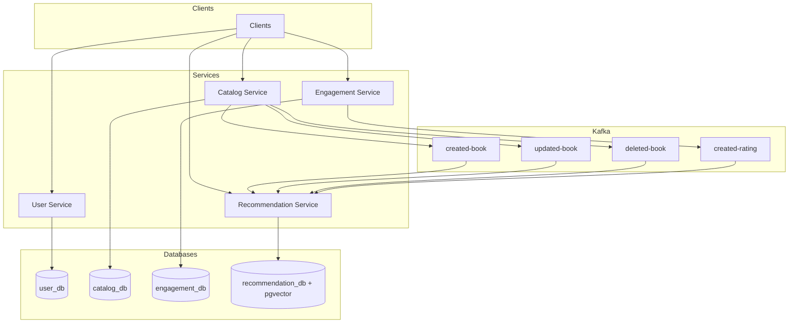
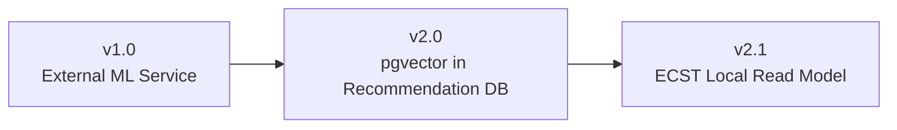
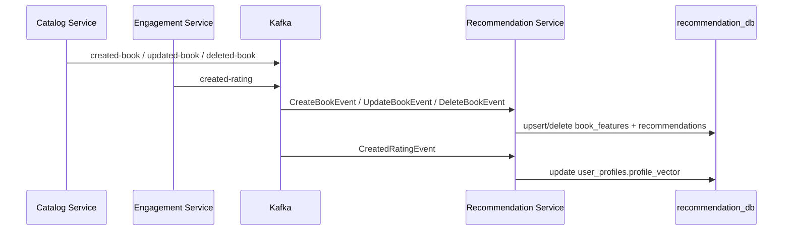

# 📖 VellumHub

[](https://openjdk.org/)
[](https://spring.io/projects/spring-boot)
[](https://www.postgresql.org/)
[](https://github.com/pgvector/pgvector)
[](https://www.docker.com/)
[](LICENSE)

VellumHub is a Spring Boot microservices platform for book discovery, user engagement, and personalized recommendations.

This document focuses on **current architecture reality (v2.1)**, with emphasis on the recommendation engine, pgvector, and event-driven state transfer.

---

## Table of Contents

- [System Design (v2.1)](#system-design-v21)
- [Architecture Evolution (v1.0 → v2.0 → v2.1)](#architecture-evolution-v10--v20--v21)
- [Active API Documentation (Swagger/OpenAPI)](#active-api-documentation-swaggeropenapi)
- [AI & Vector Pipeline](#ai--vector-pipeline)
- [Event-Driven Backbone (ECST)](#event-driven-backbone-ecst)
- [Database and pgvector Design](#database-and-pgvector-design)
- [Known Limitations](#known-limitations)
- [Quick Start](#quick-start)

---

## System Design (v2.1)


```mermaid
graph TB
    subgraph Clients
      C[Clients]
    end

    subgraph Services
      US[User Service]
      CS[Catalog Service]
      ES[Engagement Service]
      RS[Recommendation Service]
    end

    subgraph Kafka
      T1[created-book]
      T2[updated-book]
      T3[deleted-book]
      T4[created-rating]
    end

    subgraph Databases
      UDB[(user_db)]
      CDB[(catalog_db)]
      EDB[(engagement_db)]
      RDB[(recommendation_db + pgvector)]
    end

    C --> US
    C --> CS
    C --> ES
    C --> RS

    US --> UDB
    CS --> CDB
    ES --> EDB
    RS --> RDB

    CS --> T1
    CS --> T2
    CS --> T3
    ES --> T4

    T1 --> RS
    T2 --> RS
    T3 --> RS
    T4 --> RS
```

### Why v2.1 matters

The Recommendation Service is now modeled as an **event-fed local read model**:

- `book_features` stores vectorized book representations
- `user_profiles` stores evolving user preference vectors
- `recommendations` stores recommendation-facing book metadata

This allows recommendation reads to stay local to the Recommendation Service persistence boundary.

---

## Architecture Evolution (v1.0 → v2.0 → v2.1)

### v1.0
- External ML service in the recommendation path
- Higher network and operational coupling

### v2.0
- Moved recommendation compute into Java + PostgreSQL pgvector
- Historical project documentation in this repository reports recommendation latency movement from **~300–500ms** to **~80–120ms** as part of the v1.0 → v2.0 evolution narrative

### v2.1 (current)
- Event-Carried State Transfer (ECST) consolidates Recommendation Service state via Kafka events
- Book and rating events incrementally update local vector/read models
- Recommendation query path remains local to Recommendation Service data


```mermaid
graph LR
  V1[v1.0\nExternal ML Service] --> V2[v2.0\npgvector in Recommendation DB]
  V2 --> V21[v2.1\nECST Local Read Model]
```

---

## Active API Documentation (Swagger/OpenAPI)

Swagger/OpenAPI is configured in all four services (`OpenApiConfig` classes + Springdoc UI dependency).

| Service | Swagger UI | OpenAPI JSON | Evidence |
|---|---|---|---|
| User Service | `http://localhost:8084/swagger-ui/index.html` | `http://localhost:8084/v3/api-docs` | `user-service/src/main/java/com/mrs/user_service/share/config/OpenApiConfig.java`, `user-service/src/main/java/com/mrs/user_service/share/security/config/SecurityConfig.java` |
| Catalog Service | `http://localhost:8081/swagger-ui/index.html` | `http://localhost:8081/v3/api-docs` | `catalog-service/src/main/java/com/mrs/catalog_service/share/config/OpenApiConfig.java`, `catalog-service/src/main/java/com/mrs/catalog_service/share/security/SecurityConfig.java` |
| Engagement Service | `http://localhost:8083/swagger-ui/index.html` | `http://localhost:8083/v3/api-docs` | `engagement-service/src/main/java/com/mrs/engagement_service/share/config/OpenApiConfig.java`, `engagement-service/src/main/java/com/mrs/engagement_service/share/security/config/SecurityConfig.java` |
| Recommendation Service | `http://localhost:8085/swagger-ui/index.html` | `http://localhost:8085/v3/api-docs` | `recommendation-service/src/main/java/com/mrs/recommendation_service/share/config/OpenApiConfig.java`, `recommendation-service/src/main/java/com/mrs/recommendation_service/share/security/config/SecurityConfig.java` |

---

## AI & Vector Pipeline

### 1) Embedding generation

The Recommendation Service uses **LangChain4j** with `AllMiniLmL6V2EmbeddingModel` and persists vectors in **384 dimensions**.

```java
// recommendation-service/src/main/java/com/mrs/recommendation_service/share/config/EmbeddingConfig.java
@Bean
public EmbeddingModel embeddingModel() {
    return new AllMiniLmL6V2EmbeddingModel();
}
```

```java
// recommendation-service/src/main/java/com/mrs/recommendation_service/module/book_feature/domain/model/BookFeature.java
@Column(name = "embedding", columnDefinition = "vector(384)")
private float[] embedding;
```

```java
// recommendation-service/src/main/java/com/mrs/recommendation_service/module/user_profile/domain/model/UserProfile.java
@Column(columnDefinition = "vector(384)")
private float[] profileVector = new float[384];
```

Book textual input is assembled from title/author/genres/description and L2-normalized after embedding:

```java
var rawVectors = embeddingModel
        .embed(semanticContent)
        .content()
        .vector();

return normalizeVectors(rawVectors);
```

### 2) User profile update logic on new ratings

User profile learning is **incremental vector learning + L2 normalization**.

- Ratings are mapped into category weights via `RatingCategory`:
  - `DETRACTOR(-5)` for stars `<=2`
  - `NEUTRAL(1)` for stars `==3`
  - `PROMOTER(5)` for stars `>=4`
- Delta weight is applied with learning rate `0.1f`
- Final profile vector is normalized back to unit magnitude

```java
// recommendation-service/src/main/java/com/mrs/recommendation_service/module/user_profile/domain/model/UserProfile.java
int adjustmentWeight = getWeightAdjustment(newStars, oldStars, isNewRating);
this.profileVector[i] += (bookEmbedding[i] * adjustmentWeight * learningRate);
...
this.normalizeVector(sumOfSquares);
```

```java
private void normalizeVector(double sumOfSquares) {
    float magnitude = (float) Math.sqrt(sumOfSquares);
    if (magnitude > 0) {
        for (int i = 0; i < this.profileVector.length; i++) {
            this.profileVector[i] /= magnitude;
        }
    }
}
```

### 3) Vector retrieval and ranking

Recommendation candidates are retrieved with pgvector cosine distance (`<=>`) and then reranked with a blend of vector distance + popularity score.

```sql
-- recommendation-service/src/main/java/com/mrs/recommendation_service/module/book_feature/infrastructure/repository/JpaBookFeatureRepository.java
SELECT
    b.book_id,
    b.popularity_score,
    (b.embedding <=> u.profile_vector) AS vector_dist
...
ORDER BY b.embedding <=> u.profile_vector ASC
LIMIT 200
```

```sql
ORDER BY
    (c.vector_dist * 0.7) + ((1 - COALESCE(c.popularity_score, 0)) * 0.3) ASC
```

---

## Event-Driven Backbone (ECST)

### Topic flow

- Catalog → Recommendation:
  - `created-book`
  - `updated-book`
  - `deleted-book`
- Engagement → Recommendation:
  - `created-rating`


```mermaid
sequenceDiagram
    participant CS as Catalog Service
    participant ES as Engagement Service
    participant K as Kafka
    participant RS as Recommendation Service
    participant RDB as recommendation_db

    CS->>K: created-book / updated-book / deleted-book
    ES->>K: created-rating

    K->>RS: CreateBookEvent / UpdateBookEvent / DeleteBookEvent
    RS->>RDB: upsert/delete book_features + recommendations

    K->>RS: CreatedRatingEvent
    RS->>RDB: update user_profiles.profile_vector
```

### Event payloads (actual field names in code)

#### Catalog book events

```java
public record CreateBookEvent(
        UUID bookId,
        String title,
        String description,
        int releaseYear,
        String coverUrl,
        String author,
        List<Genre> genres
) {}
```

`UpdateBookEvent` has the same field set. `DeleteBookEvent` contains:

```java
public record DeleteBookEvent(UUID bookId) {}
```

#### Engagement rating event

Producer payload class:

```java
public record CreatedRatingEvent(
        UUID userId,
        UUID mediaId,
        int stars
) {}
```

Published via:

```java
eventProducer.send(
        "created-rating",
        event.userId().toString(),
        event
);
```

Recommendation consumer listens to `created-rating` and maps payload into its local rating event contract:

```java
@KafkaListener(topics = "created-rating", groupId = "recommendation-service")
public void consume(@Payload CreatedRatingEvent createdRatingEvent) { ... }
```

Consumer-side contract:

```java
public record CreatedRatingEvent(
        UUID userId,
        UUID bookId,
        int stars
) {}
```

### Local read model maintenance in Recommendation Service

- `CreateBookConsumerEvent`:
  - Creates `BookFeature` vector (`CreateBookFeatureUseCase`)
  - Creates recommendation-facing metadata row (`CreateRecommendationUseCase`)
- `UpdateBookConsumerEvent`:
  - Regenerates book embedding
  - Updates recommendation metadata
- `DeleteBookConsumerEvent`:
  - Deletes from both `book_features` and `recommendations`
- `CreatedRatingConsumerEvent`:
  - Updates `user_profiles` vector through `UpdateUserProfileWithRatingUseCase`

This is the practical ECST outcome: Recommendation reads are backed by state already transferred by events, reducing synchronous dependency in the recommendation path.

---

## Database and pgvector Design

The repository contains explicit pgvector bootstrap SQL for Recommendation DB:

```sql
-- scripts/create-vector-in-recommendation-db.sql
CREATE EXTENSION IF NOT EXISTS vector;

CREATE TABLE IF NOT EXISTS book_features (
    book_id UUID PRIMARY KEY,
    embedding vector(384),
    popularity_score DOUBLE PRECISION,
    last_updated TIMESTAMP WITH TIME ZONE NOT NULL
);

CREATE INDEX IF NOT EXISTS idx_book_embedding_hnsw
ON book_features
USING hnsw (embedding vector_cosine_ops);
```

Similarity operator used by the recommendation query layer:

```sql
(b.embedding <=> u.profile_vector)
```

This confirms:
- **Index type**: `hnsw`
- **Operator class**: `vector_cosine_ops`
- **Similarity operator**: `<=>` (cosine distance in this setup)

---

## Known Limitations

- Recommendation Service OpenAPI description text still references a 15-dimensional genre-vector approach, while implementation uses `vector(384)` with LangChain4j embeddings.
  - Tracking note: this should be corrected in `recommendation-service/src/main/java/com/mrs/recommendation_service/share/config/OpenApiConfig.java` so generated API docs match runtime implementation.
- Event naming in some descriptive text is inconsistent with active topic names (`created-rating` is the topic used in producer/consumer code).
- Rating event payload naming is inconsistent across services (`mediaId` in Engagement producer contract vs `bookId` in Recommendation consumer contract).
- Full repository test execution in this environment requires Java 21; current runner JDK does not support `--release 21`.
- No API Gateway is present; services are exposed directly.
- Integration/E2E coverage remains limited compared to unit-level coverage.

---

## Quick Start

```bash
docker-compose up -d
```

Service URLs (from `docker-compose.yml`):

- User Service: `http://localhost:8084`
- Catalog Service: `http://localhost:8081`
- Engagement Service: `http://localhost:8083`
- Recommendation Service: `http://localhost:8085`
- Kafka UI: `http://localhost:8090`

---

**VellumHub** — Event-driven, vector-native book recommendations on the JVM.
