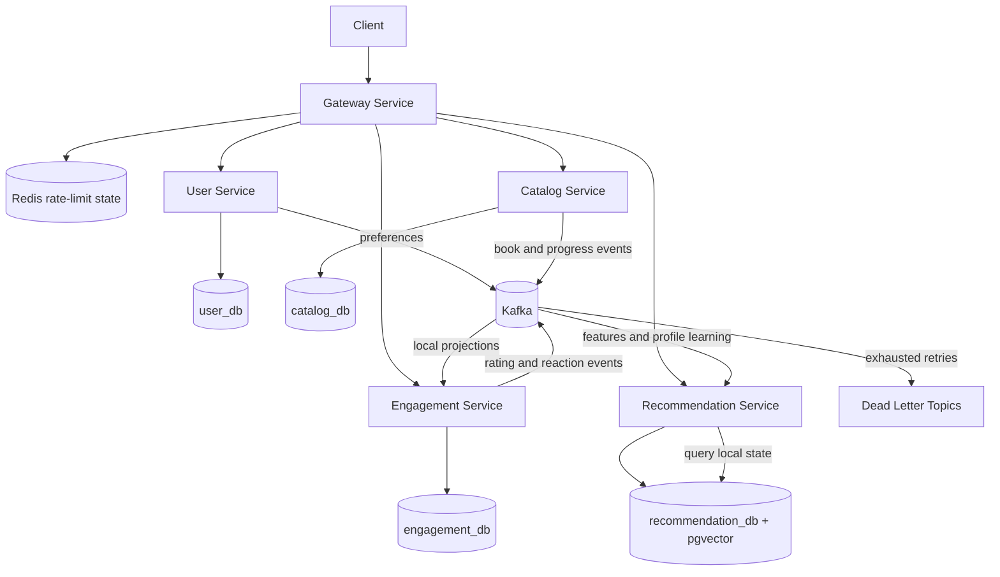

# VellumHub

> A production-oriented Java reference system for event-driven recommendation, built around service-owned data, Kafka-fed read models, and observable failure paths.

[](https://openjdk.org/)
[](https://spring.io/projects/spring-boot)
[](https://kafka.apache.org/)
[](https://github.com/pgvector/pgvector)
[](#verification)

VellumHub is the backend of a social reading and recommendation platform. Its main engineering constraint is explicit: recommendation serving must not depend on request-time calls to catalog, user, or engagement services.

The project demonstrates how service-owned databases, Event-Carried State Transfer, vector ranking, gateway security, retry/DLT behavior, and observability fit together in one coherent JVM system.

## Evidence at a glance

| Signal | Current evidence |
|---|---:|
| Application services | 5 |
| Recommendation hot-path upstream calls | 0 |
| Latest consolidated Maven validation | 478 tests passing |
| Local benchmark before | ~300-500 ms with Python sidecar |
| Local benchmark after | ~80-120 ms in-process JVM + pgvector |
| Embedding dimensions | 384 |
| ANN index | HNSW cosine |

The latency figures are local project benchmarks, not production SLAs.

## Problem, decision, result

### Problem

A recommendation request that synchronously queries catalog, user, and engagement services inherits the latency and availability of every dependency. The earlier architecture also used a separate Python ML sidecar, adding another network and runtime boundary.

### Decision

Upstream domain changes are propagated through Kafka and materialized into recommendation-owned tables. The recommendation service owns its serving state and generates embeddings in-process on the JVM.

### Result

- Recommendation requests read from local PostgreSQL/pgvector state only.
- Catalog, preference, rating, reaction, and progress changes arrive asynchronously.
- The Python sidecar was removed from the serving path.
- Local benchmark latency moved from roughly 300-500 ms to 80-120 ms.
- The latest consolidated validation records 478 Maven tests passing across the platform.

## Architecture


```mermaid
flowchart TB
    Client[Client] --> Gateway[Gateway Service]
    Gateway --> Redis[(Redis rate-limit state)]
    Gateway --> User[User Service]
    Gateway --> Catalog[Catalog Service]
    Gateway --> Engagement[Engagement Service]
    Gateway --> Recommendation[Recommendation Service]

    User --> UserDb[(user_db)]
    Catalog --> CatalogDb[(catalog_db)]
    Engagement --> EngagementDb[(engagement_db)]
    Recommendation --> RecommendationDb[(recommendation_db + pgvector)]

    User -->|preferences| Kafka[(Kafka)]
    Catalog -->|book and progress events| Kafka
    Engagement -->|rating and reaction events| Kafka

    Kafka -->|local projections| Engagement
    Kafka -->|features and profile learning| Recommendation
    Kafka -->|exhausted retries| DLT[Dead Letter Topics]

    Recommendation -->|query local state| RecommendationDb
```

### Ownership boundaries

| Service | Source of truth |
|---|---|
| `user-service` | identity, authentication, users, preference seeds |
| `catalog-service` | books, lists, memberships, current reading progress |
| `engagement-service` | ratings, reactions, replicated progress history |
| `recommendation-service` | book features, profile vectors, recommendation projections |
| `gateway-service` | public routing, JWT enforcement, route rate limits |

Each service owns its application schema. There are no shared application tables.

## Core flows

### Registration to cold start

1. A user registers with genre preferences.
2. `user-service` persists the account and publishes a preference event.
3. `recommendation-service` creates an initial profile vector before the user has interactions.

### Catalog change to local projection

1. `catalog-service` changes book state.
2. A lifecycle event is published to Kafka.
3. Recommendation and engagement consumers update their own projections.
4. Future queries do not need to call catalog synchronously.

### Engagement to profile learning

1. A rating, reaction, or reading-progress event is published.
2. `recommendation-service` updates the user's profile vector.
3. Already-interacted books are excluded during ranking.

### Recommendation serving

1. The gateway validates the request and applies rate limiting.
2. `recommendation-service` loads the user profile and candidates from local PostgreSQL/pgvector tables.
3. Candidates are ranked and returned without synchronous upstream calls.

## Recommendation model

The service maintains three main projection tables:

| Table | Purpose |
|---|---|
| `book_features` | embedding and popularity state for each book |
| `user_profiles` | preference vector and interaction history per user |
| `recommendations` | denormalized response metadata |

Ranking path:

1. Generate 384-dimensional embeddings with the in-process `all-MiniLM-L6-v2` model.
2. Store vectors in PostgreSQL using pgvector.
3. Retrieve an ANN candidate pool through HNSW cosine search.
4. Exclude already-interacted books.
5. Blend semantic score and popularity.
6. Fall back to popularity when a profile does not yet exist.

## Kafka contracts and resilience

Kafka is used for state propagation, not as a substitute for ownership. Producers publish business events; consumers update local projections.

Representative topics cover:

- book creation, update, and deletion;
- reading progress;
- ratings and reactions;
- user preference seeds.

Consumer behavior includes:

- retry topics with fixed backoff;
- bounded attempts;
- Dead Letter Topics for exhausted messages;
- DLT logs that expose topic and error metadata without printing raw payloads by default.

Current hardening work includes stronger drift detection for topic contracts, consumer idempotency, transactional outbox delivery, and end-to-end Testcontainers verification.

## Gateway and security

Spring Cloud Gateway is the public ingress boundary.

- JWT validation at the gateway.
- Independent JWT validation in downstream services.
- Redis-backed route rate limits.
- Principal-based keys with IP fallback where applicable.
- Restricted Actuator exposure in production-oriented profiles.

The gateway is not treated as the only security boundary.

## Observability

The optional observability profile provides:

- Prometheus metrics;
- Grafana dashboards;
- Loki structured logs;
- Tempo traces;
- Alloy collection and forwarding;
- Kafka UI for topic and consumer inspection.

The project records HTTP, JVM, database, Kafka, DLT, and recommendation signals. Labels are intentionally low-cardinality.

Operational documentation:

- [`docs/OBSERVABILITY.md`](docs/OBSERVABILITY.md)
- [`docs/OBSERVABILITY_RUNBOOKS.md`](docs/OBSERVABILITY_RUNBOOKS.md)
- [`docs/KAFKA_MONITORING.md`](docs/KAFKA_MONITORING.md)

## Verification

Latest consolidated project record:

```text
478 Maven tests passing across the platform
```

The strongest coverage is around domain behavior, use cases, controllers, Kafka consumers, mappers, and repository adapters. The next verification step is broader Testcontainers coverage for real Kafka/PostgreSQL projection, retry, DLT, idempotency, and outbox flows.

Run a service suite:

```bash
cd services/catalog-service
./mvnw test
```

Run all service suites on PowerShell:

```powershell
foreach ($service in 'gateway-service','catalog-service','user-service','engagement-service','recommendation-service') {
    Push-Location "services\$service"
    .\mvnw.cmd test
    Pop-Location
}
```

## Running locally

### Requirements

- Docker and Docker Compose
- Java 21 for direct Maven execution
- `.env` based on `.env.example`

Required configuration includes database credentials, a Base64 JWT key, Google client ID, and allowed origins.

Start the default stack:

```bash
docker compose up -d --build
```

Start with observability:

```bash
docker compose --profile observability up -d --build
```

Useful local endpoints:

| Component | URL |
|---|---|
| API Gateway | `http://localhost:8080` |
| Kafka UI | `http://localhost:8090` |
| Grafana | `http://localhost:3002` |
| Prometheus | `http://localhost:9090` |

## Design decisions

| Decision | Trade-off |
|---|---|
| Service-owned databases | Clear ownership and deployability, at the cost of eventual consistency and projection complexity |
| Kafka-fed local read models | Removes serving-time fan-out, but requires contract discipline and recovery paths |
| PostgreSQL + pgvector | Keeps vectors near relational metadata, but does not target every specialized vector-database feature |
| In-process embeddings | Removes a sidecar and network hop, while tying model memory and runtime behavior to the JVM service |
| Retry topics + DLT | Makes failures inspectable, but does not replace idempotency or replay tooling |
| Gateway plus downstream JWT validation | Adds defense in depth, with duplicated validation work |
| Optional observability profile | Keeps the default stack lighter, while requiring an explicit profile for full telemetry |

## Known limitations

- Benchmark numbers are local and need a reproducible public harness with hardware, dataset, warm-up, and percentile reporting.
- Transactional outbox and complete consumer idempotency remain hardening work.
- Distributed-flow tests do not yet cover every Kafka/PostgreSQL failure mode.
- Full production security review, secret management, and deployment automation are outside the current portfolio scope.

## Roadmap

The active roadmap prioritizes correctness over additional CRUD surface:

1. contract drift detection;
2. idempotent consumers;
3. transactional outbox;
4. Flyway validation across services;
5. trace propagation through Kafka boundaries;
6. Testcontainers-based distributed-flow tests;
7. operational security hardening.

## Repository layout

```text
services/   application services
infra/      Docker, scripts, and observability configuration
docs/       architecture and operational documentation
```

## Author

Built by [Lucas Eckert](https://lucas-eckert.vercel.app).
