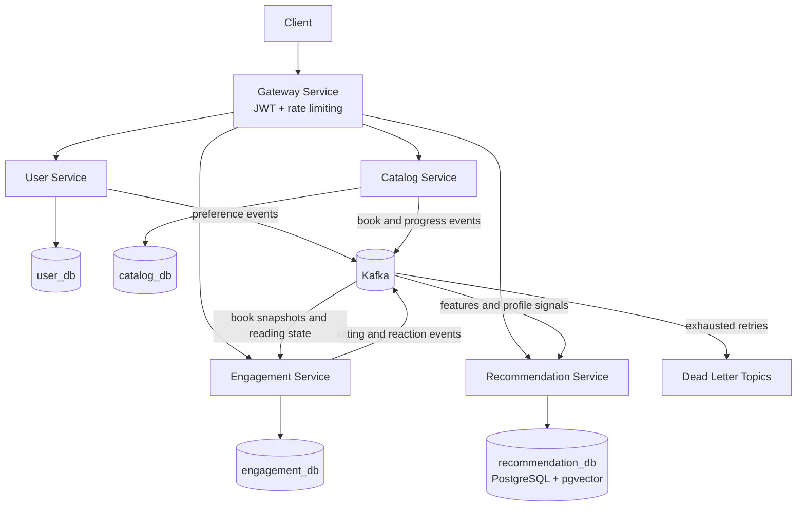
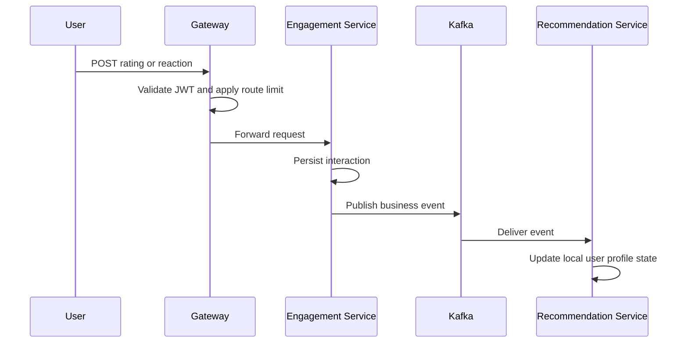

# VellumHub

> A production-oriented JVM reference system for event-driven recommendation infrastructure.

[](https://openjdk.org/)
[](https://spring.io/projects/spring-boot)
[](https://kafka.apache.org/)
[](https://www.postgresql.org/)
[](#verification)

VellumHub is the backend of a social reading platform. Its engineering focus is not the number of CRUD endpoints; it is how recommendation state is owned, propagated, served, observed, and recovered when dependencies fail.

The central decision is explicit:

> Recommendation requests are served from recommendation-owned state. The hot path does not call catalog, user, or engagement services synchronously.

Upstream changes arrive through Kafka and are materialized into local PostgreSQL/pgvector read models before a recommendation request is served.

## Problem, decision, result

### Problem

A request-time recommendation flow that queries catalog, user, and engagement services would couple its latency and availability to every upstream dependency. An earlier implementation also placed an external Python ML sidecar in the path.

### Decision

- Split the platform into five application services with service-owned databases.
- Propagate catalog and interaction state through Kafka events.
- Build recommendation-owned projections for book features, user profiles, and response metadata.
- Run embeddings and ranking in-process on the JVM.
- Use PostgreSQL/pgvector with HNSW cosine search for dense candidate retrieval.

### Result

- The recommendation hot path performs **zero synchronous upstream service calls**.
- A project-local benchmark moved from approximately **300–500 ms** with the Python sidecar to **80–120 ms** with the in-JVM pgvector path.
- The latest consolidated local validation reported by the maintainer contains **478 Maven tests passing**.

The latency numbers are local project measurements, not a production SLA. The consolidated test total is the latest confirmed project run; the repository should retain the command output or CI artifact whenever it is refreshed.

## Current implementation

| Area | Implemented |
|---|---|
| Application topology | Gateway, user, catalog, engagement, and recommendation services |
| Data ownership | A PostgreSQL database per domain service; Redis for gateway rate-limit state |
| Event backbone | Kafka business events feeding downstream projections |
| Recommendation serving | Local PostgreSQL/pgvector state with 384-dimensional embeddings and HNSW cosine search |
| Resilience | Retry topics and Dead Letter Topics in engagement and recommendation consumers |
| Security | JWT enforcement at the gateway plus validation inside downstream services |
| Observability | Actuator, Micrometer/Prometheus, structured logs, OpenTelemetry traces, Grafana, Loki, Tempo, and Alloy |
| Local runtime | Docker Compose with application, storage, Kafka, Redis, and optional observability profiles |

## Architecture


```mermaid
flowchart TB
    client[Client] --> gateway[Gateway Service\nJWT + rate limiting]
    gateway --> user[User Service]
    gateway --> catalog[Catalog Service]
    gateway --> engagement[Engagement Service]
    gateway --> recommendation[Recommendation Service]

    user --> userdb[(user_db)]
    catalog --> catalogdb[(catalog_db)]
    engagement --> engagementdb[(engagement_db)]
    recommendation --> recommendationdb[(recommendation_db\nPostgreSQL + pgvector)]

    user -->|preference events| kafka[(Kafka)]
    catalog -->|book and progress events| kafka
    engagement -->|rating and reaction events| kafka

    kafka -->|book snapshots and reading state| engagement
    kafka -->|features and profile signals| recommendation
    kafka -->|exhausted retries| dlt[Dead Letter Topics]
```

### Service responsibilities

| Service | Responsibility |
|---|---|
| `gateway-service` | Public ingress, routing, JWT enforcement, and Redis-backed rate limiting |
| `user-service` | Identity, authentication, user management, and onboarding preference seeds |
| `catalog-service` | Source of truth for books, lists, requests, memberships, and current reading progress |
| `engagement-service` | Ratings, reactions, replicated book snapshots, and reading history |
| `recommendation-service` | Event-fed projections, embeddings, profile vectors, candidate retrieval, and ranking |

## Core flows

### Registration to cold-start profile

1. The user registers with genre preferences.
2. `user-service` persists the user and publishes a preference event.
3. `recommendation-service` consumes the event and seeds a local profile vector.
4. Recommendation serving can operate before the user has ratings or reactions.

### Catalog mutation to local projections

1. `catalog-service` changes book state.
2. It publishes a lifecycle event.
3. Recommendation and engagement consumers update their own local representations.
4. Query-time code reads local state instead of joining through shared tables or calling the source service.

### Engagement to recommendation learning


```mermaid
sequenceDiagram
    participant U as User
    participant G as Gateway
    participant E as Engagement Service
    participant K as Kafka
    participant R as Recommendation Service

    U->>G: POST rating or reaction
    G->>G: Validate JWT and apply route limit
    G->>E: Forward request
    E->>E: Persist interaction
    E->>K: Publish business event
    K->>R: Deliver event
    R->>R: Update local user profile state
```

## Recommendation model

The recommendation service owns three main projections:

| Projection | Purpose |
|---|---|
| `book_features` | Book embeddings and popularity state |
| `user_profiles` | Preference vectors, interacted books, and engagement-derived state |
| `recommendations` | Response metadata needed to assemble results without source-service reads |

The current ranking path:

1. Generate or update 384-dimensional vectors in-process.
2. Store embeddings as `vector(384)`.
3. Retrieve an approximate candidate pool through an HNSW cosine index.
4. Remove books the user has already interacted with.
5. Re-rank candidates using semantic and popularity signals.
6. Fall back to popularity when no user profile is available.

## Why local read models

Local projections intentionally trade immediate global consistency for a more isolated serving path.

**Benefits**

- Recommendation availability does not depend on synchronous catalog, user, and engagement calls.
- Read latency is controlled by one service and one database boundary.
- Response assembly does not require cross-service joins.
- Failure and lag can be observed at the event-consumer boundary.

**Costs**

- State is eventually consistent.
- Consumers must handle duplicate delivery and schema evolution.
- Event publication and database writes need stronger atomicity guarantees.
- Projection rebuilds and drift detection become operational responsibilities.

## Kafka reliability

Implemented consumer behavior includes:

- retry-topic forwarding;
- fixed retry backoff;
- exhausted-message routing to `*-dlt` topics;
- DLT logs containing topic and exception context without logging raw payloads by default;
- metrics for producer/consumer success, failure, duration, and DLT events.

The following items remain reliability work rather than completed claims:

- fully centralized and drift-proof topic contracts;
- idempotent consumer storage for at-least-once delivery;
- transactional outbox for atomic state change and publication;
- complete Kafka/PostgreSQL integration coverage with Testcontainers;
- stronger manual trace propagation for domain events where automatic instrumentation is insufficient.

## Gateway and security

All external traffic enters through Spring Cloud Gateway.

| Route group | Key policy |
|---|---|
| Authentication and user | Lower IP-based rate limit |
| Catalog and engagement | Principal key with IP fallback |
| Recommendations | Principal key with IP fallback |

The gateway is not the only security boundary. Downstream services also validate JWTs, which avoids making the edge proxy a single trust point.

## Observability

Start the optional observability profile to inspect metrics, logs, traces, dashboards, alerts, and Kafka state locally:

```bash
docker compose --profile observability up -d --build
```

The profile includes:

- Prometheus for metrics;
- Grafana for dashboards and exploration;
- Loki for structured container logs;
- Tempo for traces;
- Alloy for log and OTLP collection;
- Kafka UI for topics and consumer groups.

Provisioned dashboard areas include gateway/HTTP behavior, JVM/database health, Kafka flow, and recommendation health.

## Verification

### Latest consolidated result

The latest platform-wide result confirmed by the maintainer is:

```text
478 Maven tests passing
```

This total should be updated only together with a dated command output, CI run, or Surefire artifact.

### What the tests cover

The suites target domain rules and adapter boundaries across:

- authentication and user preference publication;
- book lifecycle, lists, requests, memberships, and reading progress;
- ratings, reactions, snapshots, and reading-session events;
- recommendation profile learning, embeddings, Kafka consumers, mappers, repositories, and controllers;
- gateway startup and routing/security configuration.

### Local commands

Run one service:

```bash
cd services/catalog-service
./mvnw test
```

Run all application suites from PowerShell:

```powershell
foreach ($service in 'gateway-service','catalog-service','user-service','engagement-service','recommendation-service') {
    Push-Location "services\$service"
    .\mvnw.cmd test
    Pop-Location
}
```

## Running locally

### Prerequisites

- Java 21
- Docker and Docker Compose
- A `.env` file based on `.env.example`

### Default stack

```bash
docker compose up -d --build
```

The default profile includes the five applications, four PostgreSQL instances, Redis, Kafka, ZooKeeper, and Kafka UI.

### Useful local endpoints

| Component | Address |
|---|---|
| API Gateway | `http://localhost:8080` |
| Kafka UI | `http://localhost:8090` |
| Grafana, with observability profile | `http://localhost:3002` |
| Prometheus, with observability profile | `http://localhost:9090` |

## Design decisions

| Decision | Rationale |
|---|---|
| Service-owned persistence | Keeps source-of-truth boundaries explicit and avoids hidden coupling through shared application tables |
| Event-carried state transfer | Moves dependency work out of the request path while accepting eventual consistency |
| PostgreSQL + pgvector | Keeps vector search close to relational metadata, transactions, and local development workflows |
| HNSW cosine search | Provides an approximate speed/recall trade-off for dense candidate retrieval |
| In-process JVM embeddings | Removes a separately deployed ML sidecar from the serving path |
| Retry topics + DLT | Makes asynchronous failures inspectable instead of silently swallowing them |
| Gateway plus downstream JWT validation | Uses a central ingress policy without relying on one exclusive security boundary |
| Optional observability profile | Keeps the default stack smaller while preserving a full operational inspection mode |

## Known limitations

- The benchmark is local and not a production SLA.
- The confirmed 478-test total needs a retained dated artifact in the repository.
- Consumer idempotency and transactional outbox are still hardening work.
- Full distributed-flow integration testing is incomplete.
- Some legacy Feign-related configuration remains cleanup debt and is not part of the active recommendation hot path.
- The project does not claim production traffic, user adoption, revenue, or uptime.

## Repository layout

```text
.
├── services/
│   ├── gateway-service/
│   ├── user-service/
│   ├── catalog-service/
│   ├── engagement-service/
│   └── recommendation-service/
├── infra/
├── docs/
├── docker-compose.yml
└── .env.example
```

## Roadmap

The current roadmap is reliability-first:

1. make Kafka contracts resistant to silent drift;
2. add idempotent consumer processing;
3. implement transactional outbox publication;
4. replace permissive schema updates with versioned migrations;
5. expand event-level tracing;
6. add Testcontainers coverage for Kafka, PostgreSQL, retries, DLTs, and projection updates;
7. retain reproducible benchmark and consolidated test artifacts.

## Author

Built and maintained by [Lucas Eckert](https://github.com/Luca5Eckert).
