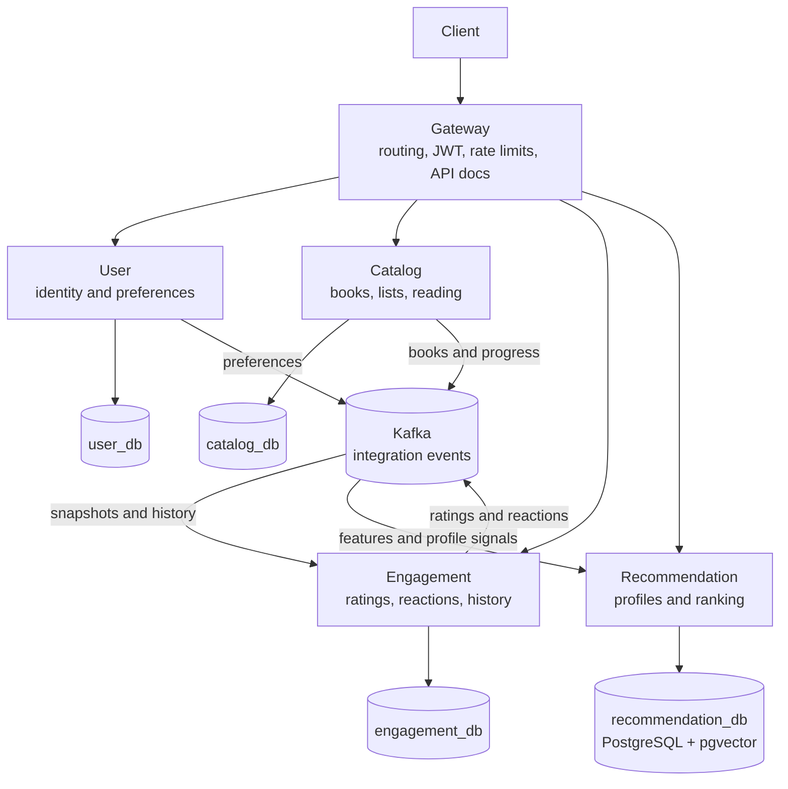
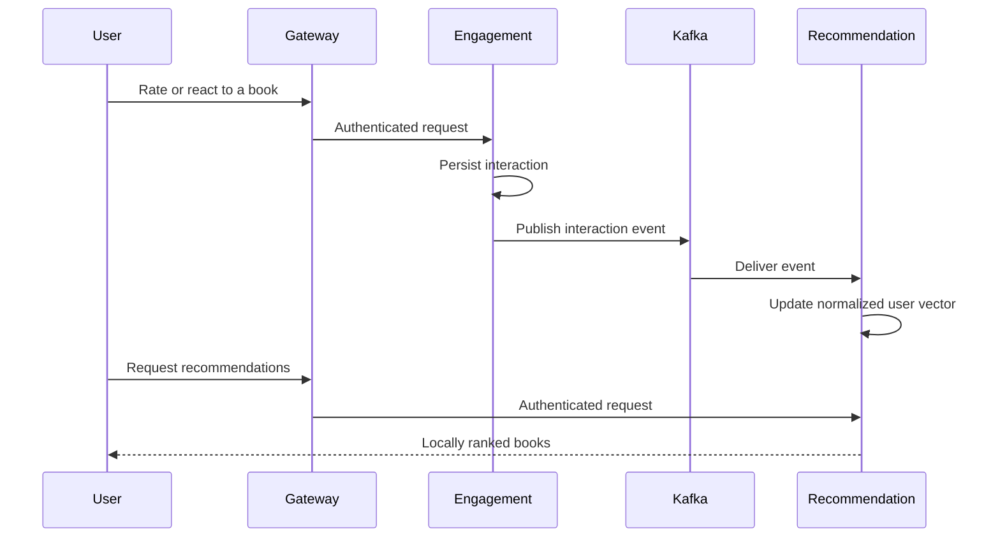

# VellumHub

> An event-driven social reading platform connecting catalog discovery, collaborative book lists, reading progress, engagement, and personalized recommendations across five independently deployable services.

[](https://openjdk.org/)
[](https://spring.io/projects/spring-boot)
[](https://kafka.apache.org/)
[](https://www.postgresql.org/)
[](https://github.com/pgvector/pgvector)
[](https://www.docker.com/)
[](https://kubernetes.io/)

VellumHub covers the complete reading journey: users create an account, choose literary preferences, discover or request books, organize shared lists, track reading progress, rate and react to titles, and receive recommendations that learn from those interactions.

The platform is also a production-oriented backend engineering reference built around one central rule: **data stays on the inside; events collaborate on the outside**. Each service protects its current state and invariants in its own database, then publishes immutable facts so other services can build the local state they need. PostgreSQL with pgvector therefore serves recommendations without synchronous fan-out to the source domains.

**Explore:** [Architecture](#architecture) · [API documentation](#explore-the-api) · [Run locally](#run-locally) · [Quality](#verification-strategy) · [Roadmap](#current-status-and-roadmap)

---

## What VellumHub Does

A user's actions form one connected product journey:

1. **Join:** register with email and password or authenticate with Google.
2. **Personalize:** choose preferred genres to create a useful cold-start profile.
3. **Discover:** browse the catalog, import a book by ISBN, or request a missing title.
4. **Organize:** create book lists, add titles, manage members, and assign collaboration roles.
5. **Read:** manage reading status, record progress, and preserve a progress history.
6. **Engage:** rate books and react to content.
7. **Improve recommendations:** every preference, rating, reaction, and progress signal refines the user's vector profile.

### Product capabilities

| Domain | Implemented capabilities |
|---|---|
| Identity | Registration, login, Google authentication, profile lookup, and user management |
| Preferences | Genre preferences used to seed recommendation profiles before interaction history exists |
| Catalog | Book lifecycle, ISBN import through Google Books, cover upload/retrieval, and bulk lookup |
| Curation | Book requests and approval workflow for titles missing from the catalog |
| Collaborative lists | List lifecycle, book membership, member management, and collaboration roles |
| Reading | Reading status, progress updates, personal reading list, and replicated progress history |
| Engagement | Ratings, current-user rating lookup, rating aggregation, and reactions |
| Recommendations | Event-fed book projections, user profile learning, ANN retrieval, re-ranking, and popularity fallback |

## Event-Driven Architecture at a Glance

VellumHub applies [Data on the Outside versus Data on the Inside](https://queue.acm.org/detail.cfm?id=3415014) at service boundaries and uses [Event-Carried State Transfer](https://martinfowler.com/articles/201701-event-driven.html) where a consumer needs source data to work autonomously.

| Architectural concern | VellumHub's approach |
|---|---|
| Data on the inside | Each domain owns a private PostgreSQL database, its mutable current state, business invariants, and local transaction boundary. |
| Events on the outside | Services publish immutable integration facts through Kafka using eight versioned payload types from `lib/kafka-contracts`. |
| Event collaboration | User, Catalog, and Engagement publish what happened; Engagement and Recommendation decide independently how those facts affect their own models. |
| Local projections | Book snapshots, reading history, book features, user vectors, and recommendation response data are materialized where they are consumed. |
| Query autonomy | Recommendation and replicated engagement flows read local tables instead of synchronously joining or calling the source services. |
| Consistency model | A service is transactionally consistent inside its boundary; projections across boundaries converge asynchronously. |
| Failure model | Consumers retry, route exhausted records to dead-letter topics, and expose Kafka/retry/DLT metrics. Atomic state-and-event publication remains planned through transactional outbox. |

The implementation spans **5 application services**, **14 functional modules**, **50 HTTP operations**, **8 shared integration-event payloads**, and **4 service-owned databases**. The numbers provide context; the important property is that each boundary can evolve and serve its queries without sharing tables or requiring a synchronous distributed transaction.

## Architecture

Every public request enters through the reactive gateway. Each domain service owns its data and still validates JWTs independently. Cross-domain state travels as integration events; consumers translate those external contracts into models they own.


```mermaid
graph TB
    Client[Client] --> Gateway[Gateway<br/>routing, JWT, rate limits, API docs]

    Gateway --> User[User<br/>identity and preferences]
    Gateway --> Catalog[Catalog<br/>books, lists, reading]
    Gateway --> Engagement[Engagement<br/>ratings, reactions, history]
    Gateway --> Recommendation[Recommendation<br/>profiles and ranking]

    User --> UserDb[(user_db)]
    Catalog --> CatalogDb[(catalog_db)]
    Engagement --> EngagementDb[(engagement_db)]
    Recommendation --> RecommendationDb[(recommendation_db<br/>PostgreSQL + pgvector)]

    User -->|preferences| Kafka[(Kafka<br/>integration events)]
    Catalog -->|books and progress| Kafka
    Engagement -->|ratings and reactions| Kafka
    Kafka -->|snapshots and history| Engagement
    Kafka -->|features and profile signals| Recommendation
```

### Service ownership

| Service | Owns | Avoids at query time |
|---|---|---|
| `gateway-service` | Public routing, JWT enforcement, Redis-backed rate limiting, and API documentation discovery | Business state |
| `user-service` | Accounts, authentication, Google login, and genre preferences | Other domain databases |
| `catalog-service` | Books, requests, covers, collaborative lists, memberships, and reading progress | Engagement or recommendation state |
| `engagement-service` | Ratings, reactions, book snapshots, and replicated reading-progress history | Synchronous catalog lookups for replicated data |
| `recommendation-service` | Book features, user profile vectors, recommendation projections, and ranking | Synchronous catalog, user, or engagement calls |

```text
.
├── services/                 # Five independently deployable applications
├── lib/kafka-contracts/      # Shared event names, payloads, aliases, and consumer groups
├── infra/                    # Docker, scripts, monitoring, and observability configuration
├── deploy/kubernetes/        # Kustomize bases, overlays, and Argo CD application
├── postman/                  # Contract-derived collection and cross-service workflows
└── docs/                     # Detailed architecture and operational documentation
```

## End-to-End Journeys

### From registration to a useful cold start

When a user registers with genre preferences, `user-service` publishes `created-user-preference`. The recommendation service converts those preferences into a normalized profile vector, allowing relevant results before ratings or reading history exist.

### From reader feedback to a refined profile


```mermaid
sequenceDiagram
    participant U as User
    participant G as Gateway
    participant E as Engagement
    participant K as Kafka
    participant R as Recommendation

    U->>G: Rate or react to a book
    G->>E: Authenticated request
    E->>E: Persist interaction
    E->>K: Publish interaction event
    K->>R: Deliver event
    R->>R: Update normalized user vector
    U->>G: Request recommendations
    G->>R: Authenticated request
    R-->>U: Locally ranked books
```

Reading-progress events follow the same integration style. Catalog owns the current state, while engagement preserves progress history and recommendation treats progress as another learning signal.

## Recommendation Engine

The recommendation service runs its embedding and ranking path inside the JVM. It consumes catalog and interaction events and maintains three local projections:

| Projection | Purpose |
|---|---|
| `book_features` | Normalized `vector(384)` representation and popularity state |
| `user_profiles` | Preference vector, interaction history, and engagement score per user |
| `recommendations` | Denormalized response data used without synchronous catalog calls |

The ranking pipeline is:

1. LangChain4j's `AllMiniLmL6V2EmbeddingModel` produces 384-dimensional embeddings.
2. Book and user vectors are L2-normalized for cosine comparison.
3. A pgvector HNSW index retrieves an approximate candidate pool of 200 books.
4. Books already present in the user's interaction history are removed.
5. Remaining candidates are re-ranked using 70% semantic similarity and 30% popularity.
6. Users without a profile receive a popularity-based fallback.

Historical local measurements for the migration from an external Python ML sidecar to in-process JVM embeddings and pgvector ranking moved recommendation latency from approximately **300–500 ms** to **80–120 ms**. These are project-local benchmark notes, not production SLAs.

## Event Collaboration and Local Projections

`lib/kafka-contracts` is the canonical source for topic names, JSON type aliases, consumer groups, and cross-service payloads.

The services collaborate through facts rather than remote commands. A producer announces a completed domain change; each consumer decides how to project it locally. For example, Catalog does not tell Recommendation how to rank a book and Engagement does not tell it how to update a user vector.

| Event topic | Producer | Consumer purpose |
|---|---|---|
| `created-book` | Catalog | Create recommendation features and an engagement book snapshot |
| `updated-book` | Catalog | Refresh recommendation projections |
| `deleted-book` | Catalog | Remove recommendation and engagement projections |
| `created-user-preference` | User | Seed the cold-start user profile |
| `created-rating` | Engagement | Learn from explicit rating feedback |
| `user-reaction-changed` | Engagement | Learn from reaction changes |
| `created-reading-progress` | Catalog | Create progress history and learn initial progress state |
| `updated-reading-progress` | Catalog | Update progress history and the recommendation profile |

Book create/update events carry title, description, author, cover, release year, and genres. This is deliberate ECST: Recommendation and Engagement can update their local copies without calling Catalog after every event. Interaction events are narrower because their consumers need the user, book, and signal—not the entire source aggregate.

Consumers use retry topics with three attempts and a fixed three-second production backoff. Exhausted records are routed to `*-dlt` topics, where dedicated listeners record recovery context without logging raw payloads.

## Reliability and Data Consistency

VellumHub makes its current guarantees and remaining boundaries explicit:

- **Database ownership:** no service reads or writes another service's application tables.
- **Event-carried state transfer:** consumers build local models from the state carried by integration events.
- **Shared contracts:** producers and consumers compile against the same event payloads and identifiers.
- **Schema evolution:** Flyway owns PostgreSQL schemas, including pgvector extensions and HNSW indexes.
- **Retry and recovery:** Kafka retry topics and DLT routing are centralized in engagement and recommendation.
- **Defense in depth:** downstream services validate JWTs after traffic passes through the gateway.
- **Real-boundary verification:** Testcontainers exercises Kafka delivery, retry/DLT, Flyway, PostgreSQL, pgvector, and projection persistence.

The current distributed-test pilot proves the `created-book` success path from real Kafka into PostgreSQL/pgvector and a failure path with three listener attempts, DLT delivery, and no partial projection. It mocks only the embedding provider and controlled failure injection; the broker, database, migrations, listener, transaction, serializer, and persistence path remain real.

Consumer idempotency and transactional outbox publication remain planned guarantees. They are not claimed as implemented until their production mechanisms and failure-sensitive tests exist. See [Distributed Integration Testing](docs/DISTRIBUTED_TESTING.md) for the precise boundary and extension rules.

This is not Event Sourcing: PostgreSQL tables remain the systems of record and Kafka carries integration events between services. Nor is every event full-state replication—the payload is shaped around what downstream collaborators need.

## Explore the API

With the default stack running, the gateway exposes one API discovery entry point:

```text
http://localhost:8080/docs
```

The selector contains the User, Catalog, Engagement, and Recommendation OpenAPI definitions. Each service remains the source of truth for its contract; the gateway only provides stable routes under `/docs/{service}/v3/api-docs`.

The repository also includes:

- a versioned [Postman collection](postman/VellumHub.postman_collection.json) generated from live OpenAPI contracts;
- a secret-free [local environment template](postman/VellumHub.local.postman_environment.json);
- cross-service workflows for login, state capture, and authenticated exploration;
- CI validation that rejects contract drift or committed credentials.

```bash
python postman/generate.py
python postman/generate.py --check
```

See [API Documentation](docs/api-documentation.md) and the [Postman guide](postman/README.md) for ownership, generation, and security details.

## Run Locally

### Prerequisites

- Docker and Docker Compose
- Java 21 for Maven execution outside containers
- An environment file based on `.env.example`

Create `.env`, provide the required credentials, and start the platform:

```bash
cp .env.example .env
docker compose up -d --build
```

At minimum, configure a Base64-compatible `JWT_KEY`, database credentials, `JWT_EXPIRATION_MS`, and `GOOGLE_CLIENT_ID`. Generate a local JWT key with:

```bash
openssl rand -base64 32
```

### Local entry points

| Component | URL |
|---|---|
| API Gateway | `http://localhost:8080` |
| Central Swagger UI | `http://localhost:8080/docs` |
| Kafka UI | `http://localhost:8090` |

The default Compose topology starts five applications, four PostgreSQL databases, Redis, Kafka, ZooKeeper, and Kafka UI.

```bash
docker compose --profile observability up -d --build
```

| Observability component | URL |
|---|---|
| Grafana | `http://localhost:3002` |
| Prometheus | `http://localhost:9090` |
| Loki | `http://localhost:3100` |
| Tempo | `http://localhost:3200` |

For service-specific configuration and standalone execution, use the README inside each directory under `services/`.

## Verification Strategy

The test portfolio uses the narrowest boundary capable of proving each behavior:

| Level | What it protects |
|---|---|
| Domain and application tests | Business rules, state transitions, ranking signals, and errors |
| Controller and mapper tests | HTTP status, request/response mapping, authentication context, and delegation |
| Repository and migration tests | JPA adapters, Flyway, PostgreSQL constraints, pgvector, and HNSW indexes |
| Distributed integration tests | Real Kafka serialization, listener execution, transactions, retry/DLT, and projections |
| Configuration and smoke checks | Gateway/OpenAPI drift, Compose topology, health, and service communication |

Run the non-distributed reactor verification:

```bash
mvn -B -ntp -DexcludedGroups=distributed clean verify
```

Run the Recommendation distributed suite with Docker available:

```bash
mvn -B -ntp -pl services/recommendation-service -am -Dgroups=distributed test
```

CI keeps these as separate jobs so application failures remain distinguishable from Kafka or Testcontainers infrastructure failures. Image build and vulnerability scanning depend on both jobs succeeding.

## Observability and Delivery

The optional local observability profile provides:

- Prometheus metrics and alert rules;
- five Grafana dashboards for platform, HTTP, Kafka, JVM/database, and recommendation health;
- structured logs collected by Alloy and queried through Loki;
- OpenTelemetry Java Agent traces exported through Alloy to Tempo;
- custom HTTP, catalog, engagement, recommendation, Kafka, retry, and DLT metrics.

The delivery path uses Git as the deployment boundary:

1. GitHub Actions verifies code, migrations, distributed behavior, images, and vulnerabilities.
2. A merge to `main` publishes one immutable GHCR image per service, tagged with the commit SHA.
3. Kustomize overlays define local and production runtime differences.
4. Argo CD observes the desired image version declared in Git and reconciles the cluster.
5. Rollback reverts the version change and reconciles the previous desired state.

Only the gateway is exposed through Kubernetes ingress. Application containers run as non-root, drop Linux capabilities, declare resource boundaries, and expose liveness/readiness probes. Production databases, Kafka, Redis, and secrets are external interfaces rather than workloads owned by the application manifests.

Detailed guides:

- [Observability](docs/OBSERVABILITY.md)
- [Operational runbooks](docs/OBSERVABILITY_RUNBOOKS.md)
- [Operations](docs/OPERATIONS.md)
- [CI/CD](docs/CI_CD.md)
- [Database migrations](docs/DATABASE_MIGRATIONS.md)
- [Kubernetes and GitOps](deploy/kubernetes/README.md)

## Current Status and Roadmap

| Capability | Status | Reference |
|---|---|---|
| Five-service architecture with service-owned data | Implemented | [Service map](#service-ownership) |
| JVM embeddings and local pgvector ranking | Implemented | [Recommendation engine](#recommendation-engine) |
| Central Kafka contract library | Implemented | [#199](https://github.com/Luca5Eckert/VellumHub/issues/199) |
| Flyway migrations and PostgreSQL verification | Implemented | [#205](https://github.com/Luca5Eckert/VellumHub/issues/205) |
| Metrics, logs, traces, dashboards, and alerts | Implemented locally | [Observability](docs/OBSERVABILITY.md) |
| CI, immutable images, Kubernetes, Kustomize, and Argo CD | Implemented | [Kubernetes](deploy/kubernetes/README.md) |
| Central Swagger UI and service-owned OpenAPI | Implemented | [API documentation](docs/api-documentation.md) |
| Contract-derived Postman collection and workflows | Implemented | [Postman](postman/README.md) |
| Real Kafka + PostgreSQL/pgvector distributed testing | Recommendation pilot implemented | [#207](https://github.com/Luca5Eckert/VellumHub/issues/207) |
| Consumer idempotency | Planned | [#200](https://github.com/Luca5Eckert/VellumHub/issues/200) |
| Transactional outbox | Planned | [#201](https://github.com/Luca5Eckert/VellumHub/issues/201), [#202](https://github.com/Luca5Eckert/VellumHub/issues/202) |
| Broader cross-service E2E coverage | Planned | [Distributed testing](docs/DISTRIBUTED_TESTING.md) |

## Design Principles

- **Own data at the domain boundary:** databases are private implementation details of their services.
- **Replicate for autonomy:** use local projections when critical queries would otherwise require synchronous fan-out.
- **Centralize contracts, not domains:** Kafka payloads are shared; business models and persistence remain service-owned.
- **Test real failure boundaries:** use Kafka and PostgreSQL when delivery, transaction, migration, extension, or retry semantics matter.
- **Keep claims auditable:** separate implemented guarantees from roadmap intentions.
- **Deliver immutable state through Git:** deployments reference exact versions instead of mutable `latest` tags.

## References

- [Service READMEs](services)
- [Architecture and operational documentation](docs)
- [Kafka contracts](lib/kafka-contracts)
- [Postman artifacts](postman)
- [Kubernetes manifests](deploy/kubernetes)
